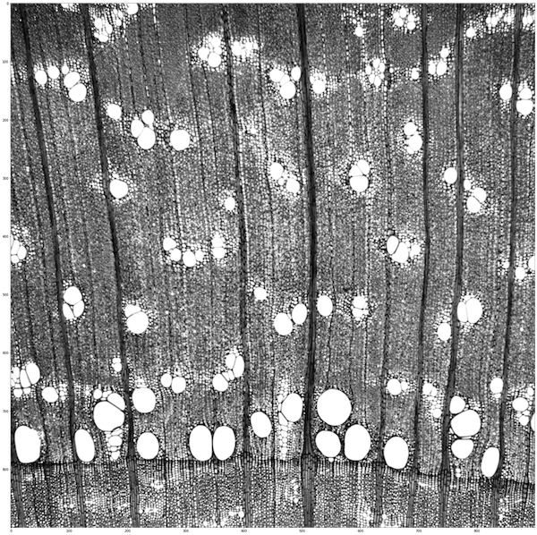
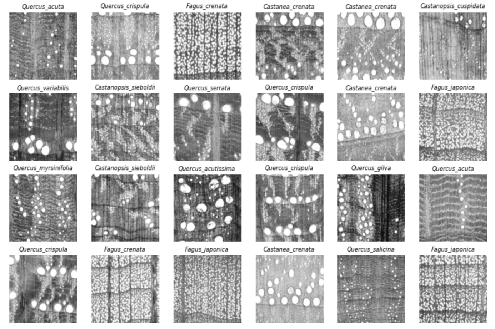

## Appendix 1: 自作の関数・モジュール


７章の最後に `from common.nir_ml import *` という表現をつかいました. 

これは, **common**というディレクトリに保存した, **nir_ml.py** というコードを読み込んで, そこにコードしてある関数やクラスモジュールを呼び出せという意味です. この関数は, Sebastianの教科書に載っているモデルの境界領域を色分けして表示するためのものです. `import *` というアスタリスクは, 関数全部という意味ですが, この場合, 関数は一つしかないので, 

```python
from common.nir_ml import plot_decision_regions
```

と同じ意味です. 以下**nir_ml.py**の中身です. 

```python
from sklearn.svm import SVC
import matplotlib.pyplot as plt
import numpy as np
from matplotlib.colors import ListedColormap

def plot_decision_regions(X, y, classifier, test_idx=None, resolution=0.02):
　　'''
    Sebastian Raschka, Python機械学習プログラミング  達人データサイエンティストによる理論と実践, \
    株式会社クイープ, 福島 真太朗 (訳),インプレス, 2016 (第3版2020）
  　'''　
    markers = ('s', 'x', 'o', '^', 'v')
    colors = ('red', 'blue', 'lightgreen', 'gray', 'cyan')
    cmap = ListedColormap(colors[:len(np.unique(y))])
    #labels=['Balau','Heavy Red Meranti','Light Red Meranti','White Meranti']
    x1_min, x1_max = X[:, 0].min() - 1, X[:, 0].max() + 1
    x2_min, x2_max = X[:, 1].min() - 1, X[:, 1].max() + 1
    xx1, xx2 = np.meshgrid(np.arange(x1_min, x1_max, resolution),
                           np.arange(x2_min, x2_max, resolution))
    Z = classifier.predict(np.array([xx1.ravel(), xx2.ravel()]).T)
    Z = Z.reshape(xx1.shape)
    plt.contourf(xx1, xx2, Z, alpha=0.3, cmap=cmap)
    plt.xlim(xx1.min(), xx1.max())
    plt.ylim(xx2.min(), xx2.max())
    # 全てのサンプルを表示
    for idx, cl in enumerate(np.unique(y)):
        plt.scatter(x=X[y == cl, 0], 
                    y=X[y == cl, 1],
                    alpha=0.8, 
                    c=colors[idx],
                    marker=markers[idx], 
                    label=cl)
    # テストサンプルに丸を付ける
    if test_idx:
        X_test, y_test = X[test_idx, :], y[test_idx]
        plt.scatter(X_test[:, 0],
                    X_test[:, 1],
                    c='',
                    alpha=1.0,
                    linewidth=1,
                    marker='o',
                    s=100, 
                    label='test set')
    # グラフ表示
    plt.xlabel('X')
    plt.ylabel('Y')
    plt.legend(loc='upper left')
    plt.tight_layout()
    plt.show()
```

同様の方法で, 自分でデザインしたよく使う関数やクラスを本体コードから分離することによって, 本体のコードが簡潔になりますし, また読みやすくなります. 

<div style="page-break-before:always">

## Appendix 2: HDF (Hierarchical Data Format)

> A versatile data model that can represent very complex data objects and a wide variety of metadata. A completely portable file format with no limit on the number or size of data objects in the collection.

> **Hierarchical Data Format**（階層的データ形式, 略称：**HDF**）は, 大量のデータを格納および構造化するために設計された一連のファイル形式（**HDF4**, **HDF5**）. 米国立スーパーコンピュータ応用研究所で開発され, 非営利法人である HDF グループによってサポートされている. HDFグループは, HDF5 テクノロジーの継続的な開発と HDF で保存されたデータの継続的なアクセスを確保することを使命としている. (from Wikipedia)


#### 木材情報学と教育用材鑑調査室デジタルデータベース

>  https://repository.kulib.kyoto-u.ac.jp/dspace/handle/2433/250016

木材教育の資源として主要な広葉樹の光学顕微鏡デジタルデータベース（XDD）を公開していす. そこからXDD16をダウンロードしてください. ファイルの名前は**WIG_v1.2.1_900.h5**で6GBあります. 

```hdf
HDF5
フォルダ, ディレクトリ Group
ファイル Dataset
プロパティ Attribute
```

逐次データの階層を確かめながら見ていくことにしましょう. **Group**としてカタログされているディレクトリ名を見てみると, 科, 属, 種, プレパラート番号の順に名前が入っていることがわかります. 


```python
import h5py
hdf_path="WIG_v1.2.1_900.h5"
with h5py.File(hdf_path,'r') as f:
    print('(1)- 1st level ')
    print(list(f.keys()))
    print('(2)-　2nd level, Group "Betulaceae" ')
    print(list(f['Betulaceae/'].keys()))
    print('(3)- 3rd level, Group "Betulaceae/Alnus"　')
    print(list(f['Betulaceae/Alnus/'].keys()))
    print('(4)- 4th level, Group "Betulaceae/Alnus/Alnus_firma" ')
    print(list(f['Betulaceae/Alnus/Alnus_firma'].keys()))
    print('(5)- 5th level, Group "Betulaceae/Alnus/Alnus_firma/prep_06341" ')
    print(len(f['Betulaceae/Alnus/Alnus_firma/prep_06341']), ' images included')
```

```text
(1)- 1st level 
['Betulaceae', 'Cannabaceae', 'Fagaceae', 'Lauraceae', 'Magnoliaceae', 'Sapindaceae', 'Ulmaceae']
(2)-　2nd level, Group "Betulaceae" 
['Alnus', 'Betula', 'Carpinus', 'Corylus', 'Ostrya']
(3)- 3rd level, Group "Betulaceae/Alnus"　
['Alnus_firma', 'Alnus_hirsuta_var_hirsuta', 'Alnus_hirsuta_var_sibirica', 'Alnus_japonica_var_japonica', 'Alnus_matsumurae', 'Alnus_pendula', 'Alnus_sieboldiana', 'Alnus_viridis_subsp_maximowiczii']
(4)- 4th level, Group "Betulaceae/Alnus/Alnus_firma" 
['prep_06341', 'prep_10208', 'prep_10337', 'prep_10769', 'prep_10825']
(5)- 5th level, Group "Betulaceae/Alnus/Alnus_firma/prep_06341" 
9  images included
```

一枚取り出すには以下のようにします. 

```python
import matplotlib.pyplot as plt
%matplotlib inline
f=h5py.File(hdf_path,'r') 
imgs=f['Cannabaceae/Celtis/Celtis_sinensis/KYOw_01137']
fig = plt.subplots(figsize=(10,10))
plt.imshow(imgs[2],cmap='gray')
plt.show()
```


​    

上の書き方だと, 一枚ごと名前を入力する必要がありますので, **hdfファイル**の全体のリストをまず取得してから, 再起的にオブジェクトをとりだすクラスを作成します. クラスのあるファイルは`common`ディレクトリの`wig.py`なので, 


```python
from common.wig import *
hdf_path="WIG_v1.2.1_900.h5"
f=h5py.File(hdf_path,'r')  
mywood=WIGDataRead()
mywood.pivot(f,'')
```

```
			img num
genus	class	species	
Acer	Sapindaceae	Acer_amoenum	21
Acer_argutum	10
Acer_carpinifolium	25
Acer_crataegifolium	24
Acer_distylum	12
...	...	...	...
Trema	Cannabaceae	Trema_orientalis	55
Ulmus	Ulmaceae	Ulmus_davidiana_var_japonica	109
Ulmus_laciniata	129
Ulmus_parvifolia	77
Zelkova	Ulmaceae	Zelkova_serrata	128
```

つぎに, Fagaceaeのリストを見てみます. 関数`pivot(f,'Fagaceae')`をつかいます. 

```python
mywood.pivot(f,'Fagaceae')
```

```
			img num
genus	class	species	
Castanea	Fagaceae	Castanea_crenata	177
Castanopsis	Fagaceae	Castanopsis_cuspidata	148
Castanopsis_sieboldii	150
Fagus	Fagaceae	Fagus_crenata	225
Fagus_japonica	180
Lithocarpus	Fagaceae	Lithocarpus_edulis	99
Lithocarpus_glaber	59
Quercus	Fagaceae	Quercus_acuta	143
Quercus_acutissima	109
Quercus_crispula	266
Quercus_dentata	39
Quercus_gilva	109
Quercus_glauca	132
Quercus_myrsinifolia	168
Quercus_phillyreoides	87
Quercus_salicina	188
Quercus_serrata	116
Quercus_variabilis	51
```

最後に, Fagaceaeのデータベースから24枚ほどランダムに取り出して表示してみます. 関数`ImageDataGenerator(self, f, class_name='', target_label='species', size=(64,64), batch_size=100, shuffle=True)`をつかいます. 


```python
imgs=mywood.ImageDataGenerator(f, class_name='Fagaceae', target_label='species', \
                    size=(124,124), batch_size=24, shuffle=True)
labels=np.unique(mywood.get_labels(f, class_name='Fagaceae', target_label='species'))

ncols=6
nrows=4
img_,label_ = next(imgs)

fig, axes= plt.subplots(ncols=ncols,nrows=nrows,figsize=(12,8))

for i,(im,lb) in enumerate(zip(img_,label_)): 
    p,q=divmod(i,ncols)
    axes[p,q].set_title(labels[np.argmax(lb)],fontsize=8,style='italic')
    axes[p,q].imshow(im,cmap='gray')
    axes[p,q].axis('off')
plt.show()
```


​    

The HDF group サイトhttps://www.hdfgroup.org　から　HDFView 3.1.3というviewerがダウンロードできます. 


<div style="page-break-before:always">
