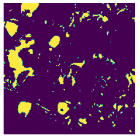

[TOC]

## ８　機械学習

**スマート農業**とは「生産現場の課題を先端技術で解決する！農業分野における**Society5.0**の実現」を目指して、**ロボット**技術や**ICT**を活用して超省力・高品質生産を実現する新たな農業のことです（農水省HPより）。いわゆる機械学習モデルと呼ばれ る大量のデータの分析を基に、ある種の法則に基づくモデルを構築し、農業生産に関わる予測や、人間の判断等の支援や作業の自動化等を行うものです。

> 農業分野においては、例えば病害虫被害診断とこれを踏まえた防除 支援、施設栽培等における環境管理支援や、農作業の自動化支援（水・肥料の投与 等）、収穫作業の自動化（ロボット等）、農業技術習得支援などの利用のための研究開 発や製品・サービスの提供が進められているところです。[農業分野におけるAI・データに関する契約ガイドライン]

しかし、農業従事者または農業団体による農業データの提供が、ノウハウや技術の流出とならないよう、農業関係者が安心 して農業データを提供できる枠組みを提供する必要があるとの考えから農林水産省では「農業分野におけるAI・データに関する契約ガイドライン」を策定しています。

いちごの成熟度を認識して自動で収穫するロボットなど、大規模データの機械学習に基づく実用化された技術も多いようです。ここではそのような技術の基本となる要素技術、すなわち画像を用いた機械学習について解説します。

<br>

### ８−１　デジタル画像

デジタル画像に対する言葉にはアナログ画像があります。アナログとは写真機でフィルムに記録したもの、あるいは絵や書物など、濃度や解像度が連続的なものです。それに対してデジタル画像は、２次元の画素の集合体です。画素はピクセルやドットと呼ばれますが、デジタル画像の最小単位で、位置と強度の情報を持ちます。

<br>

#### ８−１−１　標本化と量子化

アナログからデジタルへの変換は標本化と量子化の2つのプロセスで処理されます。標本化とは図①に示すように連続した信号を一定の間隔でサンプリングすることです。図１はマツの木口面の写真の一部を年輪に垂直な方向に標本化したもので、アナログ曲線がが一定間隔の点の集合となりました。この段階ではそれぞれの点の持つ強度は浮動小数点ですが、図②に示すように、強度を整数倍（通常2の冪乗）に分割された階級値に丸めます。これを量子化と言います。このようにして、２次元双方に標本化して強度を量子化したものがデジタル画像です。

デジタルカメラやスマートフォンを購入すると、カメラのスペックとして画素数：2,400万画素　階調：24bit RGB などの性能表示がされています。この場合、一つの画像どのくらいのメモリが必要が計算してみます。

​     24,000,000 x 24 x 3 (R,G,B) =1,728,000,000 [bit]

8bitが1Byteなので、

​     1,728,000,000 / 8 = 216,000,000 [Byte]

1,024 Byte = 1 Kilobyte[KB] , 1,024 KiloByte = 1 Megabyte[MB] なので

​     216,000,000 [Byte] = 206[MB]

となりなります。これを白黒のグレースケールで256階調の画像とすると23MBとなります。濃度RGB画像をグレースケールに変換するためには、中間値法、NTSC 加重平均法、HDTV 法などが用いられますが、一般的なNTSC 加重平均法 では以下の式で与えられます。
$$
Y(輝度値)= 0.298912\times R + 0.586611\times G + 0.114478\times B
$$


<br>

#### ８−１−２　画像ファイルの構造

実は、すでにGISのところで扱ったラスタータイプのデータがまさにデジタル画像です。青森県の「まるごと青森」というHPから写真をお借りしました。この画像をスクリプトで読み込んでみます。


```python
from PIL import Image
import numpy as np
import matplotlib.pyplot as plt
%matplotlib inline
#
img_name='../../../GitHubData/DataScience_AI/data/CV/apples.png'
im=Image.open(img_name)
print('サイズは'+str(im.size)+':'+'階調は'+str(im.mode))
# RGBAというタイプの画像だと分かったのでRGBに変換します。
im_rgb=im.convert('RGB')
im_rgb_a=np.asarray(im_rgb)
# RGBの画像を配列にします。
# RGBそれぞれのチャンネルの画像を表示。
colors=['Reds', 'Greens', 'Blues']
fig, ax =plt.subplots(ncols=5,figsize=(12,3))
ax[0].imshow(im_rgb_a[:180,:180,:])
ax[0].axis('off')
for i in range(3):
    ax[i+1].imshow(im_rgb_a[:180,:180,i], cmap=colors[i])
    ax[i+1].axis('off')
im_gray=im.convert('L')
im_gray_a=np.asarray(im_gray)
ax[4].imshow(im_gray_a[:180,:180],cmap='gray')
ax[4].axis('off')
plt.show()
```

 上のスクリプトでは apple.pngを読み込み、階調をRGBに変換し、その画像の左上から180x180ピクセルの画像を切り出して、元画像に続けてチャンネル（RGBごと）に表示し、最後にRGB画像をグレースケール変換した画像を表示します。これからも、画像データは、２次元の数値データ配列が層状に重なったものであることが理解できるでしょう。


実際に左上から10x10ピクセルのチャンネル０即ち赤の数値データは以下の通りで,　0~255までの整数、即ち８bitであることがわかりました。

```python
>>>im_rgb_a[:10,:10,0]
array([[132, 132, 132, 132, 133, 133, 134, 134, 134, 135],
       [132, 132, 132, 132, 133, 134, 134, 135, 135, 136],
       [132, 132, 133, 133, 134, 135, 135, 136, 136, 137],
       [131, 131, 133, 134, 135, 136, 136, 136, 138, 138],
       [137, 138, 136, 135, 135, 133, 134, 137, 136, 137],
       [101, 124, 132, 135, 135, 140, 140, 138, 139, 140],
       [ 46,  96,  97,  77,  92, 111, 132, 145, 145, 137],
       [ 62,  90,  96,  63,  69,  68,  82, 113, 134, 145],
       [134,  84,  41,  71,  72,  77,  76,  73, 109, 165],
       [139, 138, 108,  58,  68, 105,  79, 136, 186, 198]], dtype=uint8)
```

このような画像データを用いて、ロボットがリンゴが熟したかどうかを自動的に判断し、収穫を行うようにするのがいわゆるスマート農業です。

<br>

### ８−３　学習が必要な理由

まず、上の写真からリンゴを抜き出すのにはどうしたらいいでしょうか？それぞれの標本が持つ固有の特徴を求める必要があります。リンゴは赤いから赤のチャンネルの値を使って閾値を決めることができるでしょうか。次のスプリプトでは、レベル200より大きなもピクセルをリンゴとしてみましたが、リンゴを選択的に抜き出すことはできていません。つまり、日当たりの良いものもあれば、葉や枝の影になっているもの、さらにはリンゴのうしろに隠れているリンゴとか、一つの基準では到底線引きのできないリンゴが写っているわけです。ではなぜ我々が認識できるのかといえば、丸い形であるとかも含め、複数の基準で持って判断をしていることに他なりません。そのような情報を計算機に学習させることができれば賢いAIができることになります。

```python
plt.imshow(im_rgb_a[:180,:180,0]>200)
plt.axis('off')
plt.show()
```



<br>

### ８−４　深層学習とは

深層学習はいわゆる機械学習の一つです。前に述べたサポートベクターマシンによる判別実験も機械学習の一つです。東京⼤学の松尾⽒（情報学）は、深層学習を直感的に理解させるために、「深い最⼩⼆乗法」という表現を使っておられました。標本とその予測式があるとして、その実際の値から予測値がどれだけずれているか、誤差を取って⼆乗します。全ての実測値の⼆乗の和が最⼩になる様に、予測式を作るのが最⼩⼆乗法。⼀⽅で深いというのは、変数が多いということ。いわゆる重回帰分析では、変数の数は数個から数⼗個ですが、これが100 万にも及ぶのが深層学習です、と言われてみなさん合点がいくだろうか。

８−４−１

