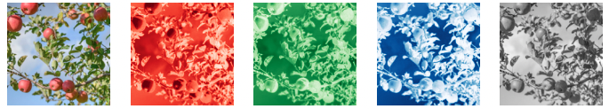
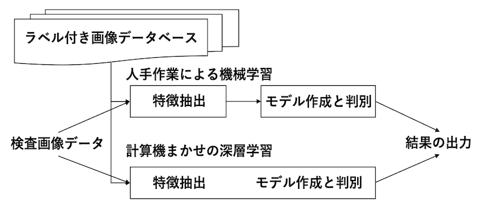
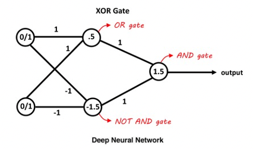
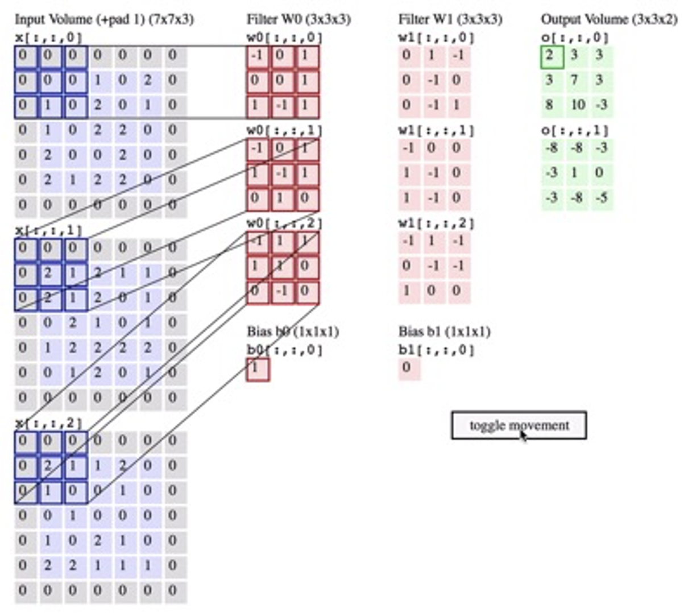
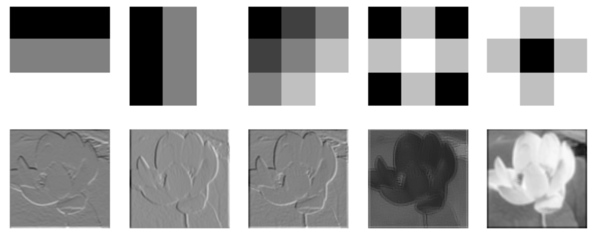
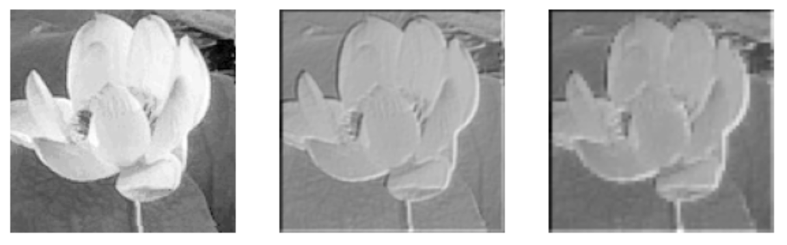
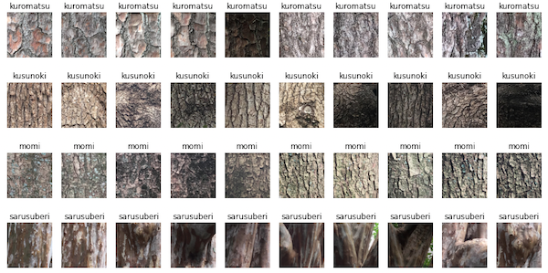
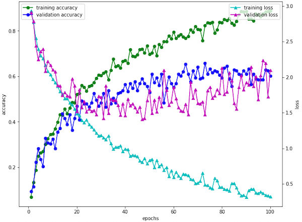
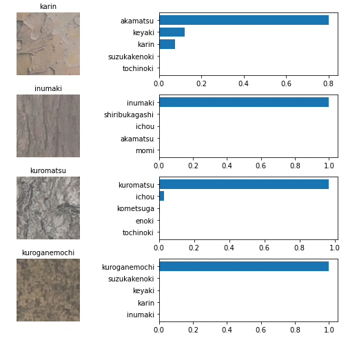
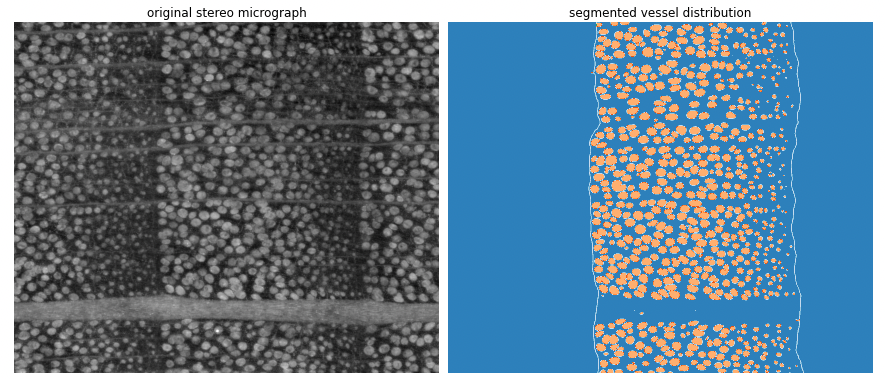

[TOC]

## ８　機械学習

**スマート農業**とは「生産現場の課題を先端技術で解決する！農業分野における**Society5.0**の実現」を目指して、**ロボット**技術や**ICT**を活用して超省力・高品質生産を実現する新たな農業のことです（農水省HPより）。いわゆる機械学習モデルと呼ばれ る大量のデータの分析を基に、ある種の法則に基づくモデルを構築し、農業生産に関わる予測や、人間の判断等の支援や作業の自動化等を行うものです。

> 農業分野においては、例えば病害虫被害診断とこれを踏まえた防除 支援、施設栽培等における環境管理支援や、農作業の自動化支援（水・肥料の投与 等）、収穫作業の自動化（ロボット等）、農業技術習得支援などの利用のための研究開 発や製品・サービスの提供が進められているところです。[農業分野におけるAI・データに関する契約ガイドライン]

しかし、農業従事者または農業団体による農業データの提供が、ノウハウや技術の流出とならないよう、農業関係者が安心 して農業データを提供できる枠組みを提供する必要があるとの考えから農林水産省では「農業分野におけるAI・データに関する契約ガイドライン」を策定しています。

いちごの成熟度を認識して自動で収穫するロボットなど、大規模データの機械学習に基づく実用化された技術も多いようです。ここではそのような技術の基本となる要素技術、すなわち画像を用いた機械学習について解説します。

<br>

### ８ー１　デジタル画像

デジタル画像に対する言葉にはアナログ画像があります。アナログとは写真機でフィルムに記録したもの、あるいは絵や書物など、濃度や解像度が連続的なものです。それに対してデジタル画像は、２次元の画素の集合体です。画素はピクセルやドットと呼ばれますが、デジタル画像の最小単位で、位置と強度の情報を持ちます。

<br>

#### ８ー１ー１　標本化と量子化

アナログからデジタルへの変換は標本化と量子化の2つのプロセスで処理されます。標本化とは図①に示すように連続した信号を一定の間隔でサンプリングすることです。図１はマツの木口面の写真の一部を年輪に垂直な方向に標本化したもので、アナログ曲線がが一定間隔の点の集合となりました。この段階ではそれぞれの点の持つ強度は浮動小数点ですが、図②に示すように、強度を整数倍（通常2の冪乗）に分割された階級値に丸めます。これを量子化と言います。このようにして、２次元双方に標本化して強度を量子化したものがデジタル画像です。

デジタルカメラやスマートフォンを購入すると、カメラのスペックとして画素数：2,400万画素　階調：24bit RGB などの性能表示がされています。この場合、一つの画像どのくらいのメモリが必要が計算してみます。

​     24,000,000 x 24 x 3 (R,G,B) =1,728,000,000 [bit]

8bitが1Byteなので、

​     1,728,000,000 / 8 = 216,000,000 [Byte]

1,024 Byte = 1 Kilobyte[KB] , 1,024 KiloByte = 1 Megabyte[MB] なので

​     216,000,000 [Byte] = 206[MB]

となりなります。これを白黒のグレースケールで256階調の画像とすると23MBとなります。濃度RGB画像をグレースケールに変換するためには、中間値法、NTSC 加重平均法、HDTV 法などが用いられますが、一般的なNTSC 加重平均法 では以下の式で与えられます。
$$
Y(輝度値)= 0.298912\times R + 0.586611\times G + 0.114478\times B
$$


<br>

#### ８ー１ー２　画像ファイルの構造

実は、すでにGISのところで扱ったラスタータイプのデータがまさにデジタル画像です。青森県の「まるごと青森」というHPから写真をお借りしました。この画像をスクリプトで読み込んでみます。


<br>

```python
from PIL import Image
import numpy as np
import matplotlib.pyplot as plt
%matplotlib inline
#
img_name='../../../GitHubData/DataScience_AI/data/CV/apples.png'
im=Image.open(img_name)
print('サイズは'+str(im.size)+':'+'階調は'+str(im.mode))
# RGBAというタイプの画像だと分かったのでRGBに変換します。
im_rgb=im.convert('RGB')
im_rgb_a=np.asarray(im_rgb)
# RGBの画像を配列にします。
# RGBそれぞれのチャンネルの画像を表示。
colors=['Reds', 'Greens', 'Blues']
fig, ax =plt.subplots(ncols=5,figsize=(12,3))
ax[0].imshow(im_rgb_a[:180,:180,:])
ax[0].axis('off')
for i in range(3):
    ax[i+1].imshow(im_rgb_a[:180,:180,i], cmap=colors[i])
    ax[i+1].axis('off')
im_gray=im.convert('L')
im_gray_a=np.asarray(im_gray)
ax[4].imshow(im_gray_a[:180,:180],cmap='gray')
ax[4].axis('off')
plt.show()
```

 上のスクリプトでは apple.pngを読み込み、階調をRGBに変換し、その画像の左上から180x180ピクセルの画像を切り出して、元画像に続けてチャンネル（RGBごと）に表示し、最後にRGB画像をグレースケール変換した画像を表示します。これからも、画像データは、２次元の数値データ配列が層状に重なったものであることが理解できるでしょう。




<br>

実際に左上から10x10ピクセルのチャンネル０即ち赤の数値データは以下の通りで,　0~255までの整数、即ち８bitであることがわかりました。

```python
>>>im_rgb_a[:10,:10,0]
array([[132, 132, 132, 132, 133, 133, 134, 134, 134, 135],
       [132, 132, 132, 132, 133, 134, 134, 135, 135, 136],
       [132, 132, 133, 133, 134, 135, 135, 136, 136, 137],
       [131, 131, 133, 134, 135, 136, 136, 136, 138, 138],
       [137, 138, 136, 135, 135, 133, 134, 137, 136, 137],
       [101, 124, 132, 135, 135, 140, 140, 138, 139, 140],
       [ 46,  96,  97,  77,  92, 111, 132, 145, 145, 137],
       [ 62,  90,  96,  63,  69,  68,  82, 113, 134, 145],
       [134,  84,  41,  71,  72,  77,  76,  73, 109, 165],
       [139, 138, 108,  58,  68, 105,  79, 136, 186, 198]], dtype=uint8)
```

このような画像データを用いて、ロボットがリンゴが熟したかどうかを自動的に判断し、収穫を行うようにするのがいわゆるスマート農業です。

<br>

### ８ー２　学習が必要な理由

まず、上の写真からリンゴを抜き出すのにはどうしたらいいでしょうか？それぞれの標本が持つ固有の特徴を求める必要があります。リンゴは赤いから赤のチャンネルの値を使って閾値を決めることができるでしょうか。次のスプリプトでは、レベル200より大きなもピクセルをリンゴとしてみましたが、リンゴを選択的に抜き出すことはできていません。つまり、日当たりの良いものもあれば、葉や枝の影になっているもの、さらにはリンゴのうしろに隠れているリンゴとか、一つの基準では到底線引きのできないリンゴが写っているわけです。ではなぜ我々が認識できるのかといえば、丸い形であるとかも含め、複数の基準で持って判断をしていることに他なりません。そのような情報を計算機に学習させることができれば賢いAIができることになります。

```python
plt.imshow(im_rgb_a[:180,:180,0]>200)
plt.axis('off')
plt.show()
```


<br>

### ８ー３　深層学習とは



<br>

図に示すように、コンピュータによる機械学習を用いた人工知能の設計には、大きく分けて２つの方法があります。一つは、人が設計したルールに従って、人が行えないような判定をコンピュータに下させるという試みです。まず、デジタル画像を、人が設計した特徴抽出法により数値化し、次に数値化した特徴を、人が設計したルールを盛り込んだ判別器にかけます。この方法は、コンピュータが「何をみているか」検証しやすいという利点を持ち合わせています。これを薄層学習と呼ぶ人もいます。

一方、今のAIブームを牽引しているのは、いわゆるディープラーニング（深層学習：deep learning）と呼ばれる機械学習技術の進化形である。これは、先に述べた学習に必要な二つのプロセス（特徴抽出と判別）を自動化したものです。計算機の高速化、ビッグデータの活用も相まって、精度はうなぎ上りに上昇し、深層学習は様々な分野に急速に広がっています。

つまり、深層学習はいわゆる機械学習の一つです。前に述べたサポートベクターマシンによる判別実験も立派な機械学習の一つです。東京⼤学の松尾⽒（情報学）は、深層学習を直感的に理解させるために、「深い最⼩⼆乗法」という表現を使っておられた。標本とその予測式があるとして、その実際の値から予測値がどれだけずれているか、誤差を取って⼆乗します。全ての実測値の⼆乗の和が最⼩になる様に、予測式を作るのが最⼩⼆乗法。⼀⽅で深いというのは、変数が多いということ。いわゆる重回帰分析では、変数の数は数個から数⼗個ですが、これが100 万にも及ぶのが深層学習です、と言われてみなさん合点がいくだろうか。結果的にはモデルにさまざまな選択肢を与えることができるので、どんなものにも対応できるモデルができるのです。


<br>

#### ８ー３ー１　ニューラルネットワーク

選択肢となる要素はニューロンと呼ばれる脳神経細胞から発想を得て考案されたものです。脳神経細胞では、樹状突起という部位で他の細胞から複数の入力を受けとり、入力がある一定以上に達すると信号を出力すると考えられています。それをモデルにしたのがとパーセプトロンであり、1957年にローゼンブラッドにより発明されたました。左図がニューロン、右図がパーセプトロンです。一言で言えば、複数の入力に対して１つの出力を行う関数です。

 

<br>

右図で$X1, X2…$は入力信号、$w1, w2…$は重みを表す。入力に重みが乗算され、その総和が閾値を超えたら１を、それ以外は０を出力する。実際には、ニューロンが発火するか否かは、活性化関数で数式化されます。単純なステップ関数、シグモイド関数や、ReLU（Rectified Linear Unit)と呼ばれる非線形関数がある。
$$
y= \left\{
\begin{array}{ll}
1 & \sum_{i=1}^{n} w_iX_i \le 0 \\
0 & \sum_{i=1}^{n} w_iX_i < 0
\end{array}
\right.
$$
重み$w$は、各信号の重要度を示します。総和がある閾値を超えて、1を出力した場合その情報が次のノードに伝わることになり、「ニューロンが発火する」と表現したりします。果たして、この単純なパーセプトロンモデルで、７−５−３で説明した論理和や論理積が説明できるか考えてみましょう。

答えから言えば、重みと閾値を適切に設定することで、AND, OR, NANDは表すことができるるのですが、排他的論理和XORが実装できません。しかしながら、図のように、AND, OR, NANDを２段に組み直すこと、つまり多層にすることでXORが実現します。この多層のパーセプトロンがニューラルネットワークの重要な要素で、深くすればするだけ、単純パーセプトロンでは学習できない複雑なモデル（非線形のモデル）を作ることができます。



<br>

#### ８ー３ー２　コンボリューショナルニューラルネットワーク

画像の２次元的な情報を学習するアルゴリズムの基本形が、いわゆる畳み込みニューラルネットワーク(CNN：Convolutional Neural Network)です。畳み込み計算とは、ある関数$A$を平行移動しながら関数$B$に掛ける、足す処理である。パーセプトロンの$X_1$に相当するのが、$n \times n$小領域の２次元の画像で、$w_1$に相当するのが、局所的な濃度変化、エッジなどを検出するフィルター演算処理（積和）である。引き続いて、$n \times n$小領域を１ピクセルずつずらしながら画像全域に対して処理することで、フィルターの数だけ新しい画像を出力して、次の層へ繋ぎます。$n \times n$小領域を２ピクセルずつずらすと、出力画像は入力画像のほぼ2分の１のサイズとなるが、この様にして、画像を徐々に縮小しながら、解像度の異なる特徴の抽出層を構築している。図は、入力画像、$5\times5$に対して、$3\times3$のフィルター処理を施す例である。まず、入力画像の外周に一列加え（パッディング=1）、１ピクセルおきに（ストライド=2）フィルタ処理を施し、結果として3x3の出力画像を得ている。

 



> CS231n Convolutional Neural Networks for Visual Recognition Course Website https://cs231n.github.io/convolutional-networks/
>
> **Convolution Demo**. Below is a running demo of a CONV layer. Since 3D volumes are hard to visualize, all the volumes (the input volume (in blue), the weight volumes (in red), the output volume (in green)) are visualized with each depth slice stacked in rows. The input volume is of size W1=5,H1=5,D1=3W1=5,H1=5,D1=3, and the CONV layer parameters are K=2,F=3,S=2,P=1K=2,F=3,S=2,P=1. That is, we have two filters of size 3×33×3, and they are applied with a stride of 2. Therefore, the output volume size has spatial size (5 - 3 + 2)/2 + 1 = 3. Moreover, notice that a padding of P=1P=1 is applied to the input volume, making the outer border of the input volume zero. The visualization below iterates over the output activations (green), and shows that each element is computed by elementwise multiplying the highlighted input (blue) with the filter (red), summing it up, and then offsetting the result by the bias.

<br>

このような計算を繰り返して、何枚ものフィルター処理をしてデータの局所領域の特徴を抽出つつ、ストライドで画像を縮小することを繰り返して最終的に、２次元の画像の情報を一次元のベクトルに落とし込んで、判別問題あるいは回帰問題のモデル（最小二乗法によって$w_i$などを解く）を求めます。

<br>

#### ８ー３ー３　一連の処理、フィルタリング（コンボリューション）、プーリング

$3 \times  3$の$w_1$から$w_5$の簡単なフィルターを設計します。

```python
import numpy as np
w1=[-1,-1,-1,0,0,0,1,1,1]
w2=[-1,0,1,-1,0,1,-1,0,1]
w3=[-1,-0.5,0,-0.5,0,0.5,0,0.5,1]
w4=[-1,0.5,-1,0.5,1,0.5,-1,0.5,-1]
w5=[1,0.5,1,0.5,-1,0.5,1,0.5,1]
w=np.array([w1,w2,w3,w4,w5])
wi=w.reshape(5,3,3)
```

<br>

浄土宗の本山で東山の華頂山にある知恩院というお寺で蓮の花を写真に撮りました。その画像を、画像の読み込みます。みなさんもお気に入りの写真で試してください。

```python
from PIL import Image
import matplotlib.pyplot as plt
im=Image.open('lotus.png')
imc=np.array(im.convert('L'))
plt.imshow(im)
plt.axis('off')
plt.show()
```


<br>

フィルターによる畳み込み計算を最初の3つのフィルターは垂直方向、水平方向、対角線方向に濃度差を持たせたもので、その方向に垂直なエッジ（濃度の変化があるところ）が強調されているのがわかります。4番目と5番目のフィルターは逆に輪郭を隈取りするような効果があるかに見えます。

```python
from scipy import signal
imgs=[]
num=5
fig, ax = plt.subplots(ncols=num,nrows=2, figsize=(10,4))

for i in range(num):
    imca=signal.convolve2d(imc,wi[i])
    imgs.append(imca)
    ax[0,i].imshow(wi[i],cmap='gray')
    ax[0,i].axis('off')
    ax[1,i].imshow(imca,cmap='gray')
    ax[1,i].axis('off')
plt.show()
```



<br>

次に原画像とフィルター後の5枚の写真を線形結合したもの、さらにストライド2（1ピクセルおきに）最大値プーリングした画像を見てみます。

```python
from skimage import measure
imgsum=np.array(imgs).sum(axis=0)
fig, ax = plt.subplots(ncols=3,nrows=1, figsize=(10,5))
ax[0].imshow(imc,cmap='gray')
ax[0].axis('off')
ax[1].imshow(imgsum,cmap='gray')
ax[1].axis('off')
ax[2].imshow(measure.block_reduce(imgsum, (2,2), np.max),cmap='gray')
ax[2].axis('off')
plt.show()

img_mpx=measure.block_reduce(imgsum, (2,2), np.max)
```



<br>

上の畳み込みとダウンサイジング・プーリングを繰り返してみます。同じ5つのフィルター処理に加えて、ストライド２で圧縮した画像は次のようになりました。画像が簡略化されて、特徴が単純化していくことがわかるでしょうか。実際はフィルターが変数となって最小二乗法によって最適化されて、より画像の特徴を捉えるように変化していく、と考えてください。


<br>

#### ８ー３ー４　判別あるいは回帰関数

ネットワークの最後には、判別問題や回帰問題に合わせて関数を設定します。さまざまありますが、複数の出力値の合計が「1.0」（＝100％）になるような値を返すソフトマックス(Softmax)関数は、主に分類問題の出力層で使われます。一方で、回帰問題の場合は、Root Mean Squared Error (RMSE)あるいはMean Absolute Error (MAE)といった精度評価指標が使われます。

<br>

### ８ー４　簡単な識別ネットワークの試作

数年前、農工大の学生さん達と京都御所に植栽されている樹木の樹皮の画像データベースを作りました。各自撮影した写真を樹種ごとにフォルダにまとめ、各画像の中心部分から$128 \times 128$ pixelの画像を切りとったのが下の図です。全体の85%のデータを学習用に、残りの15％を評価用としてtrainとtestデータベースを準備します。



ここでは、ジェネレーターを使って学習用のデータを水増ししています。上下に反転させたり、回転させたりなどして、手持ちのデータを増やす工夫です。


```python
import numpy as np
import tensorflow as tf
from tensorflow.keras.preprocessing.image import ImageDataGenerator
from tensorflow.keras.utils import to_categorical
from tensorflow.keras import datasets, layers, models

imsz=128
epochs_num=100

test=np.load('Datascience_AI/CV/CNN/test_128_128.npz')
train=np.load('Datascience_AI/CV/CNN/train_128_128.npz')
num_classes=len(train['arr_2'])
x_train,y_train,x_test,y_test=train['arr_0'],train['arr_1'],test['arr_0'],test['arr_1']
y_train = to_categorical(y_train, num_classes)
y_test = to_categorical(y_test, num_classes)

datagen = ImageDataGenerator(
    rotation_range=20,
    width_shift_range=0.2,
    height_shift_range=0.2,
    horizontal_flip=True)

datagen.fit(x_train)
```

単純な4層からなる直列のモデルを作成します。

```python
# example of 4 layered convnet
model = models.Sequential()
model.add(layers.Conv2D(16, (3, 3), activation='relu', input_shape=(imsz, imsz, 3)))
model.add(layers.MaxPooling2D((2, 2)))
model.add(layers.Conv2D(32, (3, 3), activation='relu'))
model.add(layers.MaxPooling2D((2, 2)))
model.add(layers.Conv2D(64, (3, 3), activation='relu'))
model.add(layers.MaxPooling2D((2, 2)))
model.add(layers.Conv2D(128, (3, 3), activation='relu'))
model.add(layers.MaxPooling2D((2, 2)))
model.add(layers.Conv2D(256, (3, 3), activation='relu'))
```

トップレイヤーに識別器をおきます。softmax関数で、20種の解に全結合の２層を入れました。

```python
# classifier on top of the convnet
model.add(layers.Flatten())
model.add(layers.Dense(128, activation='relu'))
model.add(layers.Dense(num_classes, activation='softmax'))
```
モデルの構造を確認します。
```python
model.summary()
```

```text
Model: "sequential"
_________________________________________________________________
Layer (type)                 Output Shape              Param #   
=================================================================
conv2d (Conv2D)              (None, 126, 126, 16)      448       
_________________________________________________________________
max_pooling2d (MaxPooling2D) (None, 63, 63, 16)        0         
_________________________________________________________________
conv2d_1 (Conv2D)            (None, 61, 61, 32)        4640      
_________________________________________________________________
max_pooling2d_1 (MaxPooling2 (None, 30, 30, 32)        0         
_________________________________________________________________
conv2d_2 (Conv2D)            (None, 28, 28, 64)        18496     
_________________________________________________________________
max_pooling2d_2 (MaxPooling2 (None, 14, 14, 64)        0         
_________________________________________________________________
conv2d_3 (Conv2D)            (None, 12, 12, 128)       73856     
_________________________________________________________________
max_pooling2d_3 (MaxPooling2 (None, 6, 6, 128)         0         
_________________________________________________________________
conv2d_4 (Conv2D)            (None, 4, 4, 256)         295168    
_________________________________________________________________
flatten (Flatten)            (None, 4096)              0         
_________________________________________________________________
dense (Dense)                (None, 128)               524416    
_________________________________________________________________
dense_1 (Dense)              (None, 20)                2580      
=================================================================
Total params: 919,604
Trainable params: 919,604
Non-trainable params: 0
_________________________________________________________________
```

モデルの計算に必要な多次元の配列をメモリ上に確保して、計算を始めます。この際に、GPUなどの高速演算装置があると圧倒的な効率化が可能になります。

```python
model.compile(optimizer='adam',
              loss='categorical_crossentropy',
              metrics=['accuracy'])

res=model.fit(datagen.flow(x_train, y_train, batch_size=32),\
                        steps_per_epoch=int(len(x_train) / 32), \
              epochs=epochs_num, validation_data=(x_test,y_test))
```

result (res) に出力されたデータをプロットとして、モデルの学習曲線を見てみましょう。続いて図と計算結果のモデルを保存します。

```python
import matplotlib.pyplot as plt
%matplotlib inline

acc=res.history['accuracy']
loss=res.history['loss']
val_acc=res.history['val_accuracy']
val_loss=res.history['val_loss']
epochs=range(1,len(acc)+1)
fig, ax1= plt.subplots(figsize=(10,8))
ax2=ax1.twinx()
ax1.plot(epochs, acc, '-go', label='training accuracy')
ax2.plot(epochs, loss, '-c^', label='training loss')
ax1.plot(epochs, val_acc, '-bo', label='validation accuracy')
ax2.plot(epochs, val_loss, '-m^', label='validation loss')
ax1.set_xlabel('epochs')
ax1.set_ylabel('accuracy')
ax2.set_ylabel('loss')
ax1.legend()
ax2.legend()
plt.savefig('Datascience_AI/CV/CNN/history/CNN_bark_'+str(imsz)+'_'+str(epochs_num)+'epo.png')
plt.show()
# modelを保存する。
model.save('Datascience_AI/CV/CNN/model/CNN_bark_'+str(imsz)+'_'+str(epochs_num)+'epo.h5')
```



学習用データから作成するモデルの精度はどんどん上昇していますが、評価用のデータを使った精度の向上は頭打ちとなり、50試行回を超えると誤差も小さくならなりました。この原因は、モデルが学習用のデータに合いすぎた、つまり勉強のしすぎです。このような現象を「過学習」といい、機械学習では注意するべきことの一つですが、学習用データを増やすこと以外にも、ネットワークに工夫するなど様々な対策がとられるところです。ここでは触れずに置きます。さて、次にこの不完全なモデルで、実際のテスト画像をいくつか予測してみましょう。

```python
hdf_source='Datascience_AI/CV/CNN/model/CNN_bark_128_100epo.h5'

batch_size_is=24

datagen = ImageDataGenerator()
testgen=datagen.flow(x_test,y_test, batch_size=24)

new_model = tf.keras.models.load_model(hdf_source)

X,Y=testgen.__next__()
true_classes=np.argmax(Y, axis=1)
preds_ft = new_model.predict(X)
pred_classes_ft = np.argmax(preds_ft, axis=1)

# Get the names of classes
class_names=train['arr_2']

fig, ax= plt.subplots(nrows=batch_size_is, ncols=2, figsize=(8, 40))
for i in range(batch_size_is):
    best_5=np.argsort(preds_ft[i])[-5:]
    ax[i,0].imshow(X[i]/ 2 + 0.5)
    ax[i,0].set_title(str(np.array(class_names)[true_classes[i]]),fontsize=10)
    ax[i,0].axis('off')
    label=np.array(class_names)[best_5]
    ax[i,1].barh(label,preds_ft[i][best_5])
    ax[i,1].set_yticks([0, 1, 2, 3, 4])
    ax[i,1].set_yticklabels(label,rotation=0,ha='right', fontsize=10)       
fig.tight_layout()
plt.savefig('Datascience_AI/CV/CNN/prediction/prediction_tmp.jpg',dpi=200)
plt.show()
```




以上、４層のCNNによる街路樹樹皮の自動認識の試みでした。

<br>

### ８ー５　進化するネットワーク

深層学習の分野における進歩には目を見張るものがあり、数学的な基礎から応用技術に至るまで広範です。今後農学分野でどのような利用があるか、また環境データサイエンスという枠組みの中でとのような進展があるか、予想もつきません。私が機械学習に興味を持った時点では、人のできない判断や予想ができるということで、専門性を必要としない樹種の同定や、木材を使う上での物性の予測ができれば良い程度に思っていました。今や、人ができないことをずっと上手くやるということがあながち無理ではないと感じています。そういう感覚を持った原因となった展開の一つが、**生成ディープラーニング**(generative deep learning)です。


<br>

簡単にいうと、画像を学習し、自ら画像を作り出すネットワーク、音楽を学び、自ら作曲するネットワークです。私のラボでも、この方法で木材の細胞を一つ一つ認識して、細胞種ごとに名前をつけて、計測してということが可能になりました。また、低倍率の実体顕微鏡画像から道管を自動的に認識して、一つの年輪から取り出すような作業も自動化できるようになりました。このような技術をどのように研究に活かせていくか、過度に依存するのも問題のようには思いますが、確実に重要な技術になるように感じます。




<br>

最後に以下のサイトを参照しながら、技術者の方がどのような仕事を進めているか見てみましょう。

https://thecores.denso.com/ja/robot01/?utm_source=google&utm_medium=cpc&utm_campaign=rebranding&gclid=EAIaIQobChMInsC59ovq9AIVxbWWCh1t5A2wEAAYASAAEgIvwPD_BwE


興味のある人は：

Semantic segmentation:

GAN: *Generative Adversarial Network*

など調べてみてください。

<br>

------

<br>

以上：　この講義ノートに関して、誤字脱字を含め、ご意見ありましたらよろしく願います。　

2021年12月18日

​                                                                京都大学大学院　農学研究科　森林科学専攻　杉山淳司　sugiyama.junji.6m@kyoto-u.ac.jp

<br>

------

<br>

