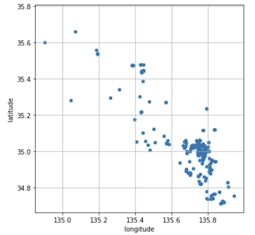
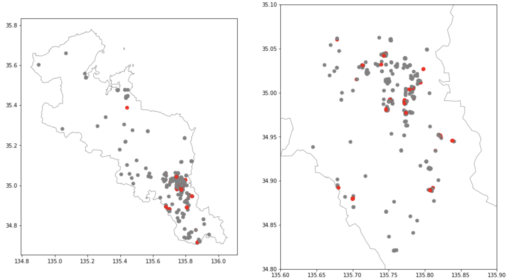
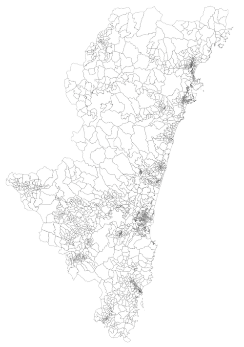
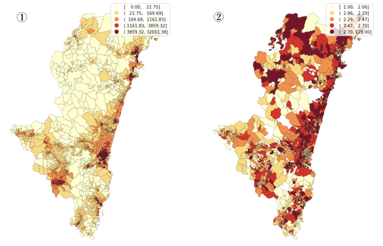
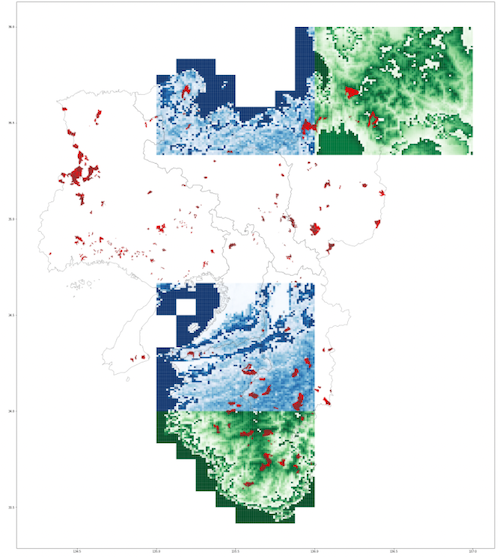

[TOC]

## ６　地理情報データを扱う

<br>

GISについて少し触れてみようと思います。以下国土交通省国土地理院のHPからの引用です。

>　地理情報システム（**GIS：Geographic Information System**）は、地理的位置を手がかりに、**位置に関する情報を持ったデータ（空間データ）** を総合的に管理・加工し、視覚的に表示し、高度な分析や迅速な判断を可能にする技術である。
>　平成7年1月の阪神・淡路大震災の反省等をきっかけに、政府において、GISに関する本格的な取組が始まった。その中核となる取組が、国土空間データ基盤の整備である。
>　ハードウェア、ソフトウェアの低価格化が進み、簡易なGIS導入が可能になる一方で、地図データ等については、電子化されていない、データ仕様が異なり利用できない等の問題があり、GISを導入する主体が、各々整備する必要があり、社会的には二重、三重の投資となる等の問題があった。
>　このため、GISを高度に活用できる社会の実現のためには、地図情報の電子化のみならず、それを活用していく技術、制度、人材等が必要であり、これらの総体を社会的な基盤としてとらえ、その総合的、体系的な整備を図っていく必要性が認識され始めた。
>　このような背景のもと、平成19年５月には、地理空間情報の活用の推進に関する施策を総合的かつ計画的に推進することを目的として、**地理空間情報活用推進基本法**が、国会で制定された。

<br>

この章では、**GISデータ**やそれに付随する統計量の扱い方について初歩的なところを学習します。データの形式にはベクター型とラスター型との２種類があり、それぞれデータに表記されています。

**ベクター型**のデータとは、複数の地理上の点の位置とそれを繋いだ線、軌跡、区画などを数値データとして記録して再現する形式です。数値で管理しているので、描いたグラフィック自体はデータ量も小さく、拡大縮小もスムーズです。例えば河川や道路、区画をなどさまざまな表現に使われます。

一方**ラスター型**は、ある特定の区画（１００メートル四方とか1km四方等）のメッシュを設けて地理的な区域を分割し、その区画内における情報を数値として表現する形式です。区画をピクセルに例えれば、格子状（グリッド状）に並んだピクセルで構成されるデータと言えます。まさに、濃淡のある画像として表現されるデータです。この場合解像度は設定された区画の大きさから変わることはありません。

ここではpythonによる初歩的な使い方をまとめますが、GISデータの取り扱いに関しては、QGIS(https://qgis.org/ja/site/forusers/download.html) という便利なアプリケーションがフリーで公開されていいます。


<br>

### ６ー１　データの構造とその表示

<br>

> GeoPandas is an open source project to make working with geospatial data in python easier. GeoPandas extends the datatypes used by [pandas](http://pandas.pydata.org/) to allow spatial operations on geometric types. Geometric operations are performed by [shapely](https://shapely.readthedocs.io/). Geopandas further depends on [fiona](https://fiona.readthedocs.io/) for file access and [matplotlib](http://matplotlib.org/) for plotting.

<br>

ここでは**geopanda**（https://geopandas.org/)（GIS用データをpandas形式に拡張したり、matplotlibで可視化できる）で処理します。

<br>

#### ６ー１ー１　文化庁の指定文化財

<br>

文化庁は国指定文化財等データベース（https://kunishitei.bunka.go.jp/bsys/index） を公開しています。「国宝・重要文化財（建造物）」を開いて「都道府県別にみる」から「京都府」を選択すると一覧がでてきますので、それらを**csv**出力してデータとします（Kyoto_Architecture.csv）。まず、**csv**ファイルを**pandas**の`DataFrame( )`として読み込みますが、その際、名称、国宝か重要文化財か、時代、緯度、経度の５項目のみを読み込みます。最後に各建造物の緯度と経度のデータをつかって横軸緯度、縦軸経度のグラフ上に散布図をつくります。データとしてはベクター型の点のデータです。

<br>

```python
import os
%matplotlib inline
import matplotlib.pyplot as plt
import pandas as pd

df_temple = pd.read_csv('../../GitHubData/DataScience_AI/data/GIS/Kyoto_Architecture.csv',\
                        usecols = [2, 5, 8, 16, 17],\
                        dtype  = {'名称': str, '種別1': str, '時代': str, '緯度': float, '経度': float})
df_temple = df_temple.rename(columns = {'名称': 'article', '種別1': 'category',\
                                        '時代': 'period', '緯度': 'latitude','経度': 'longitude'})

df_temple.plot(figsize=(6,6),y='latitude',x='longitude', kind='scatter', grid=True, legend=True)
plt.axis('square')
plt.show()
```



<br>

#### ６－１ー２　地図上への文化財所在地の表示

<br>

日本地図府県境界データを使って、京都府を描画し、その上に重ねて文化財の所在地を表示します。その際に国宝指定を赤、重要文化財指定を灰色とします。府県境界データはGitHub上に、Data of Japanさん ( https://github.com/dataofjapan/land  )  が公開しているjapan.geojsonというファイルを**GeoPanda**に読み込んで作成します。京都には305件の指定文化財がありますが、その多くは京都市に集中していますので、京都府全体の図と京都市近傍に拡大した２つの図を作成します。Data of Japanのデータは区画を表示するポリゴンのベクター型データで、そこに、文化財の点データを重ねる作業です。

```python
import geopandas as gpd
df_jap = gpd.read_file('../../GitHubData/DataScience_AI/data/GIS/japan.geojson')


colors=[]
for cat in df_temple.category:
    if cat == '国宝':
        colors.append('red')
    else:
        colors.append('gray')
            
fig, ax = plt.subplots(nrows=1,ncols=2,figsize = (16,16)) 
for i in range(2):
    if i == 1:
        ax[i].set_xlim([135.6,135.9]);ax[i].set_ylim([34.8,35.1])
    df_jap[df_jap['nam_ja'] == '京都府'].plot(ax=ax[i],figsize=(8,8), \
                           edgecolor='#444', facecolor='white', linewidth = 0.5)
    ax[i].scatter(df_temple.longitude,df_temple.latitude,color=colors)
plt.show()
```



<br>

この図に交通網を重ね合わせて、プロットを観光客動員数で表し、月毎に分析すれば、人の流れを予測しながら交通の運行計画もできそうですね。

<br>


### ６ー２　e-statのデータの利用

<br>

> **ｅ－Ｓｔａｔ**とは日本の政府統計に関する情報のワンストップサービスを実現することを目指した政府統計ポータルサイトです。これまで各府省等が独自に運用するＷｅｂサイトに散在していた統計関係情報を本サイトに集約、社会の情報基盤たる統計結果を誰でも利用しやすいかたちで提供することを目指し、各府省等が登録した統計表ファイル、統計データ、公表予定、新着情報、調査票項目情報、統計分類等の各種統計関係情報を提供していきます。(https://www.e-stat.go.jp/help)

<br>

次に「e-stat 統計で見る日本」より、国税調査、小区分、境界データを47都道府県分ダウンロードします。トップページ (https://www.e-stat.go.jp/) から、 地図で見る統計（統計GIS) / 境界データダウンロード / 国勢調査 / 2015年 / 小地域（町丁・字等別）（JGD2000）/ 世界測地系緯度経度・Shapefile  / と選択すると、都道府県別に2018-05-18公開のデータが表示されます。例として01 北海道 を選択すると、北海道全域から、小区分にいたる世界測地系緯度経度・Shapefileに至ります。ここから01000 北海道全域をダウンロードします。

ダウンロードした*A002005212012D...*というディレクトリには、*h27ka01*(おそらく平成27年で01は北海道のID)ではじまるう4つのファイルがあり、その中の **.shp** というのがこれから利用するShapefile(shp)ファイルです。次に、Shapefileの中には位置情報以外にも面積、境界長、人口、世帯数などの多くのデータが含まれてます。shpファイルはまさにベクター型のデータで表の最後に区画のポリゴンデータが記録されています。

<br>

少し時間がかかりますが、日本全国どこでも地図が表示できるように国税調査、小区分、境界データを47都道府県分ダウンロードしてみました。それを、e-stat_Kokuzei_Shpというディレクトリーに保存します。

そのディレクトリから各県に相当するshpファイルのpathをリストにします。

```　　python
import glob
data_dir='../../GitHubData/DataScience_AI/data/GIS/e-Stat_Kokuzei_Shp' #
prefecture_shp=sorted(glob.glob(data_dir+'/*/*.shp'))
```

<br>

宮崎県のデータを取り出してみましょう。japan.jsonのデータから宮崎県の県番号を取得して、その番号に対応するshpファイルを読み込み、それをgeopandasに渡して、図示します。

```python
%matplotlib inline
import matplotlib.pyplot as plt
import geopandas as gpd

pref_name='宮崎県'
pref_id=df_jap.id[df_jap['nam_ja']=='宮崎県'].values
map_id=pref_id[0]-1

fig, ax = plt.subplots(figsize = (16,16)) 
gdf = gpd.read_file(prefecture_shp[map_id])      
gdf.plot(ax=ax, facecolor='white', edgecolor='black', linewidth=0.2)
ax.set_axis_off()
plt.show()
```




<br>

#### ６ー２ー１　階級区分図（かいきゅうくぶんず、choropleth map）

<br>A choropleth map is a thematic map in which areas are shaded or patterned in proportion to the measurement of the statistical variable being displayed on the map, such as population density or per-capita income. The choropleth map provides an easy way to visualize how a measurement varies across a geographic area or it shows the level of variability within a region. A special type of choropleth map is a prism map, a three-dimensional map in which a given region's height on the map is proportional to the statistical variable's value for that region. (from web)

<br>

読み込んだshpデータには、36項目、2600区分（地域を市町村より下の区分で分けた単位、何丁目とか）の情報が含まれており、項目には、郵便番号、市町村名、以下の住所、人口、世帯数、区画を代表する緯度経度、境界データなどが記載されています。それらのうち面積、人口、世帯数を使い、人口密度と一世帯あたりの人数を新たにデータベースに加えて地図上に表示します。こういう作図を階級区分図といいます。地域による人口集中度や核家族化など、すでによく知られるところですが、実際のデータを利用して確認します。

```python
gdf['DENSITY']= gdf['JINKO']/gdf['AREA']*10**6 # 1平方キロメートルあたりの人口
gdf['FAMILY']= gdf['JINKO']/gdf['SETAI']# 1世帯あたりの人数#print(gdf.head())
 
fig, ax = plt.subplots(ncols=2,figsize = (16,16))
for i, title in enumerate(['DENSITY','FAMILY']):
    gdf.plot(column = title, edgecolor = "black",scheme='quantiles', \
             linewidth=0.2, cmap='YlOrRd', ax=ax[i], legend = True)
    ax[i].set_axis_off()
plt.show()
```



<br>


### ６ー３ 国土数値情報データベース


国土の電子情報については国土数値情報サイト(https://nlftp.mlit.go.jp/ksj/) に公開されています。これらのデータを空間的に、あるいは時系列に重ねていくことで、傾斜や高度による植生の違い、またその時系列変化なども可視化することができます。空間情報を利用して新しいビジネスをしょうとアイデアを持っている人もいるかもしれませんね。　ここでは農林水産省林野庁が国有林GISで管理している地図データから、全国の国有林野の小班区画ポリゴンデータをみてみましょう。ダウンロードサイトから、関西地域の2府３県のデータを取得します。データは平成30（2018）年4月1日時点のShpファイルです。次に、国土地理院「基盤地図情報 数値標高モデル 」をベースとした標高傾斜度3次メッシュ（ラスター型データ）から、相当する府県のデータを取得します。

1) 関西地域の2府３県の国有林領域データ
2) 標高傾斜度データから平均標高と最大傾斜度の数値データ
3) ６−１で使った日本の府県境界データ

これらを重ねて表示して、国有林（図では赤の部分）の位置と地形を見ましょう。国有林の割合は、日本全との１２％、森林面積の２０％と言われますが、いかに関西地域に国有林が少ないことがわかります。また、都市や主要な交通網から距離のある場所が多いようです。


```python
%matplotlib inline
import matplotlib.pyplot as plt
import geopandas as gpd
import pandas as pd
import numpy as np

dat0_dir='../../GitHubData/DataScience_AI/data/GIS/e-Stat_Kokuzei_Shp' 
prefecture_shp=sorted(glob.glob(dat0_dir+'/*/*.shp'))
dat1_dir='../../GitHubData/DataScience_AI/data/GIS/標高傾斜度/' 
slope_shp=sorted(glob.glob(dat1_dir+'/*/*.shp'))
dat2_dir='../../GitHubData/DataScience_AI/data/GIS/国有林野データ/' 
rinya_shp=sorted(glob.glob(dat2_dir+'/*/*.shp'))


wakaS_gdf=gpd.read_file(slope_shp[0])
shigaN_gdf=gpd.read_file(slope_shp[10])
wakaE_gdf=gpd.read_file(slope_shp[3])
kyotoN_gdf=gpd.read_file(slope_shp[9])


fig, ax = plt.subplots(figsize = (18,18)) 

# 当該メッシュにおける平均標高(緑）　当該メッシュにおける最大傾斜角度（青）　（メッシュデータ（ラスター型）
wakaS_gdf.plot(column = 'G04a_002',ax=ax, edgecolor='white',cmap='Greens',linewidth=0.2)
shigaN_gdf.plot(column = 'G04a_002',ax=ax, edgecolor='white',cmap='Greens',linewidth=0.2)
wakaE_gdf.plot(column = 'G04a_006',ax=ax, edgecolor='white',cmap='Blues',linewidth=0.2)
kyotoN_gdf.plot(column = 'G04a_006',ax=ax, edgecolor='white',cmap='Blues',linewidth=0.2)

# 関西エリアの国有林ポリゴンデータの表示（赤色）　ポリゴンデータ（ベクター型）
rinya_kansai=[]
for i in rinya_shp:
    rinya_kansai.append(gpd.read_file(i))
gdf=gpd.GeoDataFrame(pd.concat(rinya_kansai)) 
gdf.plot(ax=ax, edgecolor='#444',facecolor='red', linewidth=0.2)

# 関西エリアの府県境界データの表示　ポリゴンデータ（ベクター型）
Kansai_area=[]
for i in range(24,30):
    Kansai_area.append(df_jap[df_jap['id'] == i])
Kansai_gdf=gpd.GeoDataFrame(pd.concat(Kansai_area))

Kansai_gdf.plot(ax=ax, edgecolor='#444',facecolor='none', linewidth = 0.5)

plt.show()
```




### ６ー４　練習

１）宮崎県の国有林を図示しなさい。
