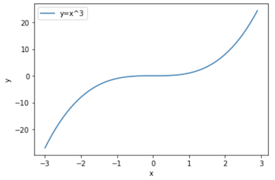
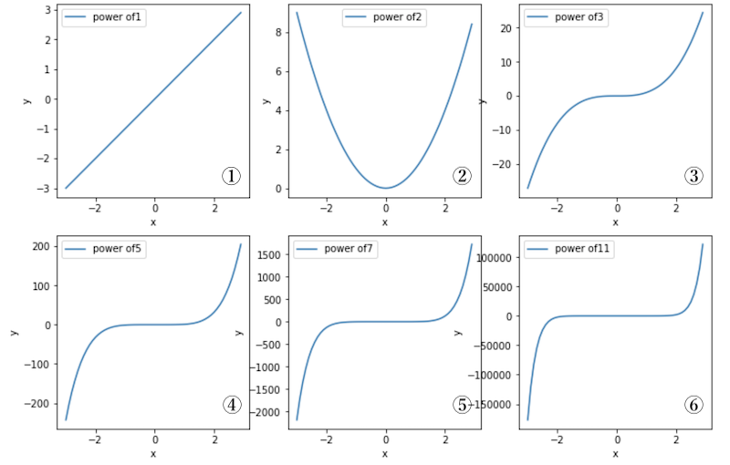
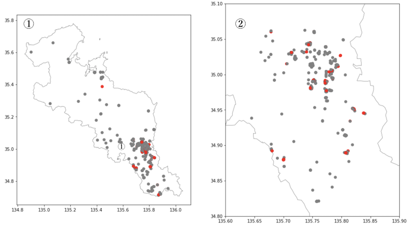
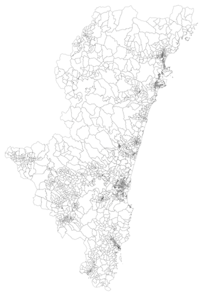
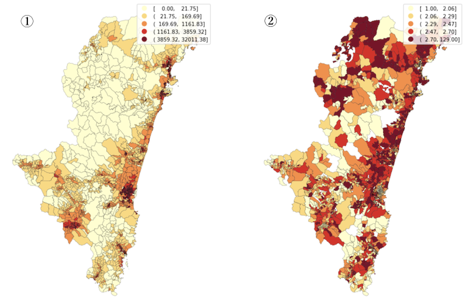
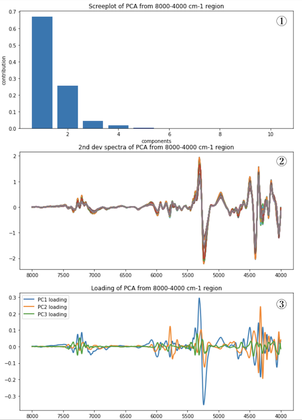
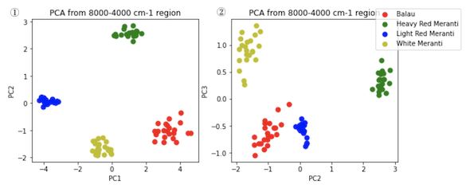
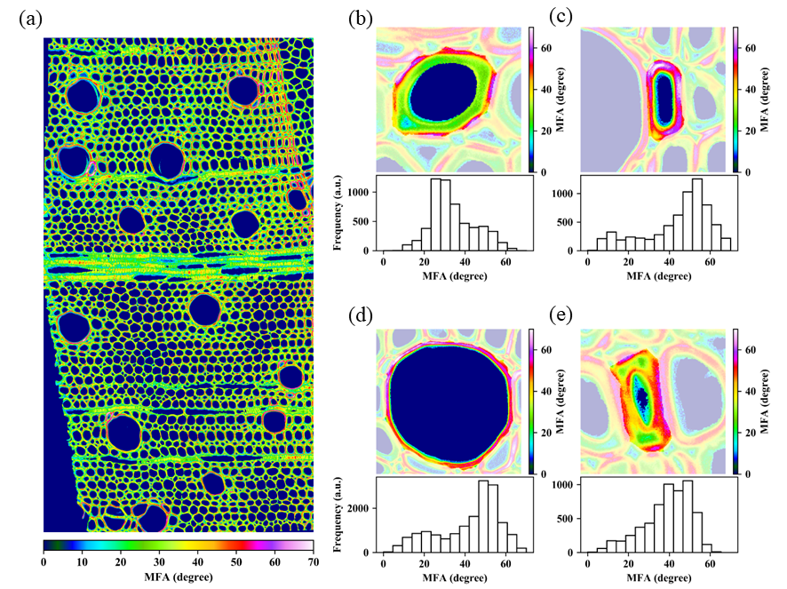

## 環境データサイエンスのノート

### Data science and Artificial Intelligence in Environmental and Agricultural Science


### 令和3年度、令和 5 年度＠宮崎大学農学部

#### 京都大学大学院農学研究科　杉⼭淳司

<br>

<br>

<br>


<div style="page-break-before:always">

[TOC]

<div style="page-break-before:always">

## 

<br>

##　「環境・農学のデータサイエンスとAI」

<br>

このテキストは、Pythonを使ってコードを作成し、大量のデータから有益な情報を抽出する統計計算や機械学習の基礎を学ぶことを目的としています。以下の書籍は、一般的な知識として、個人的に役立つと思われるものを挙げています。

1) Bill Lubanovic, 入門 Python 3, 斎藤康毅(監修),長尾高弘(訳), オライリージャパン, 2015（第2版2021）
2) ディジタル画像処理編集委員会, ディジタル画像処理（改訂第2版）, 画像情報教育振興協会, 2020
3) 金明哲編, Rで学ぶデータサイエンス, 2.多次元データ解析法、共立出版、2009
4) Sebastian Raschka, Python機械学習プログラミング  達人データサイエンティストによる理論と実践, 株式会社クイープ, 福島 真太朗 (訳),インプレス, 2016 (第3版2020）
5) 石井健一郎他, わかりやすいパターン認識（第2版）, オーム社, 2019
6) 斎藤 康毅, ゼロから作るDeep Learning―Pythonで学ぶディープラーニングの理論と実装, オライリージャパン, 2016
7) 斎藤 康毅, ゼロから作るDeep Learning―大規模言語処理, オライリージャパン, 2018
8) David Foster, 松田 晃一他,　生成 Deep Learning ―絵を描き 物語や音楽を作り ゲームをプレイする, オライリージャパン, 2020
9) Pythonプログラミング入門, 東京大学 数理・情報教育研究センター (CC BY-NC-ND 4.0), https://utokyo-ipp.github.io/index.html

<br>

<div style="page-break-before:always">

------

<br>

## １　Pythonのインストールなど

<br>

### １ー１　標準python

<br>

大学理数系の方であれば、MatLabやRなどを使用したことがあるかもしれませんし、JavaやCの言語を使える方もいるでしょう。Pythonは、特に最近、 科学分析において多くの人が使うようになりました。その理由として、科学計算に必要なライブラリーが備わってきたこと、さらには読みやすく、書きやすく設計された言語であること、が人気の一つと言われます。また、Githubに代表されるような、共同開発のサイトの活用により、コードが多くの人に何度も読まれ、改訂されるたびに、さらに分かりやすくなるといわれます。私がなぜpythonかといえば、そういうコミュニティーがあり、有益な情報をネットに上げてくれているということも上げておくべきでしょう。

とは言え、言語ですからある程度覚えないと話せません。しかし、苦しい時期はおそらく思っているより短いと思います。

Python3をインストールします。このテキスト執筆時点で、最新のバージョンは　3.10ということですので、そのうち4が出てきてまたアタフタする様なことになりそうですが、とりあえず6ヶ月くらい前にレリースされた安定バージョンをインストールするのがいいように思います。理由は、科学技術計算や機械学習で利用するパッケージの対応が遅れている可能性があるからです。ちなみに私はM1とM2 のMacを使っていますが、Pythonは3.8.10, Python 3.9.16です。インストールの際、Mac内蔵のGPUが利用できて、scikit-learn, scikit-image, tensorflowという、パターン認識、機械学習、画像処理に必要なものが問題なく動くバージョンということで選択しています。

あまり悩むことなく標準のパイソンをhttps://www.python.org/ からインストールしてみましょう。
必要なパッケージはその都度インストールしますが、この講義では使うのは以下の通りです。

```python
numpy, pandas, scikit-learn, scikit-image, opencv, matplotlib, tqdm, tensorflow, openpyxl, pillow、jupyterlab, ipykernel, seaborn, hdf5, geopanda
```

ハードディスクに余裕があって、いろいろな科学技術計算のパッケージがプレインストールされる方がいい場合は、anaconda pythonをインストールするのもいいでしょう.

OSやシステムによっては、安定した環境が作れるまで、少し勉強と根気が必要になりますので、心折れないように。

<br>

<div style="page-break-before:always">

### １ー２　クラウドサービスの利用

<br>

自分のパソコンのOSや年式によっては、安定した環境が作れるまで、少し勉強と根気が必要になりますので、講義を取り合えず受けてみようという人には、クラウドのサービスもおすすめです。Googleの提供するColaboratory（略称: Colab）は、ブラウザから Python を記述、実行できるサービスです。利用する人はGoogleアカウントを取得して、以下のサイトに行くだけ。

https://colab.research.google.com/notebooks/welcome.ipynb?hl=ja#scrollTo=5fCEDCU_qrC0

基本、ログインするだけで、環境を構築する煩わしさが全くありません。 GPUも提供されていて、深層学習も実行可能なサービスです。計算時間とか、ファイルの保存期間とかには、制限がありますが、多くの人に利用されています。Google Cloudに保存している画像データなどを利用するには、以下の設定を行います。

```python
# 自分のGoogle accountの中でコラボを立ち上げて、Google driveのデータの読み書きができるように設定する。
from google.colab import drive
drive.mount('/content/drive')

# 補足） 自分のアカウントのグーグルドライブにColab Notebooksができていることを確認して、その中に、DataScience_AIをコピーする。その後、Google Colabの作業ディレクトリを表示してみる。
import os
tdir = "/content/drive/MyDrive/Colab Notebooks/DataScience_AI"
os.chdir(tdir)
os.getcwd()
```


<div style="page-break-before:always">
<br>

------

<br>

## ２　電卓を作る

<br>

### ２ー１　Pythonで扱うデータ

<br>

取り扱うデータ型は以下の通りです。
+ ブール値（Boolean)：TrueとかFalseという値
+ 整数（integer):小数点以下がない数
+ 浮動小数点数（float):少数以下を含む数、指数表現で表される数
+ 文字列（character):文字の並びで表されるもの

<br>

### ２ー２　演算子

<br>

四則演算で必須なものは次の通りです。
+ `+`：加算
+ `-`：減算
+ `*`：乗算
+ `**`：指数（べき乗）
+ `/`：浮動小数点数の割り算
+ `//`：整数の除算（商切り捨て）
+ `%`：剰余

<br>

### ２ー３　比較演算子

<br>

主な比較演算子は次の通りです。

+ `a < b`：a は b より小さい
+ `a <= b`：a は b と等しいか小さい
+ `a > b`：a は b より大きい
+ `a >= b`：a は b と等しいか大きい
+ `a == b`：a と b は等しい
+ `a != b`：a と b は等しくない

<br>

上の演算子を使って割り算の関数`warizan()`を作ります。入力は2つ （x と y)　商と余りを返すこととします。

```python
a=5.0  # .0 をつけて浮動小数点数と定義する
b=23.0
#結果を浮動小数点数で表示
print(b/a)
#商は
print(b//a)
#余は
print(b%a)
```

4.6 4.0 3.0

```python
def warizan(x,y):  # 商と余を同時に計算する自分の関数
    sho=x//y
    amari=x%y
    return sho,amari

s,a = warizan(34,6)
print('sho', s, ' amari ', a)
```

sho 5  amari  4

<br>

### ２ー４　練習

<br>

１）9時00分00秒から3333秒後は、何時何分何秒ですか？

２）1)を計算する関数を作りなさい。

<div style="page-break-before:always"><br>

------

<br>

## ３　データの型

<br>

電卓の時は、１つの入力に対して1つの出力がありました。ここで取り上げるデータは複数あるいはもっと多元的な複雑なデータです。まずは一次元の要素の並びを考えましょう。

前出の文字列がどう扱われるかを説明します。’university' という文字列は、数値と違って、アルファベットの列と捉えられ、単語全体では10個の文字からなると認識されます。整数のインデックスで先頭から順番に各要素を取り出すことができ、3番目は'i’の文字というように、一つのシークエンスとして扱えます。pythonでは要素の1つ目を０に定義するので、3番目は0,1,2の２となることに注意しましょう。

```python
word='university'
print(len(word), word[2])
```

10 i

<br>

これと同じように、リストとタプル型のシーケンス構造が提供されています。リストは変更のきくシークエンス（並び替えが可能）で、タプルは辞書向きで、書き換えることができません。前者をミュータブル(mutable)、後者をイミュータブル(immutable)といいます。

<br>

### ３ー１　リスト型

<br>

リストは０個以上の要素をカンマで区切り角かっこ`[　]`で囲んだものです。リストの中の要素は、先頭から順番に指定して取り出すこと、範囲を決めて複数取り出すこと、など色々設定可能です。

```python
subjects=['physics', 'chemistry', 'biology', 'history']
score=[88,75,87,92]
print(subjects[2],score[2])
```

('biology', 87)

```python
print(subjects[0:2])
```

['physics', 'chemistry']

```python
print(subjects[::2])
```

['physics', 'biology']

```python
print(subjects[::-1])
```

['history', 'biology', 'chemistry', 'physics']

<br>

`list( )`関数は他のデータ型をリストに変換します。例えば、文字列の場合

```python
list('university')
```

['u', 'n', 'i', 'v', 'e', 'r', 's', 'i', 't', 'y']

```python
word='university'
word.split('r')
```

['unive', 'sity']

<br>

### ３ー２　セット型

<br>

ちょっと複雑になりますが、この機能を使ってリストの中の要素を取り出すことができます。それにはリストを`set( )`関数に入れるか、リストを`{  }`で囲みます。データが書き込まれるメモリの位置によて順番が変わるので、いつも同じ順番とは限らないので、順番を気にするときは注意が必要です。

```python
word='university students'
list(word) # 単語をアルファベットに分解してリストの要素にする
```

['u', 'n', 'i', 'v', 'e', 'r', 's', 'i', 't', 'y', ' ', 's', 't', 'u', 'd', 'e', 'n', 't', 's']

```python
lw=list(word)
set(lw) # 使われている文字の要素を書き出す。元々のデータの並びの順番とどうか？
```

{' ', 'd', 'e', 'i', 'n', 'r', 's', 't', 'u', 'v', 'y'}

```python
sorted(set(lw),key=lw.index) # 使われている文字の要素をリストの順番に書き出す
```

['u', 'n', 'i', 'v', 'e', 'r', 's', 't', 'y', ' ', 'd']

同じ事を{ }を使うと

```python
wordset={'u', 'n', 'i', 'v', 'e', 'r', 's', 'i', 't', 'y', ' ', 's', 't', 'u', 'd', 'e', 'n', 't'}
wordset # 辞書みたいに
```

{'n', 'd', 'r', 'e', 'u', 's', ' ', 't', 'y', 'i', 'v'}

<br>

セット型のデータは集合演算につかいます。

+ `|`：和集合（ユニオン）
+ ` &`：積集合（インターセクション）
+ `-`：差集合
+ `^`：対称差集合
+ `<=`：部分集合か判定
+ ` >=`：上位集合か判定

```python
a=set(list('university'));b=set(list('student'))
a | b
```

{'n', 'r', 'd', 'e', 'u', 's', 't', 'y', 'i', 'v'}

```python
a & b
```

{'n', 'e', 's', 'u', 't'}

```python
a - b
```

{'i', 'r', 'v', 'y'}

```python
a ^ b
```

{'r', 'd', 'y', 'i', 'v'}

<br>

### ３ー３　タプル型

<br>

辞書などの作成すると変更しないようなデータのために準備されています。タプルは`(  )`で囲んで作成します。
 例えば京都の地理的位置や、学生の科目別成績など、**複数の要素から構成される独立したデータ**をあらわすときはタプルを使用します。タプルは`[ ] `で引数を入れることで個別に取り出すことができます。またタプルはリスト型に直すことで値の変更が可能です。

```python
kyoto=35.02139,135.75556 # 例えば 京都の市役所
kyoto
```

(35.02139, 135.75556)  # （　）括りになりました

```python
osaka=34.68639,135.52 # 大阪の市役所
kyoto == osaka # 同じ位置かどうかの判定
```

False

```python
print('京都の緯度は',kyoto[0],'経度は',kyoto[1]) # 個別に値を取り出す
```

京都の緯度は 35.02139 経度は 135.75556

```python
list(kyoto) # 型の変換
```

[35.02139, 135.75556]

```python
yakusho_dic={'大阪':osaka,'京都':kyoto}
yakusho_dic
```

{'大阪':(34.68639, 135.52), '京都': (35.02139, 135.75556)}

<br>

### ３ー４	練習

<br>

１）近畿地区の国立大学の名称と緯度・経度の辞書を作成しなさい。

| Name                          | Latitude  | Longitude  |
| :---------------------------- | --------- | ---------- |
| Kyoto University              | 35.026244 | 135.780822 |
| Kyoto University of Education | 34.950215 | 135.773187 |
| Kyoto Institute of Technology | 35.049664 | 135.782046 |


<div style="page-break-before:always">

------

<br>

## ４　データの特徴

<br>

### ４ー１　イテラブル、イテレータ

<br>

イテラブル(iterable)とか、イテレータ(iterator)とは『反復可能な』や『繰り返し可能な』という意味です。この要素を使いこなせるようになると一気にやれることが増えてきます。

パソコンは「繰り返し処理をやらせるには最適」と考える人は少なくないようですが、その繰り返しの処理を考えてみましょう。

パソコンにログインしていつものように作業をします。そのときあなたのディレクトリーはどこですか？GUI（graphic user interface)のおかげで、それが何たるかを知る必要のない世代の皆さんは、質問の意味もわからないかもしれません。

```python
import os
os.getcwd() #get current working directory
```

/content/drive/MyDrive/Colab Notebooks/DataScience_AI

```python
dirlist = []
for f in os.listdir():
  if os.path.isdir(f): # もしも、ファイルであればりすとしない
    dirlist.append(f)
dirlist
```

[ '_data', 'common', 'SP', 'GIS', 'basic', 'CV', 'first_try.ipynb']

<br>

上に示したコードの `os.listdir()` は 今自分が利用しているディレクトリ内のディレクトリやファイルをリスト型で出力してます。list形式のデータはイテラブルなので、その要素を順番に取り出すことができ、繰り返し処理につかえます。例として、ディレクトリの中にいくつファイルがあるか順番に出力してみます。

```python
for my_dir in dirlist:
  number_of_files=len(os.listdir(my_dir))
  print('ディレクトリ'+my_dir+'のファイル数は'+str(number_of_files))  
```

ディレクトリ_dataのファイル数は4
ディレクトリcommonのファイル数は9
ディレクトリSPのファイル数は4
ディレクトリGISのファイル数は1
ディレクトリbasicのファイル数は1
ディレクトリCVのファイル数は4

<br>

上の簡単な `for 〜 in　〜` の簡単なループは、My_dirsの中のリストからひとつづつディレクトリー名をmy_dirに呼び出し、各ディレクトリにあるファイル数を出力するという意味になります。

上はリスト型データの例ですが、数字の場合も`range()`という便利なイテレーターが準備されています。

```python
list(range(10)) # range(0,10,1) と同じ
```

[0, 1, 2, 3, 4, 5, 6, 7, 8, 9]

```python
list(range(1,10,3)
```

[1, 4, 7]

<br>

もう少し複雑な繰り返し分を考えてみます。例えば複数のリストがあり、それらから同時に一つずつ取り出すことを考えます。複数のリストから一つづつまとめて取り出す`zip( )` , 取り出した順に序数をつける`enumerate( )`を使います。

```python
prefecture=['滋賀','京都','大阪','兵庫','奈良','和歌山']
city=['大津市','京都市','大阪市','神戸市','奈良市','和歌山市']
tree=['モミジ','北山スギ','イチョウ','クスノキ','スギ','ウバメガシ']

for i,p in enumerate(zip(prefecture,city,tree)):
	print(str(i+1)+'番'+' 都道府県名 '+p[0]+' 県庁所在地 '+p[1]+' 県の木 '+p[2])
```

1番 都道府県名 滋賀 県庁所在地 大津市 県の木 モミジ
2番 都道府県名 京都 県庁所在地 京都市 県の木 北山スギ 
3番 都道府県名 大阪 県庁所在地 大阪市 県の木 イチョウ 
4番 都道府県名 兵庫 県庁所在地 神戸市 県の木 クスノキ 
5番 都道府県名 奈良 県庁所在地 奈良市 県の木 スギ 
6番 都道府県名 和歌山 県庁所在地 和歌山市 県の木 ウバメガシ

<br>

### ４ー２　条件文　if〜else

<br>

例えば解析用に作ったデータの中にいわゆる不可視ファイル（実際に存在はするのだけど画面上には表示されないシステムが使うファイル）があります。ところが、プログラムでデータを読み込むとファイルが全部読まれてしまいします。それを避けてファイルを読むには次のように処理します。

```python
import os
My_png_list=[]
My_list=os.listdir('_data/CV')
for filename in My_list:
		if filename.endswith('.png'):
			My_png_list.append(filename)
		else :
			print(filename+'is not a png file !')
My_png_list
```

['apples.png', 'lotus.png']

<br>

上の例では、`_data/CV`のディレクトリにあるファイルのうち、拡張子が.pngでないものを無視してpngファイルのみのリストをMy_png_listに格納します。複数の用件を同時に満足する、あるいはどちらかを満足するという条件が必要な場合は、`and` あるいは`or` で複数の条件を併記します。

```Python
testdata=[1,2,3,4,5,6,7,8,9,0]
for i in testdata:
  if i > 4 and i<7:
    print(i)
```

5
6

<br>

以上のように、イテレータと条件文はプログラムの中で、繰り返す・判断するという二つの重要なプロセスを実現します。

<br>

### ４ー３　内包表記

<br>

繰り返しと条件文は数行のプログラムで書けるものですが、内包的表現を使うと１行で書くことができます。

例えば ある特定のディレクトリの中から特定の拡張子のファイルだけを読み出したい場合など, そのリストを作るのに便利です。 

次のコードは `_data/GSI`のディレクトリにあるCSVファイルを指定して読み込みます。CSVファイルとは, 「comma separated values」の略称を指し, データを[ , ]で区切って書いたテキストファイル・データのことで, ファイルの拡張子は「.csv」です.

```python
my_target_dir='./_data/GIS'
[fl for fl in os.listdir(my_target_dir) if fl.endswith('.csv')]  #例えばcsvのファイル
```

['Kyoto_Architecture.csv']

<br>

また、不可視ファイルを除いたリストが欲しい場合（MacOSの場合は .filenameの形式で最初にドットがつきます）には次のようにします。

```python
[fl for fl in os.listdir(my_target_dir) if fl.startswith('.')]  ＃　例えば不可視ファイル
```

['.DS_Store']

<br>

### ４ー４　ジェネレーター

<br>

これまで説明したイテレータは一度に全てのデータをメモリに読み込んでしまいます。パソコンのディレクトリの場合は問題なくても、たとえば何千枚もの画像を読み込もうとするとメモリはパンクしてしまいます。ジェネレーターは、そのような大きなイテラブルなオブジェクトに対して、指定した大きさで逐次読み出しをするための仕組みです。画像を扱う深層学習では普通に使うツールですので理解しておきましょう。次の例は、1から100の範囲、増分３の等差数列から7で割り切れる数字を順に出力する例です。２−４の関数では`return`で戻り値を得たのに対して、ここでは`yield` であることに注意です。

```python
def generator(input):
  for x in input:
    if x%7==0:  #### ７で割り切れたらその都度支出力
      yield x

input=list(range(1,100,3))
mygen=generator(input)
print(next(mygen));print(next(mygen));print(next(mygen))
```

7 28 49

<br>

### ４ー５　練習

<br>

１）testdata=[1,2,3,4,5,6,7,8,9,0]　からイテレータと条件文をつかって3,5,6,9 を出力しなさい。

２）2022年元旦から12月末まで木曜日の日付を出力しなさい。

<br>

<div style="page-break-before:always">

------

<br>

## ５　汎用モジュールとライブラリー

<br>

pythonは、オブジェクト指向型の言語と言われます。さまざまな目的を達成するために必要なひとつひとつの要素を**オブジェクト**といいます。一番上位にある目的のために特別な関数や値をまとめたもの**モジュール**、その一つ下の括りを**ライブラリー**と呼んでいます。

<br>

### ５ー１　数値演算

<br>

> NumPy is an open source project aiming to enable numerical computing with Python。It was created in 2005, building on the early work of the Numeric and Numarray libraries。NumPy will always be 100% open source software, free for all to use and released under the liberal terms of the [modified BSD license](https://github.com/numpy/numpy/blob/main/LICENSE.txt)。(From HP)

<br>

**NumPy** (https://numpy.org/) は数値計算を効率的に行うための**拡張モジュール**で、特に多次元配列（例えばベクトルや行列などを表現できる）を扱うことができ、その操作のための広範かつ高速で動作する**数学関数ライブラリー**を提供しています。　NumPy を使うには、まずnumpy を省略形npでプログラムに読み込むと、numpyに含まれているいるさまざまな関数や処理を`np.関数`という書式で呼び出すことができます。

<br>

#### ５ー１ー１　多次元配列

<br>

リストと配列の違いを理解しましょう。リストはイテラブルですが計算はできません。リストで作った配列を`np.array( )`に代入すると、個々の数値に対して同じ演算をすることができるようになります。またリストの中にリストがある入れ子の場合、`np.array( )`に渡すと、多次元の配列となります。下の例では５個の要素からなるリストを３倍の長さにして、それを３x５の行列に書き換えます。最後にそれを`np.log()`関数で対数変換します。

```Python
import numpy as np
a_list=[1,2,3,4,5]
a_list*3
```

[1, 2, 3, 4, 5, 1, 2, 3, 4, 5, 1, 2, 3, 4, 5]

```Python
a_array=np.array(a_list)
a_array*5
```

array([ 5, 10, 15, 20, 25])

```Python
x=np.array(a_list*3).reshape(5,3)
x
```

array([[1, 2, 3],
 [4, 5, 1],
 [2, 3, 4],
 [5, 1, 2],
 [3, 4, 5]])

```Python
3*np.log(x)
```

array([[0, 2.07944154, 3.29583687],
 [4.15888308, 4.82831374, 0],
 [2.07944154, 3.29583687, 4.15888308],
 [4.82831374, 0, 2.07944154],
 [3.29583687, 4.15888308, 4.82831374]])

```Python
y=3*np.log(x)
```

<br>

配列要素の情報を知る関数は次のとおりです。

| 属性      | 意味                                          |
| :-------- | :-------------------------------------------- |
| `a.dtype` | 配列 `a` の要素型                             |
| `a.shape` | 配列 `a` の形（各次元の長さのタプル）         |
| `a.ndim`  | 配列 `a` の次元数（`len(a.shape)` と等しい）  |
| `a.size`  | 配列 `a` の要素数（`a.shape` の総乗と等しい） |
| `a.flat`  | 配列 `a` の1次元表現（`a.ravel()` と等しい）  |
| `a.T`     | 配列 `a` を転置した配列（`a` と要素を共有）   |

<br>

上で作ったyでどのように出力されるか確認しましょう。

```python
print(y.dtype)
```

float64

```python
print(y.shape)
```

(5, 3)

```python
print(y.size)
```

15

```python
print(y.T)
```

[[0  4.15888308 2.07944154 4.82831374 3.29583687]
 [2.07944154 4.82831374 3.29583687 0 4.15888308]
 [3.29583687 0  4.15888308 2.07944154 4.82831374]]

<br>

#### ５ー１ー２　配列を作る関数

<br>

以下の関数で等差数列をはじめとしてn次元の様々な数列を作ることをができます。

| 関数                          | 説明                                                         |
| :---------------------------- | :----------------------------------------------------------- |
| `np.arange(start, stop)`      | start, stop あるいは stop のみ、stepは整数１                 |
| `np.arange(start,stop,step)`  | start, stop, step: `range`と異なり、浮動小数点数`float`を引数に指定可能. |
| `np.linspace(start,stop,num)` | numは要素数。それらに応じた間隔（公差）が自動的に算出される. |
| `np.zeros(x)`                 | xが6のとき一次元６要素の０の配列、(2,3)のとき2x3の２次元６要素の0の配列 |
| `np.ones(x)`                  | xが6のとき一次元６要素の1の配列、(2,3)のとき2x3の２次元６要素の1の配列 |
| `np.random.rand(x)`           | xが6のとき一次元６要素の乱数、2,3のとき2x3の２次元６要素の乱数（0〜1の範囲） |

<br>

#### ５ー１ー３　配列のインデックス、スライスによるアクセス

<br>

次の例では、5x5の乱数からなる２次元配列を作ります。個々の値は行と列に対応するインデックスを持っていて、その値を取り出したり、加工したりすることが可能です。たとえば、配列matのp行、q列の値は、`mat[p,q]`です。また、複数の行や列を取り出してスライス配列として扱うことができます。例えば、行はp、列はqの前後合わせた３つのスライス配列は`mat[p, q-1:q+1] `で与えられます。

```python
mat=np.random.rand(5,5)
mat
```

array([[0.93987159, 0.755175  , 0.25051673, 0.91663363, 0.6494    ],
       [0.50657243, 0.17434289, 0.13504302, 0.54144137, 0.22875137],
       [0.09517721, 0.43037945, 0.08206899, 0.54896378, 0.33087475],
       [0.17262683, 0.51725863, 0.83124545, 0.70180956, 0.35399325],
       [0.30247671, 0.52517184, 0.92602194, 0.01585037, 0.26942446]])

```python
mat[1:3,2:4]
```

array([[0.13504302, 0.54144137],
       [0.08206899, 0.54896378]])

```python
mat[1:3,2:4]=0
mat
```

array([[0.93987159, 0.755175  , 0.25051673, 0.91663363, 0.6494    ],
       [0.50657243, 0.17434289, 0.       , 0.       , 0.22875137],
       [0.09517721, 0.43037945, 0.       , 0.       , 0.33087475],
       [0.17262683, 0.51725863, 0.83124545, 0.70180956, 0.35399325],
       [0.30247671, 0.52517184, 0.92602194, 0.01585037, 0.26942446]])

<br>

#### ５ー１ー４　配列の統計量

<br>

NumPy配列に組み込まれている統計量は以下の通りです。この関するの( )内に軸を設定することで、行あるいは列でそれぞれの統計量を計算することができます。たとえば、上のmatの例で縦方向の行で集計する場合は`a.sum(axis=0)`横方向の列で集計する場合は、`a.sum(axis=1)` となります。

| 属性 またはコマンド            | 意味                                |
| ------------------------------ | ----------------------------------- |
| `a.sum()` or `np.sum(a)`       | 配列`a`の合計                       |
| `a.mean()` or `np.mean(a)`     | 配列`a`の平均                       |
| `a.var() `or `np.var(a)`       | 配列`a`の分散                       |
| `a.std()` or `np.std(a)`       | 配列`a`の標準偏差                   |
| `a.argmax()` or `np.argmax(a)` | 配列`a`の最大値を与えるインデックス |
| `a.argmin()` or `np.argmin(a)` | 配列`a`の最小値を与えるインデックス |

<br>

### ５ー２　作図

<br>

> Matplotlib is the brainchild of John Hunter (1968-2012), who, along with its many contributors, have put an immeasurable amount of time and effort into producing a piece of software utilized by thousands of scientists worldwide.　(From HP)

<br>

科学技術計算においてNumPyと同様に、グラフ表示に必要な**Matplotlib** ライブラリー ( https://matplotlib.org )は欠かせません。棒グラフ、折れ線グラフ、散布図はもとより、アニメーションや動画などの可視化ができます。覚えることも多いですが、パラメータの意味を習得することで、様々なグラフやデータを重ね合わせたり、合体させたりできるのも特徴です。例として$x$の範囲-3から3の $$y＝x^3$$ のグラフを描いてみます。

```python
import numpy as np
x= np.arange(-3,3,0.1)
y=x**3

import matplotlib.pyplot as plt
%matplotlib inline
plt.plot(x,y,label="y=x^3")
plt.legend()
plt.xlabel('x')
plt.ylabel('y')
plt.show()
```




<br>複数のグラフを作ることも容易ですが、文法が少し変わるので注意が必要です。$y=x$から1乗、2乗、3乗、5乗、7乗、11乗の6つを２行３列に表示するには` plt.subplots`を定義します。

```python
fig, axes = plt.subplots(ncols=3,nrows=2, figsize=(12,8))
power=[1,2,3,5,7,11]

for i,p in enumerate(power):
	c,r=divmod(i,3)
	axes[c,r].plot(x,x**p,label="power of"+str(power[i]) )
	axes[c,r].legend()
	axes[c,r].set_xlabel('x')
	axes[c,r].set_ylabel('y')
plt.show()
```



<br>

 ### ５ー３　表計算

<br>

> When working with tabular data, such as data stored in spreadsheets or databases, pandas is the right tool for you。pandas will help you to explore, clean, and process your data。In pandas, a data table is called a [`DataFrame`](https://pandas.pydata.org/docs/reference/api/pandas.DataFrame.html#pandas.DataFrame)。(From HP)

<br>

Pandas (https://pandas.pydata.org/) ライブラリーはエクセルで扱うような表形式のデータを扱うツールです。外部ソフトで作成したtext, csv, JSON, Excelなどはもちろん、配列を表形式DataFrame() に読み込むことで、用意された豊富な統計処理や表計算を実行できます。またこのライブラリーにはmatplotlibと連携したグラフ表示機能も組み込まれています。

<br>

３ー４で作成したdictデータをpandasに読み込んでみましょう。さらに、住所、各大学の学生数、創立年の情報を加えて表にします。

```python
univ_dic={'Kyoto University':(35.026244,135.780822),'Kyoto University of Education':(34.950215,135.773187),'Kyoto Institute of Technology':(35.049664,135.782046)}

import pandas as pd
df=pd.DataFrame(univ_dic, index=('latitude','longitude'))
dfn=df.T
dfn['address']=['京都府京都市左京区吉田本町','京都府京都市伏見区深草藤森町1','京都府京都市左京区松ヶ崎橋上町1']
dfn['students']=['12958','1332','2656']
dfn['teachers']=['3441','110','281']
dfn
```

|                               |  latitude |  longitude |                         address | students | teachers |
| ----------------------------: | --------: | ---------: | ------------------------------: | -------: | -------- |
|              Kyoto University | 35.026244 | 135.780822 |      京都府京都市左京区吉田本町 |    12958 | 3441     |
| Kyoto University of Education | 34.950215 | 135.773187 |   京都府京都市伏見区深草藤森町1 |     1332 | 110      |
| Kyoto Institute of Technology | 35.049664 | 135.782046 | 京都府京都市左京区松ヶ崎橋上町1 |     2656 | 281      |

<br>

最後に作成したdfn からデータを読み込んで緯度経度の値から地理的な関係と、学生と教員の関係を示す散布図を表示します。最初の①図ではプロットの大きさに学生の人数が反映されるようにします。また二つ目の②図にはプロットの凡例をつけています。

```python
import matplotlib.pyplot as plt
import numpy as np
fig, ax=plt.subplots(ncols=2,figsize=(10,5))

for i, u in enumerate(dfn.index):
    dfn['students'].values[i]
    ax[0].scatter(dfn['longitude'][i],dfn['latitude'][i],s=int(dfn['students'][i]),label=u)
    ax[0].set_ylabel('latitude')
    ax[0].set_xlabel('longitude')
    ax[1].scatter(dfn['students'][i],dfn['teachers'][i],s=100,label=u)
    ax[1].set_ylabel('students')
    ax[1].set_xlabel('teachers')
    ax[1].legend()
plt.show()
```


<br>

### ５ー４　練習

<br>

１）　0,0,1,0,0,1...。を繰り返す総数250個の1次元の数列をつくり、それを16*16の２次元数列に変換しなさい。

２）　作成した配列をmatplotlibの`imshow()`を使って表示しなさい。

３）　４ー１の例で扱った関西地域の県名、県庁所在地、県の木のデータに合わせて、県の花を加えて表にしなさい。

<br>


<div style="page-break-before:always">


------

<br>

## ６　地理情報データを扱う

<br>

GISについて少し触れてみようと思います。以下国土交通省国土地理院のHPからの引用です。

>　地理情報システム（**GIS：Geographic Information System**）は、地理的位置を手がかりに、**位置に関する情報を持ったデータ（空間データ）** を総合的に管理・加工し、視覚的に表示し、高度な分析や迅速な判断を可能にする技術である。
>　平成7年1月の阪神・淡路大震災の反省等をきっかけに、政府において、GISに関する本格的な取組が始まった。その中核となる取組が、国土空間データ基盤の整備である。
>　ハードウェア、ソフトウェアの低価格化が進み、簡易なGIS導入が可能になる一方で、地図データ等については、電子化されていない、データ仕様が異なり利用できない等の問題があり、GISを導入する主体が、各々整備する必要があり、社会的には二重、三重の投資となる等の問題があった。
>　このため、GISを高度に活用できる社会の実現のためには、地図情報の電子化のみならず、それを活用していく技術、制度、人材等が必要であり、これらの総体を社会的な基盤としてとらえ、その総合的、体系的な整備を図っていく必要性が認識され始めた。
>　このような背景のもと、平成19年５月には、地理空間情報の活用の推進に関する施策を総合的かつ計画的に推進することを目的として、**地理空間情報活用推進基本法**が、国会で制定された。

<br>

この章では、**GISデータ**やそれに付随する統計量の扱い方について初歩的なところを学習します。データの形式にはベクター型とラスター型との２種類があり、それぞれデータに表記されています。

**ベクター型**のデータとは、複数の地理上の点の位置とそれを繋いだ線、軌跡、区画などを数値データとして記録して再現する形式です。数値で管理しているので、描いたグラフィック自体はデータ量も小さく、拡大縮小もスムーズです。例えば河川や道路、区画をなどさまざまな表現に使われます。

一方**ラスター型**は、ある特定の区画（１００メートル四方とか1km四方等）のメッシュを設けて地理的な区域を分割し、その区画内における情報を数値として表現する形式です。区画をピクセルに例えれば、格子状（グリッド状）に並んだピクセルで構成されるデータと言えます。まさに、濃淡のある画像として表現されるデータです。この場合解像度は設定された区画の大きさから変わることはありません。

ここではpythonによる初歩的な使い方をまとめますが、GISデータの取り扱いに関しては、QGIS(https://qgis.org/ja/site/forusers/download.html) という便利なアプリケーションがフリーで公開されていいます。


<br>

### ６ー１　データの構造とその表示

<br>

> GeoPandas is an open source project to make working with geospatial data in python easier。GeoPandas extends the datatypes used by [pandas](http://pandas.pydata.org/) to allow spatial operations on geometric types。Geometric operations are performed by [shapely](https://shapely.readthedocs.io/)。Geopandas further depends on [fiona](https://fiona.readthedocs.io/) for file access and [matplotlib](http://matplotlib.org/) for plotting.

<br>

ここでは**geopanda**（https://geopandas.org/)（GIS用データをpandas形式に拡張したり、matplotlibで可視化できる）で処理します。

<br>

#### ６ー１ー１　文化庁の指定文化財

<br>

文化庁は国指定文化財等データベース（https://kunishitei.bunka.go.jp/bsys/index） を公開しています。「国宝・重要文化財（建造物）」を開いて「都道府県別にみる」から「京都府」を選択すると一覧がでてきますので、それらを**csv**出力してデータとします（Kyoto_Architecture.csv）。まず、**csv**ファイルを**pandas**の`DataFrame( )`として読み込みますが、その際、名称、国宝か重要文化財か、時代、緯度、経度の５項目のみを読み込みます。最後に各建造物の緯度と経度のデータをつかって横軸緯度、縦軸経度のグラフ上に散布図をつくります。データとしてはベクター型の点のデータです。

<br>

```python
import os
%matplotlib inline
import matplotlib.pyplot as plt
import pandas as pd

df_temple = pd.read_csv('_data/GIS/Kyoto_Architecture.csv',\
                        usecols = [2, 5, 8, 16, 17],\
                        dtype  = {'名称': str, '種別1': str, '時代': str, '緯度': float, '経度': float})
df_temple = df_temple.rename(columns = {'名称': 'article', '種別1': 'category',\
                                        '時代': 'period', '緯度': 'latitude','経度': 'longitude'})

df_temple.plot(figsize=(6,6),y='latitude',x='longitude', kind='scatter', grid=True, legend=True)
plt.axis('square')
plt.show()
```


<br>

#### ６－１ー２　地図上への文化財所在地の表示

<br>

日本地図府県境界データを使って、京都府を描画し、その上に重ねて文化財の所在地を表示します。その際に国宝指定を赤、重要文化財指定を灰色とします。府県境界データはGitHub上に、Data of Japanさん ( https://github.com/dataofjapan/land  )  が公開しているjapan.geojsonというファイルを**GeoPanda**に読み込んで作成します。京都には305件の指定文化財がありますが、その多くは京都市に集中していますので、京都府全体の図と京都市近傍に拡大した２つの図を作成します。Data of Japanのデータは区画を表示するポリゴンのベクター型データで、そこに、文化財の点データを重ねる作業です。

```python
import geopandas as gpd
df_jap = gpd.read_file('_data/GIS/japan.geojson')


colors=[]
for cat in df_temple.category:
    if cat == '国宝':
        colors.append('red')
    else:
        colors.append('gray')
            
fig, ax = plt.subplots(nrows=1,ncols=2,figsize = (16,16)) 
for i in range(2):
    if i == 1:
        ax[i].set_xlim([135.6,135.9]);ax[i].set_ylim([34.8,35.1])
    df_jap[df_jap['nam_ja'] == '京都府'].plot(ax=ax[i],figsize=(8,8), \
                           edgecolor='#444', facecolor='white', linewidth = 0.5)
    ax[i].scatter(df_temple.longitude,df_temple.latitude,color=colors)
plt.show()
```



<br>

この図に交通網を重ね合わせて、プロットを観光客動員数で表し、月毎に分析すれば、人の流れを予測しながら交通の運行計画もできそうですね。

<br>

### ６ー２　e-statのデータの利用

<br>

> **ｅ－Ｓｔａｔ**とは日本の政府統計に関する情報のワンストップサービスを実現することを目指した政府統計ポータルサイトです。これまで各府省等が独自に運用するＷｅｂサイトに散在していた統計関係情報を本サイトに集約、社会の情報基盤たる統計結果を誰でも利用しやすいかたちで提供することを目指し、各府省等が登録した統計表ファイル、統計データ、公表予定、新着情報、調査票項目情報、統計分類等の各種統計関係情報を提供していきます。(https://www.e-stat.go.jp/help)

<br>

次に「e-stat 統計で見る日本」より、国税調査、小区分、境界データを47都道府県分ダウンロードします。トップページ https://www.e-stat.go.jp/gis) から、 地図で見る統計（統計GIS) / 境界データダウンロード / 小領域 / 国勢調査 / 2020年 / 小地域（町丁・字等別）（JGD2000）/ 世界測地系緯度経度・Shapefile  / と選択すると、都道府県別に2022-06-24公開のデータが表示されます。例として01 北海道 を選択すると、北海道全域から、小区分にいたる世界測地系緯度経度・Shapefileに至ります。ここから01000 北海道全域をダウンロードします。

ダウンロードした*A002005212012D...*というディレクトリには、*r2ka01*(おそらく令和2年で01は北海道のID)ではじまるう4つのファイルがあり、その中の **.shp** というのがこれから利用するShapefile(shp)ファイルです。次に、Shapefileの中には位置情報以外にも面積、境界長、人口、世帯数などの多くのデータが含まれてます。shpファイルはまさにベクター型のデータで表の最後に区画のポリゴンデータが記録されています。

<br>

少し時間がかかりますが、日本全国どこでも地図が表示できるように国税調査、小区分、境界データを47都道府県分ダウンロードしてみました。それを、e-stat_Kokuzei_Shpというディレクトリーに保存します。

そのディレクトリから各県に相当するshpファイルのpathをリストにします。

```　　python
import glob
data_dir='_data/GIS/e-Stat_Kokuzei_Shp' #
prefecture_shp=sorted(glob.glob(data_dir+'/*/*.shp'))
prefecture_shp
```

['data/GIS/e-Stat_Kokuzei_Shp/A002005212015DDSWC01/h27ka01.shp',
 'data/GIS/e-Stat_Kokuzei_Shp/A002005212015DDSWC02/h27ka02.shp',
 'data/GIS/e-Stat_Kokuzei_Shp/A002005212015DDSWC03/h27ka03.shp',
 'data/GIS/e-Stat_Kokuzei_S (以下省略)

<br>

宮崎県のデータを取り出してみましょう。japan.jsonのデータから宮崎県の県番号を取得して、その番号に対応するshpファイルを読み込み、それをgeopandasに渡して、図示します。

```python
%matplotlib inline
import matplotlib.pyplot as plt
import geopandas as gpd

pref_name='宮崎県'
pref_id=df_jap.id[df_jap['nam_ja']=='宮崎県'].values
map_id=pref_id[0]-1

fig, ax = plt.subplots(figsize = (16,16)) 
gdf = gpd.read_file(prefecture_shp[map_id])      
gdf.plot(ax=ax, facecolor='white', edgecolor='black', linewidth=0.2)
ax.set_axis_off()
plt.show()
```




<br>

#### ６ー２ー１　階級区分図（かいきゅうくぶんず、choropleth map）

<br>A choropleth map is a thematic map in which areas are shaded or patterned in proportion to the measurement of the statistical variable being displayed on the map, such as population density or per-capita income。The choropleth map provides an easy way to visualize how a measurement varies across a geographic area or it shows the level of variability within a region。A special type of choropleth map is a prism map, a three-dimensional map in which a given region's height on the map is proportional to the statistical variable's value for that region。(from web)

<br>

読み込んだshpデータには、36項目、2600区分（地域を市町村より下の区分で分けた単位、何丁目とか）の情報が含まれており、項目には、郵便番号、市町村名、以下の住所、人口、世帯数、区画を代表する緯度経度、境界データなどが記載されています。それらのうち面積、人口、世帯数を使い、人口密度と一世帯あたりの人数を新たにデータベースに加えて地図上に表示します。こういう作図を階級区分図といいます。地域による人口集中度や核家族化など、すでによく知られるところですが、実際のデータを利用して確認します。

```python
gdf['DENSITY']= gdf['JINKO']/gdf['AREA']*10**6 # 1平方キロメートルあたりの人口
gdf['FAMILY']= gdf['JINKO']/gdf['SETAI']# 1世帯あたりの人数#print(gdf.head())
 
fig, ax = plt.subplots(ncols=2,figsize = (16,16))
for i, title in enumerate(['DENSITY','FAMILY']):
    gdf.plot(column = title, edgecolor = "black",scheme='quantiles', \
             linewidth=0.2, cmap='YlOrRd', ax=ax[i], legend = True)
    ax[i].set_axis_off()
plt.show()
```



エラーが出る場合はパッケージがない場合、以下のコマンドでインストールする、

```
! pip install mapclassify
```


<br>

### ６ー３ 国土数値情報データベース

<br>

国土の電子情報については国土数値情報サイト(https://nlftp.mlit.go.jp/ksj/) に公開されています。これらのデータを空間的に、あるいは時系列に重ねていくことで、傾斜や高度による植生の違い、またその時系列変化なども可視化することができます。 

空間情報を利用して新しいビジネスをしょうとアイデアを持っている人もいるかもしれませんね。 ここでは農林水産省林野庁が国有林GISで管理している地図データから、全国の国有林野の小班区画ポリゴンデータをみてみましょう。ダウンロードサイト(https://nlftp.mlit.go.jp/ksj/gml/datalist/KsjTmplt-A45.html)から、関西地域の2府３県のデータを取得します。データは平成30（2018）年4月1日時点の**Shpファイル**です。

次に、国土地理院「基盤地図情報 数値標高モデル 」をベースとした標高傾斜度3次メッシュ（ラスター型データ）から、相当する府県のデータを取得します。

1) 関西地域の2府３県の国有林領域データ
2) 標高傾斜度データから平均標高と最大傾斜度の数値データ
3) ６−１で使った日本の府県境界データ

これらを重ねて表示して、国有林（図では赤の部分）の位置と地形を見ましょう。国有林の割合は、日本全との１２％、森林面積の２０％と言われますが、いかに関西地域に国有林が少ないことがわかります。また、都市や主要な交通網から距離のある場所が多いようです。


```python
%matplotlib inline
import matplotlib.pyplot as plt
import geopandas as gpd
import pandas as pd
import numpy as np

dat0_dir='_data/GIS/e-Stat_Kokuzei_Shp' 
prefecture_shp=sorted(glob.glob(dat0_dir+'/*/*.shp'))
dat1_dir='_data/GIS/標高傾斜度/' 
slope_shp=sorted(glob.glob(dat1_dir+'/*/*.shp'))
dat2_dir='_data/GIS/国有林野データ/' 
rinya_shp=sorted(glob.glob(dat2_dir+'/*/*.shp'))


wakaS_gdf=gpd.read_file(slope_shp[0])
shigaN_gdf=gpd.read_file(slope_shp[10])
wakaE_gdf=gpd.read_file(slope_shp[3])
kyotoN_gdf=gpd.read_file(slope_shp[9])


fig, ax = plt.subplots(figsize = (18,18)) 

# 当該メッシュにおける平均標高(緑）　当該メッシュにおける最大傾斜角度（青）　（メッシュデータ（ラスター型）
wakaS_gdf.plot(column = 'G04a_002',ax=ax, edgecolor='white',cmap='Greens',linewidth=0.2)
shigaN_gdf.plot(column = 'G04a_002',ax=ax, edgecolor='white',cmap='Greens',linewidth=0.2)
wakaE_gdf.plot(column = 'G04a_006',ax=ax, edgecolor='white',cmap='Blues',linewidth=0.2)
kyotoN_gdf.plot(column = 'G04a_006',ax=ax, edgecolor='white',cmap='Blues',linewidth=0.2)

# 関西エリアの国有林ポリゴンデータの表示（赤色）　ポリゴンデータ（ベクター型）
rinya_kansai=[]
for i in rinya_shp:
    rinya_kansai.append(gpd.read_file(i))
gdf=gpd.GeoDataFrame(pd.concat(rinya_kansai)) 
gdf.plot(ax=ax, edgecolor='#444',facecolor='red', linewidth=0.2)

# 関西エリアの府県境界データの表示　ポリゴンデータ（ベクター型）
Kansai_area=[]
for i in range(24,30):
    Kansai_area.append(df_jap[df_jap['id'] == i])
Kansai_gdf=gpd.GeoDataFrame(pd.concat(Kansai_area))

Kansai_gdf.plot(ax=ax, edgecolor='#444',facecolor='none', linewidth = 0.5)

plt.show()
```


<br>

### ６ー４　練習

<br>

１）宮崎県の国有林を図示しなさい。

<br>

<div style="page-break-before:always">

------

<br>
	
## ７　スペクトルの解析

<br>ここでは、スペクトルデータを使って、多変量解析について学習することを目的とします。

<br>

> No matter who pens them, nor in which language they are penned, mere words fail to convey the sadness that befell us on July 17th, 2019, when **Karl Norris** passed away。He became a legend in his own lifetime, long before its end, a legend that will never be surpassed, and created a new world of rapid, chemical-free analysis, the World of Near-infrared Spectroscopy (NIRS)。More than 50 years ago his genius recognized that what he had found in the spectra of soybeans could be metamorphosed into a technique that would revolutionize grain analysis。In the decades immediately following, his vision became reality, and the technique has since then expanded far beyond grain analysis into fields too numerous to document。https://icnirs.org/news/a-tribute-to-a-legend/

<br>

### ７ー１　スペクトルデータ

<br>

「非破壊検査」、「品質」でネット検索すると青果物の分析についての論文や装置がヒットします。光を用いる分光法、X線などの放射線を用いる方法、または電磁気的な性質を利用する方法などあるなかで、**近赤外分光法**は 1970 年代から農産物の分析に用いられています。なぜ近赤外を使うのでしょう。

私たちが水中の物体をみることができるのは可視光が水を透過するからです。それでも光が達する深さには限界があり、そこからの散乱光を見ることもできません。このことは経験的に皆知るところであり、青が赤よりも透過率が良いために海が青く見えるのも同じ物理現象です。つまり、可視光は水を透過するが、その程度は波長により異なること、赤すなわち波長の長い光はより吸収されるということです。さらに長い赤外線波長を使うとどうでしょう？　赤外線吸収スペクトル法では分子内の官能基の構造を調べることができますが、測定には水を極力排除します。それはOHやNHなどの重要な官能基の吸収付近に覆い被さる吸収を生じることと、ハード的にも光学素子を痛めやすいためです。

近赤外法はちょうど間の波長帯を利用するで、その見えない光は含水物内に浸透して、官能基の情報も与えるという両方の性質を持つと理解できます。具体的には、近赤外分析で用いられる波長は果実の皮を透過して果肉のサンプリングを可能にします。一般には、まず目的の成分が既知のサンプルからスペクトルデータを収集し、次にスペクトルから逆に成分量を予測する**校正モデル**を作成します。このモデルに未知のサンプルから得た近赤外スペクトルを代入して目的成分の予測値を得ます。操作は簡単で測定も迅速で非破壊的であることが近赤外の魅力といえます。

果実のスペクトルは残念ながら持ち合わせていないので、木材の表面から集めたスペクトルで話を進めましょう。４種類の熱帯産材、市場ではメランチと呼ばれる4種のスペクトルです。

<br>


<br>

スペクトルデータは概ね緩やかな曲線で、とてもよく似ていることに注目してください。ただし、同じ大きさの領域からサンプリングしても有機物の絶対量に応じて吸光の度合が変わるたバックグラウンドは変化します。その影響を除くため２次微分します。下の図は波数8000cm<sup>-1</sup>から4000cm<sup>-1</sup>の領域を取り出してプロットしたものですが、絶対値の大きさに影響されずに変化量としたため、各サンプルを比較できるようになりました。このような処理を**正規化**（normalization）といいます。正規化については後で説明します。

<br>


<br>

正規化後のスペクトルデータはますます似てきますが、若干の差があるようにも見えます。1960年代にKarl Norrisが行なった大豆の研究から始まり、このような微妙なスペクトルの変化を捉えてサンプルの特徴を取り出す**多変量解析手法**、今でいう**ケモメトリクス**という方法はあらゆる分野で発展し、自動化された品質評価の技術として社会実装されました。

<br>

### ７ー２　次元の圧縮

<br>

さて、スペクトルのデータは、波数8000cm<sup>-1</sup>から4000cm<sup>-1</sup>まで2cm<sup>-1</sup>間隔とすると2000個あります。これらを一つ一つサンプルごとに比べて、クラス分けする手もありますが、ここでは、サンプルを代表するような**特徴量**を取り出すことを考えます。

話は変わりますが、健康診断でよく耳にする**BMI** (Body Mass Index) という指標は、体重（$kg$）を身長<sup>2</sup>（$ m$<sup>$2$</sup> ）で除したものです。重さは体積に比例するので、BMIはもう一辺の長さに相当しますから、「あなたの体積にふさわしい重さを超えています」という基準として提案でき、男性ではその値25だと言うわけです。言い換えれば、体重と身長をいう二つのデータ（２次元のデータ）をBMIという一つの指標（１次元）にまとめたものです。このように多次元データの特徴をうまく引き出す幾つかの変数にまとめることを、**次元の圧縮**（Dimensionality Reduction）といいます。GISのところで、人口を世帯数で除したコレログラムを作りましたが、これも人口と世帯数を一つの指標「世帯あたりの人数」に圧縮したことにほかなりません。

<br>

### ７ー３　主成分分析

<br>

**主成分分析**（Principle Component Analysis）は多次元のデータの情報のもつ傾向を低次元の情報に**縮約**（次元の圧縮）する代表的な方法です。例えば、50サンプルのデータがあり、サンプルごとに6つの測定値があるとします。6次元のデータをグラフ上（直行する６つの軸上）にプロットしてサンプルの特徴をみることを想像できますか。しかし、これを２次元に縮約すればグラフ上に表示でき、データ全体の分布を視覚的にとらえることができるので、データがもつ情報を解釈しやすくなります。

まず縮約から考えてみます。話を簡単にするために変数二つの２次元のデータを定義します。グループAは平均１、標準偏差2の正規分布にしたがう乱数からなる（ $x_{1}, x_{2}$ ）のデータ、グループBは平均−２、標準偏差２の正規分布にしたがう乱数からなる（$x_{1}, x_{2}$）データです。

<br>

```python
import numpy as np
# np.random.normal(loc,scale,)は、平均loc、標準偏差scaleの正規分布に従う乱数を返します
A=np.random.normal(1,2,(2,10))
B=np.random.normal(-2,2,(2,10))
```

上のスクリプトは実行するたびに新しい乱数が発生しますので、下の表の数字は再現されませんので注意してください。

| A       |         | **B**   |         |
| ------- | ------- | ------- | ------- |
| $x_{1}$ | $x_{2}$ | $x_{1}$ | $x_{2}$ |
| 1.34536 | -0.4811 | -2.38   | -2.3792 |
| 1.60766 | 0.66383 | -0.376  | -2.1983 |
| 2.47402 | 2.15362 | -0.7576 | -5.3951 |
| -0.993  | -0.0655 | -1.445  | 0.24701 |
| 4.13782 | 0.09339 | -2.8229 | -3.4589 |
| -2.3125 | 0.47425 | -1.9756 | 1.34693 |
| 2.12943 | 3.14667 | -2.3888 | 0.30033 |
| 0.29949 | -1.2055 | -0.4291 | -1.2403 |
| -0.0528 | 3.08214 | -1.1383 | -1.2218 |
| 3.03482 | 2.889   | -0.9443 | -2.8388 |

<br>

①〜④に$x_{1}, x_{2}$を軸として値の分布を示しました。この２次元に分布する点を１次元に縮約するには、①$x_{1}$上に正射影する、②$x_{2}$上に正射影する、ということも考えられますが、この場合、前者はの$x_{2}$の情報を失い、後者はの$x_{1}$情報を失うので、全体の傾向をみることができません。③は、それに対して、２次元上のプロットをある軸上に正射影したとき、その分散が最も大きくなる軸を見つける方法です。この軸を第1主成分軸$y_{1}$（橙色）といいます。④は第1主成分軸に直行し、２番目に分散が大きくなる軸$y_{2}$（青色）を見つけます。これを第2主成分軸といいます。


上の20個のデータで実際の計算をしてみましょう。$y_{i}$を次式のように、$x_{1}$、$x_{2}$に係数$h_{1j}$ ,$h_{2j}$をかけたものの線形和として表します。
$$
y_{i}=h_{1j}x_{1}+h_{2j}x_{2}
$$
主成分分析では、この$y_{i}$の**分散を最大**にする$h_{ij}$を求めるのですが、この例の場合はデータが二次元なので主成分軸は2つ、三次元であれば3つと、データの次元に応じて主成分軸の数はことなります。その軸を求める方法の数学的な根拠は成書に譲るとしてここでは手順をしめします。（$x_{i1}, x_{i2}$）のデータからまず、分散共分散行列$X$を次式より求めます。
$$
X=\left( \begin{array}{rr}S_{x_{1}x_{1}} & S_{x_{1}x_{2}} \\ S_{x_{2}x_{1}} & S_{x_{2}x_{2}}\end{array} \right)
$$


ここで、分散$S_{x_{1}x_{1}}$と共分散$S_{x_{1}x_{2}} $は次式のとおりです。
$$
S_{x_{1}x_{1}}= \frac{1}{n}\sum_{i=0}^{n}(x_{i1}-\bar{x_{1}})^{2}　　　S_{x_{1}x_{2}} = \frac{1}{n}\sum_{i=0}^{n}(x_{i1}-\bar{x_{1}})(x_{i2}-\bar{x_{2}})
$$

主成分軸は、この分散共分散行列$X$の**固有値**と**固有ベクトル**を計算することから得られますが、分散最大となるベクトル $h_{ij}$ は固有値・固有ベクトルの中で、 最大固有値に対応する固有ベクトル としてもとめられます。また$X$は**対角行列**なので、複数求められる固有ベクトルはすべて**直交**します。

固有値$λ$、固有ベクトル$\overrightarrow{x}$は次の連立方程式を解いて求めます。左式の固有方程式は上の例では2次方程式なので、固有値$λ$の解が2つ得られ、それぞれを右式に代入することで、2組の固有ベクトル$\overrightarrow{x}$が求められます。
$$
det(X−λE)=0　　　(X−λE)\overrightarrow{x}=0
$$
NumPyでは分散共分散行列を`np.cov()`、固有値・固有値ベクトル、 `np.linalg.eig()`で計算することができます。

```python
data=np.hstack((A,B)) #AとBをひとまとめにしてdataとします。
mat_cov=np.cov(data)
print("分散共分散行列 variance-covariance matrix \n{}".format(mat_cov))
print("\n")
eig_value, eig_vector = np.linalg.eig(mat_cov)
print("固有値 eigenvalue\n{}".format(eig_value))
print("\n")
print("固有ベクトル eigenvector \n{}".format(eig_vector))
```

分散共分散行列 variance-covariance matrix 
[[3.98836461 2.12351884]
 [2.12351884 5.1323994 ]]
固有値 eigenvalue
[2.36116937 6.75959463]
固有ベクトル eigenvector 
[[-0.7937572  -0.60823474]
 [ 0.60823474 -0.7937572 ]]

<br>

固有値については、6.76と2.36の二つが得られました。大きい方が第1主成分軸、小さい方が第2主成分軸の固有値です。この値の意味は、データの分散の何割を説明するかという寄与率で表すと理解しやすくなります。寄与率は、固有値を両者の和9.12で除した値、74%、26％で与えられます。第１主成分の固有ベクトルは (-0.60823474, -0.7937572) で、これをプロットしたのが、次の①図です。次に、サンプルデータ（$x_{1}, x_{2}$）と固有ベクトルの内積$y_{ij}$を主成分ごとに計算します。この値はスコアーと呼ばれる軸上のサンプルの得点に相当し、第1主成分と第2主成分を軸としてプロットしたのが②図です。

```python
import matplotlib.pyplot as plt
%matplotlib inline
x=np.arange(-4,4,1)
pc1=np.dot(data.T,eig_vector.T[1])
pc2=np.dot(data.T,eig_vector.T[0])
#
fig,ax=plt.subplots(ncols=2,figsize=(12,6))
ax[0].scatter(data[0][:10],data[1][:10])
ax[0].scatter(data[0][10:],data[1][10:])
ax[0].plot(x,x/eig_vector.T[1][1]*eig_vector.T[1][0])
ax[0].set_ylim(-4,4)
ax[0].set_xlabel('X1')
ax[0].set_ylabel('X2')
ax[1].scatter(pc1,pc2)
ax[1].set_ylim(-4,4)
ax[1].set_xlabel('PC 1')
ax[1].set_ylabel('PC 2')
plt.show() 
```


<br>

#### ７ー３ー１　練習

<br>

１）行列Aの固有値と固有ベクトルを求めなさい。
$$
A=\left( \begin{array}{rr}５ & ２ \\ ２ & ８\end{array} \right)
$$
２）メランチ属の２次微分スペクトルデータ(2nd_Meranti.xlsx)を読みプロット表示しなさい。

<br>

### ７ー４　主成分分析によるスペクトル解析

<br>

機械学習に必要な関数をまとめたパッケージ**scikit-learn**（https://scikit-learn.org/stable/)　が利用できます。先の例を試してみましょう。固有値も第1主成分から順に出力されますので安心です。

<br>

```python
import pandas as pd
from sklearn.decomposition import PCA   #主成分分析器
from sklearn.preprocessing import StandardScaler
#
pca = PCA()  # Class 関数の呼び出し
pca.fit(data.T)
pca_cor = pca.transform(data.T) # データを主成分空間に写像
#eigen values　（固有値）
eig = pd.DataFrame(pca.explained_variance_, index=['pc1','pc2'], columns=['固有値'])
display(eig.T)
# eigenvectors　（固有ベクトル）
eig_vec = pd.DataFrame(pca.components_.T, columns = ['pc1','pc2'])
display(eig_vec)
# proportion of the variance　(寄与率）
pv = pd.DataFrame(pca.explained_variance_ratio_, index=['pc1','pc2'], columns=['寄与率'])
display(pv.T)
# score plots
cor = pd.DataFrame(pca_cor, columns=['pc1','pc2'])
fig, ax = plt.subplots(figsize=(6,6))
cor.plot(x='pc1',y='pc2',kind='scatter', ax=ax, grid=True, legend=True)
plt.show()
```

上のスクリプトの出力は載せていませんが、各自トライしてください。

<br>

#### ７ー４ー１ データの規格化

<br>

７ー３の例では、$x$のデータは中央値が異なりますが、標準偏差を同じとする比較的よく似た数値群でした。その場合、両者の大きさの大小については注目しませんでした。しかし、データが体重（kg）と身長（m)と視力の場合はどうでしょう。データ間で**平均**や**分散**が大きく変わる場合、上の例で説明した方法では正しい固有値や固有ベクトルを導くことができません。簡単に言えば、数値の大きなものの影響が大きなり、正しい寄与率を求めることができません。

そこで、全てのデータの平均値が0で分散が１となるような前処理を行うことが慣例となっており、これを**規格化**（standardization)といいます。計算はサンプルの値から平均を引いて分散で割るだけですが、**scikit-learn** では組み込み関数として利用できます。

<br>

#### ７ー４ー２ 寄与率と因子負荷量

<br>

さて、主成分分析を理解したところで、スペクトルデータに戻ります。サンプル数は88、各スペクトルのデータ数は2001です。上述した規格化ですが、実はスペクトルの場合は大きさ自体の連続性に意味があるので一般的な規格化はしませんが、データを揃える意味で2次微分をしています。

二次微分では実測スペクトル中のピーク（上向き）が下向きのピークとして見えてきます。一見スムーズに見える曲線でも敏感にピークを検出することができますが、ノイズを拾わないよう注意する必要があります。

<br>

手順は以下の通りです。

- indexとしてサンプル名を、カラム名を波数としてpandasのDataFrameに読み込みます。これは後で結果の表示や判別分析の際に使います。
- **scikit-learn**のPCAクラス関数を呼び出し、第10成分までの主成分を計算します。
- 第10成分までの**寄与率**を棒グラフに表示します（図①）。
- 入力した二次微分曲線を表示します（図②）。
- 上に対応する**因子負荷量**を第3主成分まで表示します（図③）。

```python
# PCA analyses : wavenuber range  8000-4000 cm-1
import pandas as pd
import numpy as np
from sklearn.decomposition import PCA
from mpl_toolkits.mplot3d import Axes3D
import matplotlib.pyplot as plt
%matplotlib inline
#
df=pd.read_excel('_data/SP/2nd_Meranti.xlsx', index_col=0)
target_names=np.unique(df.index)
tmp = pd.get_dummies(df.index)
X_category = tmp.values.argmax(1) # make strings into numbers 0,1,2,...
sp_names = df.index
#
X = df
X = X*1e4  # 
title = "PCA from 8000-4000 cm-1 region"
pca = PCA(n_components=10)
X_r = pca.fit(X).transform(X)        
#
fig, axes = plt.subplots(nrows=3, figsize=(10,15))
#　寄与率
axes[0].bar(np.arange(1,11,1), pca.explained_variance_ratio_, align = "center")
axes[0].set_title("Screeplot of "+title)
axes[0].set_xlabel("components")
axes[0].set_ylabel("contribution")
# ２次微分曲線の表示
axes[1].plot(df.columns,X.T,linewidth = 2 ) ## x 10e3 
axes[1].set_title("2nd dev spectra of "+title)
axes[1].invert_xaxis()
# 因子負荷量の表示
loadings = pca.components_*np.c_[np.sqrt(pca.explained_variance_)]
axes[2].plot(df.columns,loadings[0],linewidth = 2, label='PC1 loading')
axes[2].plot(df.columns,loadings[1],linewidth = 2, label='PC2 loading' )
axes[2].plot(df.columns,loadings[2],linewidth = 2, label='PC3 loading' )
axes[2].set_title("Loading of "+title)
axes[2].invert_xaxis()
axes[2].legend()
plt.show()
```



<br>

この場合、10次元まで表示しましたが、第３主成分まで寄与率を累積するとサンプルのもつ分散のほぼ97％が説明されていることがわかりました。そこで、ここから先は３成分のみに対象を限り考察します。

それぞれのサンプルの主成分値（スコアー：score）は、2次微分スペクトルに係数$h_{ij}$を掛けて線形和を求めたものですが、2001個のスペクトルデータそれぞれにかける因子負荷量（loadings）$h_{ij}$は、それぞれの固有値の平方根に固有ベクトルをかけて得られます。すなわち

$$　loadings = \sqrt{eigenvalue}\mbox{×}eigen vector$$

が上図に示したものです。この図は二次微分スペクトル上のどのピークの寄与が高いかを示すもので、ここから官能基を特定し、成分がなんであるかを辿ることができます。

<br>

#### ７ー４ー３ スコアープロット

<br>

さて、最後にスコアープロットをを表示します。第3成分までですから、2次元に2つのグラフで示してみます。図①は第1主成分と第2主成分、図②は第2主成分と第3主成分の関係を示し、図中の表示色はそれぞれメランチ属の4種をX_category`で定義したものですから、属が見事に分かれたことがわかります。

このように、主成分分析は、標本全体の分散を大きくするプロセスを通して、似ているものはより近く、似ていないものはより遠くに振り分けますので、この機能を使って、多変量の次元圧縮に頻用されます。

スペクトルの場合は、因子負荷量と主成分軸を併せて考えることで、サンプル間の相違点を化学構造から説明できるわけです。

<br>

```python
colors = ['r', 'g', 'b','y' ]      
# PCA 2D plot
fig, axes = plt.subplots(ncols=2,figsize=(10,4))
lw = 2 # line width
for color, i, target_name in zip(colors, list(range(max(X_category)+1)), target_names):
    axes[0].scatter(X_r[X_category == i, 0], X_r[X_category == i, 1], color=color,lw=lw,label=target_name)
axes[0].set_title(title)
axes[0].set_xlabel('PC1')
axes[0].set_ylabel('PC2')
for color, i, target_name in zip(colors, list(range(max(X_category)+1)), target_names):
    axes[1].scatter(X_r[X_category == i, 1], X_r[X_category == i, 2], color=color, lw=lw,label=target_name)
axes[1].legend(bbox_to_anchor=(1.4, 1.1), shadow=False, scatterpoints=1)
axes[1].set_title(title)
axes[1].set_xlabel('PC2')
axes[1].set_ylabel('PC3')
plt.show()
```



<br>


### ７ー５　判別モデルの作成

<br>

#### ７ー５ー１ 「教師あり」と「教師なし」学習

<br>

主成分分析は、サンプルのデータを線形結合して、主成分軸のもとに次元の圧縮を行い、サンプルに内在する傾向を見事に捉えました。上の図①のPC1 vs PC2のグラフをもう一度に見てみましょう。４つの樹種が綺麗に分かれているので、その間を分けるような方程式を立てれば、十分に樹種を識別するためのモデルとしても使えることがわかるでしょう。このようにデータを解析して何らかのモデルをつくることを学習といいます。しかし、計算の過程では、サンプルがどのグループに属しているのか未知のまま解析しました。この場合「**教師なし**」の学習といい、主成分分析はその代表格です。

それに対して、各サンプルに対して最初から与えられている正解データあるいはラベルを基準にして、主成分分析だけではうまく分類できないような問題に対してモデルを作る手法を「**教師あり**」学習といいます。

このような「教師あり」と「教師なし」学習手法は、いわゆる機械学習の基礎になることころで、さまざまな方法が確立されています。サンプリング、モデル化、回帰問題あるいは判別問題の解決をする上で重要で、解析の結果（精度）にも影響します。対象と目的にに合わせて、比較するのがいいでしょう。

<br>

#### ７ー５ー２　線形判別器と非線形判別器

<br>

上の主成分分析では第1主成分と第1主成分の２次元プロットに２直線を定義すれば分類完了です。これが判別関数の一つであり、**線形の**判別器です。ところが判別したい対象の分布が必ずしも線形関数では判別できない事例もあり、そのような場合、非線形判別器を用います。線形の代表にはロジスティック関数があり、非線形にはサポートベクターマシンやランダムフォレストなどがあります。実践的なところは成書[3,4]を参照ください。

<br>

#### ７ー５ー３　論理回路

<br>

論理回路は、二つの入力 ($x, y$) に対して、ある答えを導くための基本的なルールです。計算機がだしてきた数値をもとに判断を下す際の重要な仕組みです。論理回路にはAND, OR, NAND, XORなどがありますが、それぞれ以下のような判断をします。

- AND 論理積: $x=1$ と同時に$y=1$のとき　1を出力して、それ以外は0とする
- OR 論理和: $x=1 あるいは y=1$のとき　1を出力して、それ以外は0とする
- NAND 否定論理積: $ x\neq1$と同時に$y\neq1 $のとき　1を出力して、それ以外は0とする
- XOR 排他的論理和: $x\neq1あるいはy\neq1$のとき　1を出力して、それ以外は0とする

これを表に描くと次のようになります。それぞれの場合はx,y平面上に点として示したとき、$y=ax＋b$の直線で論理回路が作れるか、考えてみましょう。

<br>

#### ７ー５ー４　排他的論理和データセットの判別

<br>

２次元で綺麗に分かれないようなデータの組み合わせをつくって、その時な解決策について考えます。最初から答えを言えば、非線形判別器が必要な事例の説明です。データには上で説明したXOR 排他的論理和の関係をつかいます。

```python
import numpy as np
import matplotlib.pyplot as plt
%matplotlib inline
np.random.seed(0)
X_xor=np.random.randn(150,2)
Y_xor=np.logical_xor(X_xor[:,0]>0,X_xor[:,1]>0)
Y_xor = np.where(Y_xor,1,-1)
plt.scatter(X_xor[Y_xor==1,0],X_xor[Y_xor==1,1],c='b',marker='x',label='1')
plt.scatter(X_xor[Y_xor==-1,0],X_xor[Y_xor==-1,1],c='y',marker='s',label='1')
plt.xlabel('X')
plt.ylabel('Y')
plt.show()
```


<br>

このように第１、２象限と第１、２象限に別れた二組のデータを作ることができました。XORゲートと比べてみてください。

この場合は一見して線形関数では分けることができないですね。そこで非線形関数を導入しますが、一例としてサポートベクターマシンを利用してみます。

```python
from common.nir_ml import *
clf=SVC()
clf.fit(X_xor,Y_xor)
plot_decision_regions(X_xor, Y_xor, classifier=clf, resolution=0.02)

```


このように、線形ではできないような判別が非線形の判別器では可能です。

<br>


#### ７ー５ー４　サーポートベクターマシンによるスペクトルの判別

<br>

では最後に, 上で紹介した４種類の木材の判別モデルをサポートベクターマシン(SVM)を使って実装してみます。

手順は以下の通りです。

sklearnのtrain_test_splitを使って, 入力する２次微分スペクトルを学習用とテスト用の二つに分けます。下の例では比率20%としました。本来は, SVMのパラメータをいくつか振って一番正解が多くなるところを見つけます。そのために, GridSrearchCVという関数をつかうのですが, 下の例では, `{'C':[0.1],'gamma':[0.1],'kernel':['rbf']}`のところで1条件しか入れてておらず, すでに最適化した際のパラメータを入力しています。

```Python
# SVM analyses : wavenuber range  8000-4000 cm-1
import pandas as pd
from sklearn import svm
from sklearn.model_selection import GridSearchCV
import numpy as np
from sklearn.model_selection import train_test_split
import matplotlib.pyplot as plt
%matplotlib inline
#
df=pd.read_excel('_data/SP/2nd_Meranti.xlsx', index_col=0)
X = df*1e4
target_names=np.unique(df.index)
tmp = pd.get_dummies(df.index)
Y = tmp.values.argmax(1) # make strings into numbers 0,1,2,...
sp_names = df.index
#
x_train,x_test,y_train,y_test=train_test_split(X,Y,test_size=0.20,random_state=77,stratify=Y)
title = "SVM discriminant analysis from 8000-4000 cm-1 region"
param_grid={'C':[0.1],'gamma':[0.1],'kernel':['rbf']}
svc=svm.SVC(probability=True)
model=GridSearchCV(svc,param_grid,verbose=2)

model.fit(x_train,y_train)
print(title)
print('The Model is trained well with the given images')

# model.best_params_ to get the best parameters from GridSearchCV
```

Fitting 5 folds for each of 1 candidates, totalling 5 fits
[CV] END .......................C=0.1, gamma=0.1, kernel=rbf; total time=   0.1s 
[CV] END .......................C=0.1, gamma=0.1, kernel=rbf; total time=   0.0s 
[CV] END .......................C=0.1, gamma=0.1, kernel=rbf; total time=   0.0s 
[CV] END .......................C=0.1, gamma=0.1, kernel=rbf; total time=   0.1s
[CV] END .......................C=0.1, gamma=0.1, kernel=rbf; total time=   0.1s 
SVM discriminant analysis from 8000-4000 cm-1 region 
The Model is trained well with the given images

<br>

モデルを作成した後は, テスト用データをモデルに入力して, 正しいラベル（樹種）が出力されるかの比率で精度を算出します。

```python
from sklearn.metrics import accuracy_score

x_test_f=np.array(x_test)
y_pred=model.predict(x_test_f)
print(f"The model is {accuracy_score(y_pred,y_test)*100}% accurate")
```

The model is 100.0% accurate

結果として判別性能100%のモデルができたことになります。

<br>

### ７ー６　練習

<br>

１）７ー５の例では2000個のスペクトルデータを判別に使用した。これをPCAで次元圧縮して得られる10個の情報を使って実行しなさい。

<br>


<div style="page-break-before:always">

------

<br>

## ８　機械学習

<br>

**スマート農業**とは「生産現場の課題を先端技術で解決する！農業分野における**Society5.0**の実現」を目指して、**ロボット**技術や**ICT**を活用して超省力・高品質生産を実現する新たな農業のことです（農水省HPより）。いわゆる機械学習モデルと呼ばれ る大量のデータの分析を基に、ある種の法則に基づくモデルを構築し、農業生産に関わる予測や、人間の判断等の支援や作業の自動化等を行うものです。

> 農業分野においては、例えば病害虫被害診断とこれを踏まえた防除 支援、施設栽培等における環境管理支援や、農作業の自動化支援（水・肥料の投与 等）、収穫作業の自動化（ロボット等）、農業技術習得支援などの利用のための研究開 発や製品・サービスの提供が進められているところです。[農業分野におけるAI・データに関する契約ガイドライン]

しかし、農業従事者または農業団体による農業データの提供が、ノウハウや技術の流出とならないよう、農業関係者が安心 して農業データを提供できる枠組みを提供する必要があるとの考えから農林水産省では「農業分野におけるAI・データに関する契約ガイドライン」を策定しています。

いちごの成熟度を認識して自動で収穫するロボットなど、大規模データの機械学習に基づく実用化された技術も多いようです。ここではそのような技術の基本となる要素技術、すなわち画像を用いた機械学習について解説します。

> AIというってもピント来ない人は7年前ですがTEDのLi教授の講演を見てください。https://www.ted.com/talks/fei_fei_li_how_we_re_teaching_computers_to_understand_pictures


<br>

### ８ー１　デジタル画像

<br>

デジタル画像に対する言葉にはアナログ画像があります。アナログとは写真機でフィルムに記録したもの、あるいは絵や書物など、濃度や解像度が連続的なものです。それに対してデジタル画像は、２次元の画素の集合体です。画素はピクセルやドットと呼ばれますが、デジタル画像の最小単位で、位置と強度の情報を持ちます。

<br>

#### ８ー１ー１　標本化と量子化

<br>

アナログからデジタルへの変換は標本化と量子化の2つのプロセスで処理されます。標本化とは図①に示すように連続した信号を一定の間隔でサンプリングすることです。図１はマツの木口面の写真の一部を年輪に垂直な方向に標本化したもので、アナログ曲線がが一定間隔の点の集合となりました。この段階ではそれぞれの点の持つ強度は浮動小数点ですが、図②に示すように、強度を整数倍（通常2の冪乗）に分割された階級値に丸めます。これを量子化と言います。このようにして、２次元双方に標本化して強度を量子化したものがデジタル画像です。

デジタルカメラやスマートフォンを購入すると、カメラのスペックとして画素数：2,400万画素　階調：24bit RGB などの性能表示がされています。この場合、一つの画像どのくらいのメモリが必要が計算してみます。

​     24,000,000 x 24 x 3 (R,G,B) =1,728,000,000 [bit]

8bitが1Byteなので、

​     1,728,000,000 / 8 = 216,000,000 [Byte]

1,024 Byte = 1 Kilobyte[KB] , 1,024 KiloByte = 1 Megabyte[MB] なので

​     216,000,000 [Byte] = 206[MB]

となりなります。これを白黒のグレースケールで256階調の画像とすると23MBとなります。濃度RGB画像をグレースケールに変換するためには、中間値法、NTSC 加重平均法、HDTV 法などが用いられますが、一般的なNTSC 加重平均法 では以下の式で与えられます。
$$
Y(輝度値)= 0.298912\times R + 0.586611\times G + 0.114478\times B
$$


<br>

#### ８ー１ー２　画像ファイルの構造

<br>

実は、すでにGISのところで扱ったラスタータイプのデータがまさにデジタル画像です。青森県の「まるごと青森」というHPから写真をお借りしました。この画像をスクリプトで読み込んでみます。


<br>

```python
from PIL import Image
import numpy as np
import matplotlib.pyplot as plt
%matplotlib inline
#
img_name='_data/CV/apples.png'
im=Image.open(img_name)
print('サイズは'+str(im.size)+':'+'階調は'+str(im.mode))
# RGBAというタイプの画像だと分かったのでRGBに変換します。
im_rgb=im.convert('RGB')
im_rgb_a=np.asarray(im_rgb)
# RGBの画像を配列にします。
# RGBそれぞれのチャンネルの画像を表示。
colors=['Reds', 'Greens', 'Blues']
fig, ax =plt.subplots(ncols=5,figsize=(12,3))
ax[0].imshow(im_rgb_a[:180,:180,:])
ax[0].axis('off')
for i in range(3):
    ax[i+1].imshow(im_rgb_a[:180,:180,i], cmap=colors[i])
    ax[i+1].axis('off')
im_gray=im.convert('L')
im_gray_a=np.asarray(im_gray)
ax[4].imshow(im_gray_a[:180,:180],cmap='gray')
ax[4].axis('off')
plt.show()
```

 上のスクリプトでは apple.pngを読み込み、階調をRGBに変換し、その画像の左上から180x180ピクセルの画像を切り出して、元画像に続けてチャンネル（RGBごと）に表示し、最後にRGB画像をグレースケール変換した画像を表示します。これからも、画像データは、２次元の数値データ配列が層状に重なったものであることが理解できるでしょう。


<br>

実際に左上から10x10ピクセルのチャンネル０即ち赤の数値データは以下の通りで,　0~255までの整数、即ち８bitであることがわかりました。

```python
im_rgb_a[:10,:10,0]
```

array([[132, 132, 132, 132, 133, 133, 134, 134, 134, 135],
       [132, 132, 132, 132, 133, 134, 134, 135, 135, 136],
       [132, 132, 133, 133, 134, 135, 135, 136, 136, 137],
       [131, 131, 133, 134, 135, 136, 136, 136, 138, 138],
       [137, 138, 136, 135, 135, 133, 134, 137, 136, 137],
       [101, 124, 132, 135, 135, 140, 140, 138, 139, 140],
       [ 46、96、97、77、92, 111, 132, 145, 145, 137],
       [ 62、90、96、63、69、68、82, 113, 134, 145],
       [134、84、41、71、72、77、76、73, 109, 165],
       [139, 138, 108、58、68, 105、79, 136, 186, 198]], dtype=uint8)

このような画像データを用いて、ロボットがリンゴが熟したかどうかを自動的に判断し、収穫を行うようにするのがいわゆるスマート農業です。

<br>

### ８ー２　学習が必要な理由

<br>

まず、上の写真からリンゴを抜き出すのにはどうしたらいいでしょうか？それぞれの標本が持つ固有の特徴を求める必要があります。リンゴは赤いから赤のチャンネルの値を使って閾値を決めることができるでしょうか。次のスプリプトでは、レベル200より大きなもピクセルをリンゴとしてみましたが、リンゴを選択的に抜き出すことはできていません。つまり、日当たりの良いものもあれば、葉や枝の影になっているもの、さらにはリンゴのうしろに隠れているリンゴとか、一つの基準では到底線引きのできないリンゴが写っているわけです。ではなぜ我々が認識できるのかといえば、丸い形であるとかも含め、複数の基準で持って判断をしていることに他なりません。そのような情報を計算機に学習させることができれば賢いAIができることになります。

```python
plt.imshow(im_rgb_a[:180,:180,0]>200)
plt.axis('off')
plt.show()
```


<br>

### ８ー３　深層学習とは

<br>


<br>

図に示すように、コンピュータによる機械学習を用いた人工知能の設計には、大きく分けて２つの方法があります。一つは、人が設計したルールに従って、人が行えないような判定をコンピュータに下させるという試みです。まず、デジタル画像を、人が設計した特徴抽出法により数値化し、次に数値化した特徴を、人が設計したルールを盛り込んだ判別器にかけます。この方法は、コンピュータが「何をみているか」検証しやすいという利点を持ち合わせています。これを薄層学習と呼ぶ人もいます。

一方、今のAIブームを牽引しているのは、いわゆるディープラーニング（深層学習：deep learning）と呼ばれる機械学習技術の進化形である。これは、先に述べた学習に必要な二つのプロセス（特徴抽出と判別）を自動化したものです。計算機の高速化、ビッグデータの活用も相まって、精度はうなぎ上りに上昇し、深層学習は様々な分野に急速に広がっています。

つまり、深層学習はいわゆる機械学習の一つです。前に述べたサポートベクターマシンによる判別実験も立派な機械学習の一つです。東京⼤学の松尾⽒（情報学）は、深層学習を直感的に理解させるために、「深い最⼩⼆乗法」という表現を使っておらました。標本とその予測式があるとして、その実際の値から予測値がどれだけずれているか、誤差を取って⼆乗します。全ての実測値の⼆乗の和が最⼩になる様に、予測式を作るのが最⼩⼆乗法。⼀⽅で深いというのは、変数が多いということ。いわゆる重回帰分析では、変数の数は数個から数⼗個ですが、これが100 万にも及ぶのが深層学習です、と言われてみなさん合点がいくだろうか。

　深層学習では，入力 $x$ から中間的な計算を経て、最終的な出力 $y$ へと関数が評価されます。最も一般的な順伝播型ニューラルネットワークでは、例えば3 つの関数$f_1$、$f_2$、$f_3$が連鎖的につながり、$y = f_1(f_2(f_3(x))) $が構成されます。この場合、$f_1$ がネットワークの第1 層目、$f_2$ がネットワークの第2 層目、$f_3$ がネットワークの第3 層目と呼ばれ、何段にも繋がることがモデルの深さに相当します。一般的なケースでは、それぞれの層は、$w$を線形変換の重み、$c$ をバイアスとし、$f_i(x) = g(w^Tx + c)$されます。ここで $g$ は次てでてくる活性化関数です。


<br>

#### ８ー３ー１　ニューラルネットワーク

<br>

選択肢となる要素はニューロンと呼ばれる脳神経細胞から発想を得て考案されたものです。脳神経細胞では、樹状突起という部位で他の細胞から複数の入力を受けとり、入力がある一定以上に達すると信号を出力すると考えられています。それをモデルにしたのがとパーセプトロンであり、1957年にローゼンブラッドにより発明されたました。左図がニューロン、右図がパーセプトロンです。一言で言えば、複数の入力に対して１つの出力を行う関数です。

 

<br>

右図で$X1, X2…$は入力信号、$w1, w2…$は重みを表す。入力に重みが乗算され、その総和が閾値を超えたら１を、それ以外は０を出力する。実際には、ニューロンが発火するか否かは、活性化関数で数式化されます。単純なステップ関数、シグモイド関数や、ReLU（Rectified Linear Unit)と呼ばれる非線形関数がある。
$$
y= \left\{
\begin{array}{ll}
1 & \sum_{i=1}^{n} w_iX_i \le 0 \\
0 & \sum_{i=1}^{n} w_iX_i < 0
\end{array}
\right.
$$
重み$w$は、各信号の重要度を示します。総和がある閾値を超えて、1を出力した場合その情報が次のノードに伝わることになり、「ニューロンが発火する」と表現したりします。果たして、この単純なパーセプトロンモデルで、７−５−３で説明した論理和や論理積が説明できるか考えてみましょう。

答えから言えば、重みと閾値を適切に設定することで、AND, OR, NANDは表すことができるるのですが、排他的論理和XORが実装できません。しかしながら、図のように、AND, OR, NANDを２段に組み直すこと、つまり多層にすることでXORが実現します。この多層のパーセプトロンがニューラルネットワークの重要な要素で、深くすればするだけ、単純パーセプトロンでは学習できない複雑なモデル（非線形のモデル）を作ることができます。


<br>

#### ８ー３ー２　コンボリューショナルニューラルネットワーク

<br>

画像の２次元的な情報を学習するアルゴリズムの基本形が、いわゆる畳み込みニューラルネットワーク(CNN：Convolutional Neural Network)です。畳み込み計算とは、ある関数$A$を平行移動しながら関数$B$に掛ける、足す処理である。パーセプトロンの$X_1$に相当するのが、$n \times n$小領域の２次元の画像で、$w_1$に相当するのが、局所的な濃度変化、エッジなどを検出するフィルター演算処理（積和）である。引き続いて、$n \times n$小領域を１ピクセルずつずらしながら画像全域に対して処理することで、フィルターの数だけ新しい画像を出力して、次の層へ繋ぎます。$n \times n$小領域を２ピクセルずつずらすと、出力画像は入力画像のほぼ2分の１のサイズとなるが、この様にして、画像を徐々に縮小しながら、解像度の異なる特徴の抽出層を構築している。図は、入力画像、$5\times5$に対して、$3\times3$のフィルター処理を施す例である。まず、入力画像の外周に一列加え（パッディング=1）、１ピクセルおきに（ストライド=2）フィルタ処理を施し、結果として3x3の出力画像を得ている。

 


> CS231n Convolutional Neural Networks for Visual Recognition Course Website https://cs231n.github.io/convolutional-networks/
>

<br>

このような計算を繰り返して、何枚ものフィルター処理をしてデータの局所領域の特徴を抽出つつ、ストライドで画像を縮小することを繰り返して最終的に、２次元の画像の情報を一次元のベクトルに落とし込んで、判別問題あるいは回帰問題のモデル（最小二乗法によって$w_i$などを解く）を求めます。

<br>

#### ８ー３ー３　一連の処理、フィルタリング（コンボリューション）、プーリング

<br>

$3 \times  3$の$w_1$から$w_5$の簡単なフィルターを設計します。

```python
import numpy as np
w1=[-1,-1,-1,0,0,0,1,1,1]
w2=[-1,0,1,-1,0,1,-1,0,1]
w3=[-1,-0.5,0,-0.5,0,0.5,0,0.5,1]
w4=[-1,0.5,-1,0.5,1,0.5,-1,0.5,-1]
w5=[1,0.5,1,0.5,-1,0.5,1,0.5,1]
w=np.array([w1,w2,w3,w4,w5])
wi=w.reshape(5,3,3)
```

<br>

浄土宗の本山で東山の華頂山にある知恩院というお寺で蓮の花を写真に撮りました。その画像を、画像の読み込みます。みなさんもお気に入りの写真で試してください。

```python
from PIL import Image
import matplotlib.pyplot as plt
im=Image.open('_data/CV/lotus.png')
imc=np.array(im.convert('L'))
plt.imshow(im)
plt.axis('off')
plt.show()
```


<br>

フィルターによる畳み込み計算を最初の3つのフィルターは垂直方向、水平方向、対角線方向に濃度差を持たせたもので、その方向に垂直なエッジ（濃度の変化があるところ）が強調されているのがわかります。4番目と5番目のフィルターは逆に輪郭を隈取りするような効果があるかに見えます。

```python
from scipy import signal
imgs=[]
num=5
fig, ax = plt.subplots(ncols=num,nrows=2, figsize=(10,4))

for i in range(num):
    imca=signal.convolve2d(imc,wi[i])
    imgs.append(imca)
    ax[0,i].imshow(wi[i],cmap='gray')
    ax[0,i].axis('off')
    ax[1,i].imshow(imca,cmap='gray')
    ax[1,i].axis('off')
plt.show()
```


<br>

次に原画像とフィルター後の5枚の写真を線形結合したもの、さらにストライド2（1ピクセルおきに）最大値プーリングした画像を見てみます。

```python
from skimage import measure
imgsum=np.array(imgs).sum(axis=0)
fig, ax = plt.subplots(ncols=3,nrows=1, figsize=(10,5))
ax[0].imshow(imc,cmap='gray')
ax[0].axis('off')
ax[1].imshow(imgsum,cmap='gray')
ax[1].axis('off')
ax[2].imshow(measure.block_reduce(imgsum, (2,2), np.max),cmap='gray')
ax[2].axis('off')
plt.show()

img_mpx=measure.block_reduce(imgsum, (2,2), np.max)
```


<br>

上の畳み込みとダウンサイジング・プーリングを繰り返してみます。同じ5つのフィルター処理に加えて、ストライド２で圧縮した画像は次のようになりました。画像が簡略化されて、特徴が単純化していくことがわかるでしょうか。実際はフィルターが変数となって最小二乗法によって最適化されて、より画像の特徴を捉えるように変化していく、と考えてください。


<br>

#### ８ー３ー４　判別あるいは回帰関数

<br>

ネットワークの最後には、判別問題や回帰問題に合わせて関数を設定します。さまざまありますが、複数の出力値の合計が「1.0」（＝100％）になるような値を返すソフトマックス(Softmax)関数は、主に分類問題の出力層で使われます。一方で、回帰問題の場合は、Root Mean Squared Error (RMSE)あるいはMean Absolute Error (MAE)といった精度評価指標が使われます。

<br>

### ８ー４　識別ネットワークの試作

<br>

#### ８ー４ー１　CNNの実際

<br>

数年前、農工大の学生さん達と京都御所に植栽されている樹木の樹皮の画像データベースを作りました。各自撮影した写真を樹種ごとにフォルダにまとめ、各画像の中心部分から$128 \times 128$ pixelの画像を切りとったのが下の図です。全体の85%のデータを学習用に、残りの15％を評価用としてtrainとtestデータベースを準備します。


ここでは、ジェネレーターを使って学習用のデータを水増ししています。上下に反転させたり、回転させたりなどして、手持ちのデータを増やす工夫です。


```python
import numpy as np
import tensorflow as tf
from tensorflow.keras.preprocessing.image import ImageDataGenerator
from tensorflow.keras.utils import to_categorical
from tensorflow.keras import datasets, layers, models

imsz=128
epochs_num=100

test=np.load('_data/CV/CNN/test_128_128.npz')
train=np.load('_data/CV/CNN/train_128_128.npz')
num_classes=len(train['arr_2'])
x_train,y_train,x_test,y_test=train['arr_0'],train['arr_1'],test['arr_0'],test['arr_1']
y_train = to_categorical(y_train, num_classes)
y_test = to_categorical(y_test, num_classes)

datagen = ImageDataGenerator(
    rotation_range=20,
    width_shift_range=0.2,
    height_shift_range=0.2,
    horizontal_flip=True)

datagen.fit(x_train)
```

単純な4層からなる直列のモデルを作成します。

```python
# example of 4 layered convnet
model = models.Sequential()
model.add(layers.Conv2D(16, (3, 3), activation='relu', input_shape=(imsz, imsz, 3)))
model.add(layers.MaxPooling2D((2, 2)))
model.add(layers.Conv2D(32, (3, 3), activation='relu'))
model.add(layers.MaxPooling2D((2, 2)))
model.add(layers.Conv2D(64, (3, 3), activation='relu'))
model.add(layers.MaxPooling2D((2, 2)))
model.add(layers.Conv2D(128, (3, 3), activation='relu'))
model.add(layers.MaxPooling2D((2, 2)))
model.add(layers.Conv2D(256, (3, 3), activation='relu'))
```

トップレイヤーに識別器をおきます。`softmax`関数で、20種の解に全結合の２層を入れました。

```python
# classifier on top of the convnet
model.add(layers.Flatten())
model.add(layers.Dense(128, activation='relu'))
model.add(layers.Dense(num_classes, activation='softmax'))
```
モデルの構造を確認します。
```python
model.summary()
```

Model: "sequential"
Layer (type)                 Output Shape              Param #   
conv2d (Conv2D)              (None, 126, 126, 16)      448       
max_pooling2d (MaxPooling2D) (None, 63, 63, 16)        0         
・・・・（中略）・・・・・
conv2d_9 (Conv2D)           (None, 4, 4, 256)         295168
flatten (Flatten)           (None, 4096)              0
dense (Dense)               (None, 128)               524416
dense_1 (Dense)             (None, 20)                2580   

Total params: 919,604
Trainable params: 919,604
Non-trainable params: 0

_________________________________________________________________

モデルの計算に必要な多次元の配列をメモリ上に確保して、計算を始めます。この際に、GPUなどの高速演算装置があると圧倒的な効率化が可能になります。

```python
model.compile(optimizer='adam',
              loss='categorical_crossentropy',
              metrics=['accuracy'])

res=model.fit(datagen.flow(x_train, y_train, batch_size=32),\
                        steps_per_epoch=int(len(x_train) / 32), \
              epochs=epochs_num, validation_data=(x_test,y_test))
```

result (res) に出力されたデータをプロットとして、モデルの学習曲線を見てみましょう。続いて図と計算結果のモデルを保存します。

```python
import matplotlib.pyplot as plt
%matplotlib inline

acc=res.history['accuracy']
loss=res.history['loss']
val_acc=res.history['val_accuracy']
val_loss=res.history['val_loss']
epochs=range(1,len(acc)+1)
fig, ax1= plt.subplots(figsize=(10,8))
ax2=ax1.twinx()
ax1.plot(epochs, acc, '-go', label='training accuracy')
ax2.plot(epochs, loss, '-c^', label='training loss')
ax1.plot(epochs, val_acc, '-bo', label='validation accuracy')
ax2.plot(epochs, val_loss, '-m^', label='validation loss')
ax1.set_xlabel('epochs')
ax1.set_ylabel('accuracy')
ax2.set_ylabel('loss')
ax1.legend()
ax2.legend()
plt.savefig('_data/CV/CNN/history/CNN_bark_'+str(imsz)+'_'+str(epochs_num)+'epo.png')
plt.show()
# modelを保存する。
#model.save('_data/CV/CNN/model/CNN_bark_'+str(imsz)+'_'+str(epochs_num)+'epo.h5')
```


学習用データから作成するモデルの精度はどんどん上昇していますが、評価用のデータを使った精度の向上は頭打ちとなり、50試行回を超えると誤差も小さくならなりました。この原因は、モデルが学習用のデータに合いすぎた、つまり勉強のしすぎです。このような現象を「過学習」といい、機械学習では注意するべきことの一つですが、学習用データを増やすこと以外にも、ネットワークに工夫するなど様々な対策がとられるところです。ここでは触れずに置きます。さて、次にこの不完全なモデルで、実際のテスト画像をいくつか予測してみましょう。

```python
hdf_source='_data/CV/CNN/model/CNN_bark_128_100epo.h5'

batch_size_is=24

datagen = ImageDataGenerator()
testgen=datagen.flow(x_test,y_test, batch_size=24)

new_model = tf.keras.models.load_model(hdf_source)

X,Y=testgen.__next__()
true_classes=np.argmax(Y, axis=1)
preds_ft = new_model.predict(X)
pred_classes_ft = np.argmax(preds_ft, axis=1)

# Get the names of classes
class_names=train['arr_2']

fig, ax= plt.subplots(nrows=batch_size_is, ncols=2, figsize=(8, 40))
for i in range(batch_size_is):
    best_5=np.argsort(preds_ft[i])[-5:]
    ax[i,0].imshow(X[i]/ 2 + 0.5)
    ax[i,0].set_title(str(np.array(class_names)[true_classes[i]]),fontsize=10)
    ax[i,0].axis('off')
    label=np.array(class_names)[best_5]
    ax[i,1].barh(label,preds_ft[i][best_5])
    ax[i,1].set_yticks([0, 1, 2, 3, 4])
    ax[i,1].set_yticklabels(label,rotation=0,ha='right', fontsize=10)       
fig.tight_layout()
#plt.savefig('_data/CV/CNN/prediction/prediction_tmp.jpg',dpi=200)
plt.show()
```


以上、４層のCNNによる街路樹樹皮の自動認識の試みでした。

<br>

#### ８ー４ー２　CNNのメリット

<br>

７章で取り上げた, SVMはスペクトルのデータを見事に判別しました。その時はモデルに入力したデータは2000個の１次元のデータでした。一方８章で扱った画像は$128\times128\times3$（pixel, pixel, channel)の２次元のデータです。そこにCNNという新しい概念を応用して, ニューラルネットに組み込みました。

すこしもどって, 画像を一次元にしてSVMで判別させたらどうなるか試してみます。画像は49152個の１次元データとして扱います。

```python
from sklearn import svm
from sklearn.metrics import accuracy_score
import numpy as np

test=np.load('_data/CV/CNN/test_128_128.npz')
train=np.load('_data/CV/CNN/train_128_128.npz')
num_classes=len(train['arr_2'])
x_train,y_train,x_test,y_test=train['arr_0'],train['arr_1'],test['arr_0'],test['arr_1']
x_train_f=x_train.reshape(1170,128*128*3)

model=svm.SVC(probability=True, kernel='rbf', C=1, gamma=0.0001)

model.fit(x_train_f,y_train)

x_test_f=x_test.reshape(234,128*128*3)
y_pred=model.predict(x_test_f)

print(f"The model is {accuracy_score(y_pred,y_test)*100}%3d accurate")
```

結果は17％程度で, 全く識別モデルとしては体をなしません。

次に, テスト画像をどのように判別したか出力してみます。

```python
import matplotlib.pyplot as plt
%matplotlib inline

x_test_f=x_test.reshape(234,128*128*3)
y_pred=model.predict(x_test_f)
print(f"The model is {accuracy_score(y_pred,y_test)*100}%3d accurate")

batch_size_is=24

true_classes=y_test
preds_ft = model.predict_proba(x_test_f)

# Get the names of classes
class_names=train['arr_2']

fig, ax= plt.subplots(nrows=batch_size_is, ncols=2, figsize=(8, 40))
for i in range(batch_size_is):
    best_5=np.argsort(preds_ft[i])[-5:]
    ax[i,0].imshow(x_test_f[i].reshape(128,128,3)/ 2 + 0.5)
    ax[i,0].set_title(str(np.array(class_names)[true_classes[i]]),fontsize=10)
    ax[i,0].axis('off')
    label=np.array(class_names)[best_5]
    ax[i,1].barh(label,preds_ft[i][best_5])
    ax[i,1].set_yticks([0, 1, 2, 3, 4])
    ax[i,1].set_yticklabels(label,rotation=0,ha='right', fontsize=10)       
fig.tight_layout()
#plt.savefig('_data/CV/CNN/prediction/prediction_svm.jpg',dpi=200)
plt.show()
```

アカマツのように特に赤っぽいものは正確に識別されましたが, そのほかは全く予想が効かないようです。その理由について考えることで, CNNがどのような特徴を識別判断に使うのか理解が進むかもしれません。


<br>

### ８ー５　進化するネットワーク

<br>

#### ものをつくりだすネットワーク

深層学習の分野における進歩には目を見張るものがあり、数学的な基礎から応用技術に至るまで広範です。今後農学分野でどのような利用があるか、また環境データサイエンスという枠組みの中でとのような進展があるか、予想もつきません。私が機械学習に興味を持った時点では、人のできない判断や予想ができるということで、専門性を必要としない樹種の同定や、木材を使う上での物性の予測ができれば良い程度に思っていました。今や、人ができないことをずっと上手くやるということがあながち無理ではないと感じています。そういう感覚を持った原因となった展開の一つが、**生成ディープラーニング**(generative deep learning)です。


<br>

簡単にいうと、画像を学習し、自ら画像を作り出すネットワーク、音楽を学び、自ら作曲するネットワークです。私のラボでも、この方法で木材の細胞を一つ一つ認識して、細胞種ごとに名前をつけて、計測してということが可能になりました。また、低倍率の実体顕微鏡画像から道管を自動的に認識して、一つの年輪から取り出すような作業も自動化できるようになりました。このような技術をどのように研究に活かせていくか、過度に依存するのも問題のようには思いますが、確実に重要な技術になるように感じます。


我々の仲間内でよく使っているのが**UNet**で以下のような構造になっています。画像をエンコードしながら1024個のノードにまで簡素化したものから、元の画像のサイズにまでデコードするモデルです。その際、エンコードする際に失われたテクスチャー情報をデコード側にも参照することで、精度良く、元の画像の特徴に似たものを再生することができます。実際には、細胞の縁取りをおこなったような輪郭図をターゲットのモデルとして、細胞の入力写真にたいして、その輪郭図を出力するようなことが全自動で行えるようになります。


>O. Ronneberger, P. Fischer, and T. Brox: U-net: Convolutional networks for biomedical image segmentation, in International Conference on Medical image computing and computer-assisted intervention, Springer, pp. 234–241 (2015).

<br>

興味のある人は：

Semantic segmentation:

GAN: *Generative Adversarial Network*


#### 大規模言語モデルが画像にも利用できる?

2020年にGoogleは、自然言語解析の分野で開発されてきた、BERTやGPT-3など、Self-Attention構造にもとづいたTransformerを応用し、それを画像認識タスクにも応用できることを発表しました。『画像は16x16のワードの並び見たいなもの: 大規模画像認識用のTransformer』というタイトルの論文は、機械学習のパラダイムシフトを起こすであろうと言われています。大展開してきたCNNベースのモデルに変わる、軽量で、教師データも少なくて済む、新しい概念のモデルは、これから大いに展開が期待されています。


>Alexey Dosovitskiy, Lucas Beyer, Alexander Kolesnikov, Dirk Weissenborn, Xiaohua Zhai, Thomas Unterthiner, Mostafa Dehghani, Matthias Minderer, Georg Heigold, Sylvain Gelly, Jakob Uszkoreit, Neil Houlsby. (2020) An Image is Worth 16x16 Words: Transformers for Image Recognition at Scale, 	arXiv:2010.11929 [cs.CV] https://arxiv.org/abs/2010.11929


ViT: *Vision Transformer. # ChatGPTなどの言語モデルの基本となるTransformerという技術。*

> Stanford CS25: https://www.youtube.com/watch?v=BP5CM0YxbP8&list=PLoROMvodv4rNiJRchCzutFw5ItR_Z27CM&index=3

など調べてみてください。

<br>

<div style="page-break-before:always">

------


## Appendix 1: 自作の関数・モジュール

<br>

７章の最後に `from common.nir_ml import *` という表現をつかいました。

これは, **common**というディレクトリに保存した, **nir_ml.py** というコードを読み込んで, そこにコードしてある関数やクラスモジュールを呼び出せという意味です。この関数は, Sebastianの教科書に載っているモデルの境界領域を色分けして表示するためのものです。`import *` というアスタリスクは, 関数全部という意味ですが, この場合, 関数は一つしかないので, 

```python
from common.nir_ml import plot_decision_regions
```

と同じ意味です。以下**nir_ml.py**の中身です。

```python
from sklearn.svm import SVC
import matplotlib.pyplot as plt
import numpy as np
from matplotlib.colors import ListedColormap

def plot_decision_regions(X, y, classifier, test_idx=None, resolution=0.02):
　　'''
    Sebastian Raschka, Python機械学習プログラミング  達人データサイエンティストによる理論と実践, \
    株式会社クイープ, 福島 真太朗 (訳),インプレス, 2016 (第3版2020）
  　'''　
    markers = ('s', 'x', 'o', '^', 'v')
    colors = ('red', 'blue', 'lightgreen', 'gray', 'cyan')
    cmap = ListedColormap(colors[:len(np.unique(y))])
    #labels=['Balau','Heavy Red Meranti','Light Red Meranti','White Meranti']
    x1_min, x1_max = X[:, 0].min() - 1, X[:, 0].max() + 1
    x2_min, x2_max = X[:, 1].min() - 1, X[:, 1].max() + 1
    xx1, xx2 = np.meshgrid(np.arange(x1_min, x1_max, resolution),
                           np.arange(x2_min, x2_max, resolution))
    Z = classifier.predict(np.array([xx1.ravel(), xx2.ravel()]).T)
    Z = Z.reshape(xx1.shape)
    plt.contourf(xx1, xx2, Z, alpha=0.3, cmap=cmap)
    plt.xlim(xx1.min(), xx1.max())
    plt.ylim(xx2.min(), xx2.max())
    # 全てのサンプルを表示
    for idx, cl in enumerate(np.unique(y)):
        plt.scatter(x=X[y == cl, 0], 
                    y=X[y == cl, 1],
                    alpha=0.8, 
                    c=colors[idx],
                    marker=markers[idx], 
                    label=cl)
    # テストサンプルに丸を付ける
    if test_idx:
        X_test, y_test = X[test_idx, :], y[test_idx]
        plt.scatter(X_test[:, 0],
                    X_test[:, 1],
                    c='',
                    alpha=1.0,
                    linewidth=1,
                    marker='o',
                    s=100, 
                    label='test set')
    # グラフ表示
    plt.xlabel('X')
    plt.ylabel('Y')
    plt.legend(loc='upper left')
    plt.tight_layout()
    plt.show()
```

同様の方法で, 自分でデザインしたよく使う関数やクラスを本体コードから分離することによって, 本体のコードが簡潔になりますし, また読みやすくなります。

<div style="page-break-before:always">

------


## Appendix 2: HDF (Hierarchical Data Format)

<br>

> A versatile data model that can represent very complex data objects and a wide variety of metadata。A completely portable file format with no limit on the number or size of data objects in the collection.

> **Hierarchical Data Format**（階層的データ形式, 略称：**HDF**）は, 大量のデータを格納および構造化するために設計された一連のファイル形式（**HDF4**, **HDF5**）。米国立スーパーコンピュータ応用研究所で開発され, 非営利法人である HDF グループによってサポートされている。HDFグループは, HDF5 テクノロジーの継続的な開発と HDF で保存されたデータの継続的なアクセスを確保することを使命としている。(from Wikipedia)


#### 木材情報学と教育用材鑑調査室デジタルデータベース

<br>

>  https://repository.kulib.kyoto-u.ac.jp/dspace/handle/2433/250016

木材教育の資源として主要な広葉樹の光学顕微鏡デジタルデータベース（XDD）を公開していす。そこからXDD16をダウンロードしてください。ファイルの名前は**WIG_v1.2.1_900.h5**で6GBあります。

```hdf
HDF5
フォルダ, ディレクトリ Group
ファイル Dataset
プロパティ Attribute
```

逐次データの階層を確かめながら見ていくことにしましょう。**Group**としてカタログされているディレクトリ名を見てみると, 科, 属, 種, プレパラート番号の順に名前が入っていることがわかります。


```python
import h5py
hdf_path="WIG_v1.2.1_900.h5"
with h5py.File(hdf_path,'r') as f:
    print('(1)- 1st level ')
    print(list(f.keys()))
    print('(2)-　2nd level, Group "Betulaceae" ')
    print(list(f['Betulaceae/'].keys()))
    print('(3)- 3rd level, Group "Betulaceae/Alnus"　')
    print(list(f['Betulaceae/Alnus/'].keys()))
    print('(4)- 4th level, Group "Betulaceae/Alnus/Alnus_firma" ')
    print(list(f['Betulaceae/Alnus/Alnus_firma'].keys()))
    print('(5)- 5th level, Group "Betulaceae/Alnus/Alnus_firma/prep_06341" ')
    print(len(f['Betulaceae/Alnus/Alnus_firma/prep_06341']), ' images included')
```

```text
(1)- 1st level 
['Betulaceae', 'Cannabaceae', 'Fagaceae', 'Lauraceae', 'Magnoliaceae', 'Sapindaceae', 'Ulmaceae']
(2)-　2nd level, Group "Betulaceae" 
['Alnus', 'Betula', 'Carpinus', 'Corylus', 'Ostrya']
(3)- 3rd level, Group "Betulaceae/Alnus"　
['Alnus_firma', 'Alnus_hirsuta_var_hirsuta', 'Alnus_hirsuta_var_sibirica', 'Alnus_japonica_var_japonica', 'Alnus_matsumurae', 'Alnus_pendula', 'Alnus_sieboldiana', 'Alnus_viridis_subsp_maximowiczii']
(4)- 4th level, Group "Betulaceae/Alnus/Alnus_firma" 
['prep_06341', 'prep_10208', 'prep_10337', 'prep_10769', 'prep_10825']
(5)- 5th level, Group "Betulaceae/Alnus/Alnus_firma/prep_06341" 
9  images included
```

一枚取り出すには以下のようにします。

```python
import matplotlib.pyplot as plt
%matplotlib inline
f=h5py.File(hdf_path,'r') 
imgs=f['Cannabaceae/Celtis/Celtis_sinensis/KYOw_01137']
fig = plt.subplots(figsize=(10,10))
plt.imshow(imgs[2],cmap='gray')
plt.show()
```


​    

上の書き方だと, 一枚ごと名前を入力する必要がありますので, **hdfファイル**の全体のリストをまず取得してから, 再起的にオブジェクトをとりだすクラスを作成します。クラスのあるファイルは`common`ディレクトリの`wig.py`なので, 


```python
from common.wig import *
hdf_path="WIG_v1.2.1_900.h5"
f=h5py.File(hdf_path,'r')  
mywood=WIGDataRead()
mywood.pivot(f,'')
```

```
			img num
genus	class	species	
Acer	Sapindaceae	Acer_amoenum	21
Acer_argutum	10
Acer_carpinifolium	25
Acer_crataegifolium	24
Acer_distylum	12
...	...	...	...
Trema	Cannabaceae	Trema_orientalis	55
Ulmus	Ulmaceae	Ulmus_davidiana_var_japonica	109
Ulmus_laciniata	129
Ulmus_parvifolia	77
Zelkova	Ulmaceae	Zelkova_serrata	128
```

つぎに, Fagaceaeのリストを見てみます。関数`pivot(f,'Fagaceae')`をつかいます。

```python
mywood.pivot(f,'Fagaceae')
```

```
			img num
genus	class	species	
Castanea	Fagaceae	Castanea_crenata	177
Castanopsis	Fagaceae	Castanopsis_cuspidata	148
Castanopsis_sieboldii	150
Fagus	Fagaceae	Fagus_crenata	225
Fagus_japonica	180
Lithocarpus	Fagaceae	Lithocarpus_edulis	99
Lithocarpus_glaber	59
Quercus	Fagaceae	Quercus_acuta	143
Quercus_acutissima	109
Quercus_crispula	266
Quercus_dentata	39
Quercus_gilva	109
Quercus_glauca	132
Quercus_myrsinifolia	168
Quercus_phillyreoides	87
Quercus_salicina	188
Quercus_serrata	116
Quercus_variabilis	51
```

最後に, Fagaceaeのデータベースから24枚ほどランダムに取り出して表示してみます。関数`ImageDataGenerator(self, f, class_name='', target_label='species', size=(64,64), batch_size=100, shuffle=True)`をつかいます。


```python
imgs=mywood.ImageDataGenerator(f, class_name='Fagaceae', target_label='species', \
                    size=(124,124), batch_size=24, shuffle=True)
labels=np.unique(mywood.get_labels(f, class_name='Fagaceae', target_label='species'))

ncols=6
nrows=4
img_,label_ = next(imgs)

fig, axes= plt.subplots(ncols=ncols,nrows=nrows,figsize=(12,8))

for i,(im,lb) in enumerate(zip(img_,label_)): 
    p,q=divmod(i,ncols)
    axes[p,q].set_title(labels[np.argmax(lb)],fontsize=8,style='italic')
    axes[p,q].imshow(im,cmap='gray')
    axes[p,q].axis('off')
plt.show()
```


​    

The HDF group サイトhttps://www.hdfgroup.org　から　HDFView 3.1.3というviewerがダウンロードできます。


<div style="page-break-before:always">


------

## Appendix 3: 応用研究

<br>

#### コンピュータービジョンによる細胞毎変形解析

セグメンテーション技術を発展させて,ビデオ画像に応用しました. 細胞抽出をビデオ画像一枚一枚に適用して, 抜き出した個々の細胞をトラッキング（追跡）します. この技術で, 変形下にあるどの細胞がどの程度ひずんだか解析できるようになりました. 


> Chen Shuoye, Awano Tatsuya, Yoshinaga Arata and Sugiyama Junji. "Flexural behavior of wood in the transverse direction investigated using novel computer vision and machine learning approach" *Holzforschung*, vol. 76, no. 10, 2022, pp. 875-885. https://doi.org/10.1515/hf-2022-0096<br>
>
> プロフラムなど：https://github.com/pywood21/holz_202209


#### 顕微鏡画像から曲げ物性を予測するネットワークの構築

木材組織の顕微鏡画像をもとに, 木材の横方向のヤング率や強度を予測できるか検討し，精度の高いモデルをつくることができました．


> Shuoye Chen, Rei Shiina, Kazushi Nakai, Tatsuya Awano, Arata Yoshinaga, Junji Sugiyama,. "Potential of machine learning approaches for predicting mechanical properties of spruce wood in the transverse direction", *Journal of Wood Science*, 69:22, DOI：10.1186/s10086-023-02096-z
>
> プログラムなど：https://github.com/pywood21/prop_pred_2023


#### 針葉樹ラジアルファイルの自動認識と細胞毎MFA測定

偏光レターデーション測定からMFAを測定する手法を開発し、セグメンテーション技術と併用することにより、木口面における細胞ごとのMFA分布を可視化することができた。


> Kita Y, Awano T, Yoshinaga A, Sugiyama J (2022) Intra-annual fluctuation in morphology and microfibril angle of tracheids revealed by novel microscopy-based imaging. PLoS ONE 17(11): e0277616. https://doi.org/10.1371/journal.pone.0277616
>
> プロフラムなど：https://github.com/pywood21/po_mfa_2022


#### 広葉樹20種の細胞毎MFA測定による多様性の解析

細胞種によりMFAが異なることは予想されることですが、隣り合う細胞の組み合わせでもMFAが異なる可能性がしめされました。



> Kita Y, Setiyobudi T, Awano T, Yoshinaga A, Sugiyama J, Simultaneous cell-by-cell recognition and microfibril angle determination in Japanese hardwoods by polarized optical microscopy combined with semantic segmentation. *Cellulose* **30**, 8439–8450 (2023). https://doi.org/10.1007/s10570-023-05351-
>
> プロフラムなど：https://github.com/pywood21/po_mfa_2023


#### モウソウチクの維管束の構造変異に関する定量的な解析

Variational Auto Encoderを利用して、維管束が外側から内側までどのように変化しているか、位置情報と携帯の情報を生成型ネットワークに学習させて、変化を可視化することも試みました。


> Taku Tsuyama, Kensei Hamai, Yoshio Kijidani, Junji Sugiyama, Quantitative morphological transformation of vascular bundles in the culm of moso bamboo (Phyllostachys pubescens). PLOS ONE 18(9) e0290732-e0290732
>
> プロフラムなど：https://github.com/pywood21/vb_unet_2023


#### コンピュータービジョンによる樹種識別に関するレビュー

- 2021年時点での木材画像による樹種識別に関するレビューを報告しました. 


Hwang, SW., Sugiyama, J. Computer vision-based wood identification and its expansion and contribution potentials in wood science: A review. *Plant Methods* **17,** 47 (2021). https://doi.org/10.1186/s13007-021-00746-1

<br>

#### 認識技術による社会貢献

文化財に代表される貴重な木製品や構造物を末長く維持することためには科学的調査が不可欠です. しかし, 文化財として指定されたものは, 非破壊・非侵襲の測定が原則です. そのため, 国立博物館にはX線CTが導入されて仏像などの内部調査に威力を発揮しています. 得られる木材の画像は低分解能ですが, その情報を頼りに, 木材に関する知識や機械学習技術を駆使することで, 樹種の同定や, 木取りや制作手順などに関する様々な情報を引き出すことができます. 文化財の健康診断の際に, われわれの分野で社会貢献できることの一つかもしれません. 


>  興福寺 監修  阿修羅像のひみつ 興福寺中金堂落慶記念 2018年8月10日
>
>  ISBN：9784022630759

<br>


<br>

<br>

<br>

<br>

<br>

<br>

<br>

<br>

<br>

以上：　この講義ノートに関して、誤字脱字を含め、ご意見ありましたらよろしく願います。　

2023年12月25日

​                          京都大学大学院　農学研究科　森林科学専攻　杉山淳司　sugiyama.junji.6m@kyoto-u.ac.jp

<br>

------

<br>

