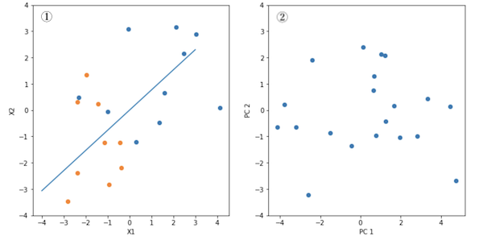
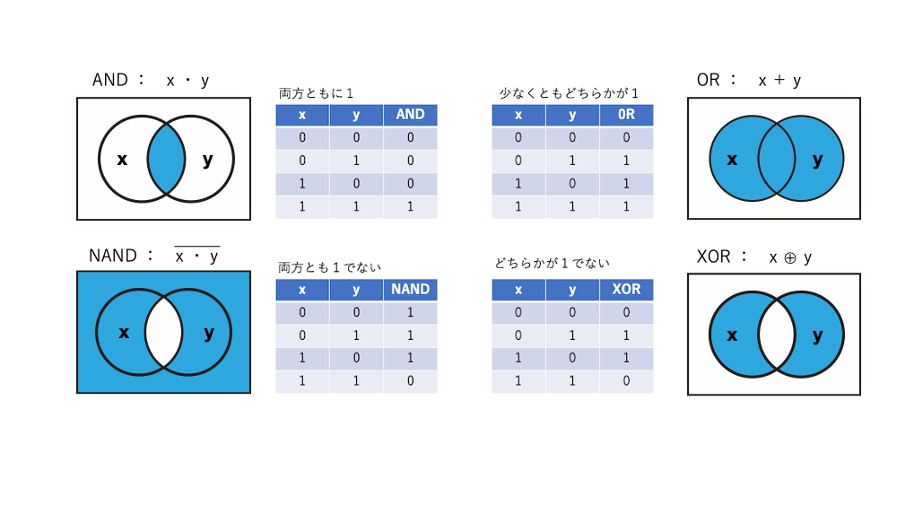

## ７　スペクトルの解析

ここでは、スペクトルデータを使って、多変量解析について学習することを目的とします。

<br>

> No matter who pens them, nor in which language they are penned, mere words fail to convey the sadness that befell us on July 17th, 2019, when **Karl Norris** passed away. He became a legend in his own lifetime, long before its end, a legend that will never be surpassed, and created a new world of rapid, chemical-free analysis, the World of Near-infrared Spectroscopy (NIRS). More than 50 years ago his genius recognized that what he had found in the spectra of soybeans could be metamorphosed into a technique that would revolutionize grain analysis. In the decades immediately following, his vision became reality, and the technique has since then expanded far beyond grain analysis into fields too numerous to document. https://icnirs.org/news/a-tribute-to-a-legend/

<br>

### ７ー１　スペクトルデータとは

「非破壊検査」、「品質」でネット検索すると青果物の分析についての論文や装置がヒットします。光を用いる分光法、X線などの放射線を用いる方法、または電磁気的な性質を利用する方法などあるなかで、**近赤外分光法**は 1970 年代から農産物の分析に用いられています。なぜ近赤外を使うのでしょう。

私たちが水中の物体をみることができるのは可視光が水を透過するからです。それでも光が達する深さには限界があり、そこからの散乱光を見ることもできません。このことは経験的に皆知るところであり、青が赤よりも透過率が良いために海が青く見えるのも同じ物理現象です。つまり、可視光は水を透過するが、その程度は波長により異なること、赤すなわち波長の長い光はより吸収されるということです。さらに長い赤外線波長を使うとどうでしょう？　赤外線吸収スペクトル法では分子内の官能基の構造を調べることができますが、測定には水を極力排除します。それはOHやNHなどの重要な官能基の吸収付近に覆い被さる吸収を生じることと、ハード的にも光学素子を痛めやすいためです。

近赤外法はちょうど間の波長帯を利用するで、その見えない光は含水物内に浸透して、官能基の情報も与えるという両方の性質を持つと理解できます。具体的には、近赤外分析で用いられる波長は果実の皮を透過して果肉のサンプリングを可能にします。一般には、まず目的の成分が既知のサンプルからスペクトルデータを収集し、次にスペクトルから逆に成分量を予測する**校正モデル**を作成します。このモデルに未知のサンプルから得た近赤外スペクトルを代入して目的成分の予測値を得ます。操作は簡単で測定も迅速で非破壊的であることが近赤外の魅力といえます。

果実のスペクトルは残念ながら持ち合わせていないので、木材の表面から集めたスペクトルで話を進めましょう。４種類の熱帯産材、市場ではメランチと呼ばれる4種のスペクトルです。

<br>


<br>

スペクトルデータは概ね緩やかな曲線で、とてもよく似ていることに注目してください。ただし、同じ大きさの領域からサンプリングしても有機物の絶対量に応じて吸光の度合が変わるたバックグラウンドは変化します。その影響を除くため２次微分します。下の図は波数8000cm<sup>-1</sup>から4000cm<sup>-1</sup>の領域を取り出してプロットしたものですが、絶対値の大きさに影響されずに変化量としたため、各サンプルを比較できるようになりました。このような処理を**正規化**（normalization）といいます。正規化については後で説明します。

<br>


<br>

正規化後のスペクトルデータはますます似てきますが、若干の差があるようにも見えます。1960年代にKarl Norrisが行なった大豆の研究から始まり、このような微妙なスペクトルの変化を捉えてサンプルの特徴を取り出す**多変量解析手法**、今でいう**ケモメトリクス**という方法はあらゆる分野で発展し、自動化された品質評価の技術として社会実装されました。

<br>

### ７ー２　次元の圧縮

<br>

さて、スペクトルのデータは、波数8000cm<sup>-1</sup>から4000cm<sup>-1</sup>まで2cm<sup>-1</sup>間隔とすると2000個あります。これらを一つ一つサンプルごとに比べて、クラス分けする手もありますが、ここでは、サンプルを代表するような**特徴量**を取り出すことを考えます。

話は変わりますが、健康診断でよく耳にする**BMI** (Body Mass Index) という指標は、体重（$kg$）を身長<sup>2</sup>（$ m$<sup>$2$</sup> ）で除したものです。重さは体積に比例するので、BMIはもう一辺の長さに相当しますから、「あなたの体積にふさわしい重さを超えています」という基準として提案でき、男性ではその値25だと言うわけです。言い換えれば、体重と身長をいう二つのデータ（２次元のデータ）をBMIという一つの指標（１次元）にまとめたものです。このように多次元データの特徴をうまく引き出す幾つかの変数にまとめることを、**次元の圧縮**（Dimensionality Reduction）といいます。GISのところで、人口を世帯数で除したコレログラムを作りましたが、これも人口と世帯数を一つの指標「世帯あたりの人数」に圧縮したことにほかなりません。

<br>

### ７ー３　主成分分析

<br>

**主成分分析**（Principle Component Analysis）は多次元のデータの情報のもつ傾向を低次元の情報に**縮約**（次元の圧縮）する代表的な方法です。例えば、50サンプルのデータがあり、サンプルごとに6つの測定値があるとします。6次元のデータをグラフ上（直行する６つの軸上）にプロットしてサンプルの特徴をみることを想像できますか。しかし、これを２次元に縮約すればグラフ上に表示でき、データ全体の分布を視覚的にとらえることができるので、データがもつ情報を解釈しやすくなります。

まず縮約から考えてみます。話を簡単にするために変数二つの２次元のデータを定義します。グループAは平均１、標準偏差2の正規分布にしたがう乱数からなる（ $x_{1}, x_{2}$ ）のデータ、グループBは平均−２、標準偏差２の正規分布にしたがう乱数からなる（$x_{1}, x_{2}$）データです。

<br>

```python
import numpy as np
# np.random.normal(loc,scale,)は、平均loc、標準偏差scaleの正規分布に従う乱数を返します
A=np.random.normal(1,2,(2,10))
B=np.random.normal(-2,2,(2,10))
```

上のスクリプトは実行するたびに新しい乱数が発生しますので、下の表の数字は再現されませんので注意してください。

| A       |         | **B**   |         |
| ------- | ------- | ------- | ------- |
| $x_{1}$ | $x_{2}$ | $x_{1}$ | $x_{2}$ |
| 1.34536 | -0.4811 | -2.38   | -2.3792 |
| 1.60766 | 0.66383 | -0.376  | -2.1983 |
| 2.47402 | 2.15362 | -0.7576 | -5.3951 |
| -0.993  | -0.0655 | -1.445  | 0.24701 |
| 4.13782 | 0.09339 | -2.8229 | -3.4589 |
| -2.3125 | 0.47425 | -1.9756 | 1.34693 |
| 2.12943 | 3.14667 | -2.3888 | 0.30033 |
| 0.29949 | -1.2055 | -0.4291 | -1.2403 |
| -0.0528 | 3.08214 | -1.1383 | -1.2218 |
| 3.03482 | 2.889   | -0.9443 | -2.8388 |

<br>

①〜④に$x_{1}, x_{2}$を軸として値の分布を示しました。この２次元に分布する点を１次元に縮約するには、①$x_{1}$上に正射影する、②$x_{2}$上に正射影する、ということも考えられますが、この場合、前者はの$x_{2}$の情報を失い、後者はの$x_{1}$情報を失うので、全体の傾向をみることができません。③は、それに対して、２次元上のプロットをある軸上に正射影したとき、その分散が最も大きくなる軸を見つける方法です。この軸を第1主成分軸$y_{1}$（橙色）といいます。④は第1主成分軸に直行し、２番目に分散が大きくなる軸$y_{2}$（青色）を見つけます。これを第2主成分軸といいます。


上の20個のデータで実際の計算をしてみましょう。$y_{i}$を次式のように、$x_{1}$、$x_{2}$に係数$h_{1j}$ ,$h_{2j}$をかけたものの線形和として表します。
$$
y_{i}=h_{1j}x_{1}+h_{2j}x_{2}
$$
主成分分析では、この$y_{i}$の**分散を最大**にする$h_{ij}$を求めるのですが、この例の場合はデータが二次元なので主成分軸は2つ、三次元であれば3つと、データの次元に応じて主成分軸の数はことなります。その軸を求める方法の数学的な根拠は成書に譲るとしてここでは手順をしめします。（$x_{i1}, x_{i2}$）のデータからまず、分散共分散行列$X$を次式より求めます。
$$
X=\left( \begin{array}{rr}S_{x_{1}x_{1}} & S_{x_{1}x_{2}} \\ S_{x_{2}x_{1}} & S_{x_{2}x_{2}}\end{array} \right)
$$


ここで、分散$S_{x_{1}x_{1}}$と共分散$S_{x_{1}x_{2}} $は次式のとおりです。
$$
S_{x_{1}x_{1}}= \frac{1}{n}\sum_{i=0}^{n}(x_{i1}-\bar{x_{1}})^{2}　　　S_{x_{1}x_{2}} = \frac{1}{n}\sum_{i=0}^{n}(x_{i1}-\bar{x_{1}})(x_{i2}-\bar{x_{2}})
$$

主成分軸は、この分散共分散行列$X$の**固有値**と**固有ベクトル**を計算することから得られますが、分散最大となるベクトル $h_{ij}$ は固有値・固有ベクトルの中で、 最大固有値に対応する固有ベクトル としてもとめられます。また$X$は**対角行列**なので、複数求められる固有ベクトルはすべて**直交**します。

固有値$λ$、固有ベクトル$\overrightarrow{x}$は次の連立方程式を解いて求めます。左式の固有方程式は上の例では2次方程式なので、固有値$λ$の解が2つ得られ、それぞれを右式に代入することで、2組の固有ベクトル$\overrightarrow{x}$が求められます。
$$
det(X−λE)=0　　　(X−λE)\overrightarrow{x}=0
$$
NumPyでは分散共分散行列を`np.cov()`、固有値・固有値ベクトル、 `np.linalg.eig()`で計算することができます。

```python
data=np.hstack((A,B)) #AとBをひとまとめにしてdataとします。
mat_cov=np.cov(data)
print("分散共分散行列 variance-covariance matrix \n{}".format(mat_cov))
print("\n")
eig_value, eig_vector = np.linalg.eig(mat_cov)
print("固有値 eigenvalue\n{}".format(eig_value))
print("\n")
print("固有ベクトル eigenvector \n{}".format(eig_vector))
```

```
分散共分散行列 variance-covariance matrix 
[[3.98836461 2.12351884]
 [2.12351884 5.1323994 ]]
固有値 eigenvalue
[2.36116937 6.75959463]
固有ベクトル eigenvector 
[[-0.7937572  -0.60823474]
 [ 0.60823474 -0.7937572 ]]
```

<br>

固有値については、6.76と2.36の二つが得られました。大きい方が第1主成分軸、小さい方が第2主成分軸の固有値です。この値の意味は、データの分散の何割を説明するかという寄与率で表すと理解しやすくなります。寄与率は、固有値を両者の和9.12で除した値、74%、26％で与えられます。第１主成分の固有ベクトルは (-0.60823474, -0.7937572) で、これをプロットしたのが、次の①図です。次に、サンプルデータ（$x_{1}, x_{2}$）と固有ベクトルの内積$y_{ij}$を主成分ごとに計算します。この値はスコアーと呼ばれる軸上のサンプルの得点に相当し、第1主成分と第2主成分を軸としてプロットしたのが②図です。

```python
import matplotlib.pyplot as plt
%matplotlib inline
x=np.arange(-4,4,1)
pc1=np.dot(data.T,eig_vector.T[1])
pc2=np.dot(data.T,eig_vector.T[0])
#
fig,ax=plt.subplots(ncols=2,figsize=(12,6))
ax[0].scatter(data[0][:10],data[1][:10])
ax[0].scatter(data[0][10:],data[1][10:])
ax[0].plot(x,x/eig_vector.T[1][1]*eig_vector.T[1][0])
ax[0].set_ylim(-4,4)
ax[0].set_xlabel('X1')
ax[0].set_ylabel('X2')
ax[1].scatter(pc1,pc2)
ax[1].set_ylim(-4,4)
ax[1].set_xlabel('PC 1')
ax[1].set_ylabel('PC 2')
plt.show() 
```



<br>

#### ７ー３ー１　練習

<br>

１）行列Aの固有値と固有ベクトルを求めなさい。
$$
A=\left( \begin{array}{rr}５ & ２ \\ ２ & ８\end{array} \right)
$$
２）メランチ属の２次微分スペクトルデータ(2nd_Meranti.xlsx)を読みプロット表示しなさい。

<br>

### ７ー４　主成分分析によるスペクトル解析

<br>

機械学習に必要な関数をまとめたパッケージ**scikit-learn**（https://scikit-learn.org/stable/)　が利用できます。先の例を試してみましょう。固有値も第1主成分から順に出力されますので安心です。

<br>

```python
import pandas as pd
from sklearn.decomposition import PCA   #主成分分析器
from sklearn.preprocessing import StandardScaler
#
pca = PCA()  # Class 関数の呼び出し
pca.fit(data.T)
pca_cor = pca.transform(data.T) # データを主成分空間に写像
#eigen values　（固有値）
eig = pd.DataFrame(pca.explained_variance_, index=['pc1','pc2'], columns=['固有値'])
display(eig.T)
# eigenvectors　（固有ベクトル）
eig_vec = pd.DataFrame(pca.components_.T, columns = ['pc1','pc2'])
display(eig_vec)
# proportion of the variance　(寄与率）
pv = pd.DataFrame(pca.explained_variance_ratio_, index=['pc1','pc2'], columns=['寄与率'])
display(pv.T)
# score plots
cor = pd.DataFrame(pca_cor, columns=['pc1','pc2'])
fig, ax = plt.subplots(figsize=(6,6))
cor.plot(x='pc1',y='pc2',kind='scatter', ax=ax, grid=True, legend=True)
plt.show()
```

上のスクリプトの出力は載せていませんが、各自トライしてください。

<br>

#### ７ー４ー１ データの規格化

<br>

７ー３の例では、$x$のデータは中央値が異なりますが、標準偏差を同じとする比較的よく似た数値群でした。その場合、両者の大きさの大小については注目しませんでした。しかし、データが体重（kg）と身長（m)と視力の場合はどうでしょう。データ間で**平均**や**分散**が大きく変わる場合、上の例で説明した方法では正しい固有値や固有ベクトルを導くことができません。簡単に言えば、数値の大きなものの影響が大きなり、正しい寄与率を求めることができません。

そこで、全てのデータの平均値が0で分散が１となるような前処理を行うことが慣例となっており、これを**規格化**（standardization)といいます。計算はサンプルの値から平均を引いて分散で割るだけですが、**scikit-learn** では組み込み関数として利用できます。

<br>

#### ７ー４ー２ 寄与率と因子負荷量


さて、主成分分析を理解したところで、スペクトルデータに戻ります。サンプル数は88、各スペクトルのデータ数は2001です。上述した規格化ですが、実はスペクトルの場合は大きさ自体の連続性に意味があるので一般的な規格化はしませんが、データを揃える意味で2次微分をしています。

二次微分では実測スペクトル中のピーク（上向き）が下向きのピークとして見えてきます。一見スムーズに見える曲線でも敏感にピークを検出することができますが、ノイズを拾わないよう注意する必要があります。


手順は以下の通りです。

- indexとしてサンプル名を、カラム名を波数としてpandasのDataFrameに読み込みます。これは後で結果の表示や判別分析の際に使います。
- **scikit-learn**のPCAクラス関数を呼び出し、第10成分までの主成分を計算します。
- 第10成分までの**寄与率**を棒グラフに表示します（図①）。
- 入力した二次微分曲線を表示します（図②）。
- 上に対応する**因子負荷量**を第3主成分まで表示します（図③）。

```python
# PCA analyses : wavenuber range  8000-4000 cm-1
import pandas as pd
import numpy as np
from sklearn.decomposition import PCA
from mpl_toolkits.mplot3d import Axes3D
import matplotlib.pyplot as plt
%matplotlib inline
#
df=pd.read_excel('../../../GitHubData/Datascience_AI/data/Spectroscopy/2nd_Meranti.xlsx', index_col=0)
target_names=np.unique(df.index)
tmp = pd.get_dummies(df.index)
X_category = tmp.values.argmax(1) # make strings into numbers 0,1,2,...
sp_names = df.index
#
X = df
X = X*1e4  # 
title = "PCA from 8000-4000 cm-1 region"
pca = PCA(n_components=10)
X_r = pca.fit(X).transform(X)        
#
fig, axes = plt.subplots(nrows=3, figsize=(10,15))
#　寄与率
axes[0].bar(np.arange(1,11,1), pca.explained_variance_ratio_, align = "center")
axes[0].set_title("Screeplot of "+title)
axes[0].set_xlabel("components")
axes[0].set_ylabel("contribution")
# ２次微分曲線の表示
axes[1].plot(df.columns,X.T,linewidth = 2 ) ## x 10e3 
axes[1].set_title("2nd dev spectra of "+title)
axes[1].invert_xaxis()
# 因子負荷量の表示
loadings = pca.components_*np.c_[np.sqrt(pca.explained_variance_)]
axes[2].plot(df.columns,loadings[0],linewidth = 2, label='PC1 loading')
axes[2].plot(df.columns,loadings[1],linewidth = 2, label='PC2 loading' )
axes[2].plot(df.columns,loadings[2],linewidth = 2, label='PC3 loading' )
axes[2].set_title("Loading of "+title)
axes[2].invert_xaxis()
axes[2].legend()
plt.show()
```


<br>

この場合、10次元まで表示しましたが、第３主成分まで寄与率を累積するとサンプルのもつ分散のほぼ97％が説明されていることがわかりました。そこで、ここから先は３成分のみに対象を限り考察します。

それぞれのサンプルの主成分値（スコアー：score）は、2次微分スペクトルに係数$h_{ij}$を掛けて線形和を求めたものですが、2001個のスペクトルデータそれぞれにかける因子負荷量（loadings）$h_{ij}$は、それぞれの固有値の平方根に固有ベクトルをかけて得られます。すなわち

$$　loadings = \sqrt{eigenvalue}\mbox{×}eigen vector$$

が上図に示したものです。この図は二次微分スペクトル上のどのピークの寄与が高いかを示すもので、ここから官能基を特定し、成分がなんであるかを辿ることができます。

<br>

#### ７ー４ー３ スコアープロット

さて、最後にスコアープロットをを表示します。第3成分までですから、2次元に2つのグラフで示してみます。図①は第1主成分と第2主成分、図②は第2主成分と第3主成分の関係を示し、図中の表示色はそれぞれメランチ属の4種をX_category`で定義したものですから、属が見事に分かれたことがわかります。

このように、主成分分析は、標本全体の分散を大きくするプロセスを通して、似ているものはより近く、似ていないものはより遠くに振り分けますので、この機能を使って、多変量の次元圧縮に頻用されます。

スペクトルの場合は、因子負荷量と主成分軸を併せて考えることで、サンプル間の相違点を化学構造から説明できるわけです。

<br>

```python
colors = ['r', 'g', 'b','y' ]      
# PCA 2D plot
fig, axes = plt.subplots(ncols=2,figsize=(10,4))
lw = 2 # line width
for color, i, target_name in zip(colors, list(range(max(X_category)+1)), target_names):
    axes[0].scatter(X_r[X_category == i, 0], X_r[X_category == i, 1], color=color,lw=lw,label=target_name)
axes[0].set_title(title)
axes[0].set_xlabel('PC1')
axes[0].set_ylabel('PC2')
for color, i, target_name in zip(colors, list(range(max(X_category)+1)), target_names):
    axes[1].scatter(X_r[X_category == i, 1], X_r[X_category == i, 2], color=color, lw=lw,label=target_name)
axes[1].legend(bbox_to_anchor=(1.4, 1.1), shadow=False, scatterpoints=1)
axes[1].set_title(title)
axes[1].set_xlabel('PC2')
axes[1].set_ylabel('PC3')
plt.show()
```


<br>


#### ７ー４ー４ 「教師あり」と「教師なし」学習

主成分分析は、サンプルのデータを線形結合して、主成分軸のもとに次元の圧縮を行い、サンプルに内在する傾向を見事に捉えました。上の図①のPC1 vs PC2のグラフをもう一度に見てみましょう。４つの樹種が綺麗に分かれているので、その間を分けるような方程式を立てれば、十分に樹種を識別するためのモデルとしても使えることがわかるでしょう。このようにデータを解析して何らかのモデルをつくることを学習といいます。しかし、計算の過程では、サンプルがどのグループに属しているのか未知のまま解析しました。この場合「**教師なし**」の学習といい、主成分分析はその代表格です。

それに対して、各サンプルに対して最初から与えられている正解データあるいはラベルを基準にして、主成分分析だけではうまく分類できないような問題に対してモデルを作る手法を「**教師あり**」学習といいます。

このような「教師あり」と「教師なし」学習手法は、いわゆる機械学習の基礎になることころで、さまざまな方法が確立されています。サンプリング、モデル化、回帰問題あるいは判別問題の解決をする上で重要で、解析の結果（精度）にも影響します。対象と目的にに合わせて、比較するのがいいでしょう。

<br>

#### ７ー５ー２　線形判別器と非線形判別器

上の主成分分析では第1主成分と第1主成分の２次元プロットに２直線を定義すれば分類完了です。これが判別関数の一つであり、**線形の**判別器です。ところが判別したい対象の分布が必ずしも線形関数では判別できない事例もあり、そのような場合、非線形判別器を用います。線形の代表にはロジスティック関数があり、非線形にはサポートベクターマシンやランダムフォレストなどがあります。実践的なところは成書[3,4]を参照ください。

<br>

#### ７ー５ー３　論理回路

論理回路は、二つの入力 ($x, y$) に対して、ある答えを導くための基本的なルールです。計算機がだしてきた数値をもとに判断を下す際の重要な仕組みです。論理回路にはAND, OR, NAND, XORなどがありますが、それぞれ以下のような判断をします。

- AND 論理積: $x=1と同時にy=1$のとき　1を出力して、それ以外は0とする
- OR 論理和: $x=1 あるいは y=1$のとき　1を出力して、それ以外は0とする
- NAND　否定論理積: $x\neq1と同時にy\neq1$のとき　1を出力して、それ以外は0とする
- XOR 排他的論理和: $x\neq1あるいはy\neq1$のとき　1を出力して、それ以外は0とする

これを表に描くと次のようになります。それぞれの場合はx,y平面上に点として示したとき、y=ax＋bの直線で論理回路が作れるか、考えてみましょう。



<br>

#### ７ー５ー４　排他的論理和データセットの判別

２次元で綺麗に分かれないようなデータの組み合わせをつくって、その時な解決策について考えます。最初から答えを言えば、非線形判別器が必要な事例の説明です。データには上で説明したXOR 排他的論理和の関係をつかいます。

```python
import numpy as np
import matplotlib.pyplot as plt
%matplotlib inline
np.random.seed(0)
X_xor=np.random.randn(150,2)
Y_xor=np.logical_xor(X_xor[:,0]>0,X_xor[:,1]>0)
Y_xor = np.where(Y_xor,1,-1)
plt.scatter(X_xor[Y_xor==1,0],X_xor[Y_xor==1,1],c='b',marker='x',label='1')
plt.scatter(X_xor[Y_xor==-1,0],X_xor[Y_xor==-1,1],c='y',marker='s',label='1')
plt.xlabel('X')
plt.ylabel('Y')
plt.show()
```


<br>

このように第１、２象限と第１、２象限に別れた二組のデータを作ることができました。XORゲートと比べてみてください。

この場合は一見して線形関数では分けることができないですね。そこで非線形関数を導入しますが、一例としてサポートベクターマシンを利用してみます。

```python
from common.nir_ml import *
clf=SVC()
clf.fit(X_xor,Y_xor)
plot_decision_regions(X_xor, Y_xor, classifier=clf, resolution=0.02)

```


```
from sklearn.datasets import fetch_olivetti_faces

faces = fetch_olivetti_faces()
print(faces.DESCR)
```
